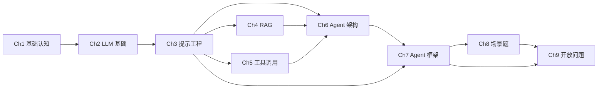

# 大模型 Agent 应用开发 · 三阶段总览

> **TL;DR**：本教程分入门 9 章 + 生产进阶 4 章。入门 9 章按"打地基→核心能力→实战视野"三阶段递进；进阶 4 章独立成册，假定已掌握入门 Ch1-Ch6。

## 三阶段路径

## 阶段 1·打地基
- [Ch1 基础认知](/getting-started/01-basics/01-llm-and-agent) — 大模型应用、Agent 概念、学习路线
- [Ch2 LLM 基础](/getting-started/01-basics/02-llm-fundamentals) — Token、Attention、训练、采样

## 阶段 2·核心能力
- [Ch3 提示工程](/getting-started/02-core/03-prompt-engineering)
- [Ch4 RAG](/getting-started/02-core/04-rag)
- [Ch5 工具调用](/getting-started/02-core/05-tool-calling)
- [Ch6 Agent 架构](/getting-started/02-core/06-agent-architecture)

## 阶段 3·实战与视野
- [Ch7 Agent 框架](/getting-started/03-advanced/07-frameworks)
- [Ch8 场景题](/getting-started/03-advanced/08-scenarios)
- [Ch9 开放问题](/getting-started/03-advanced/09-open-questions)

## 📗 生产进阶（4 章）

[前往生产进阶](/production/00-prerequisites)
