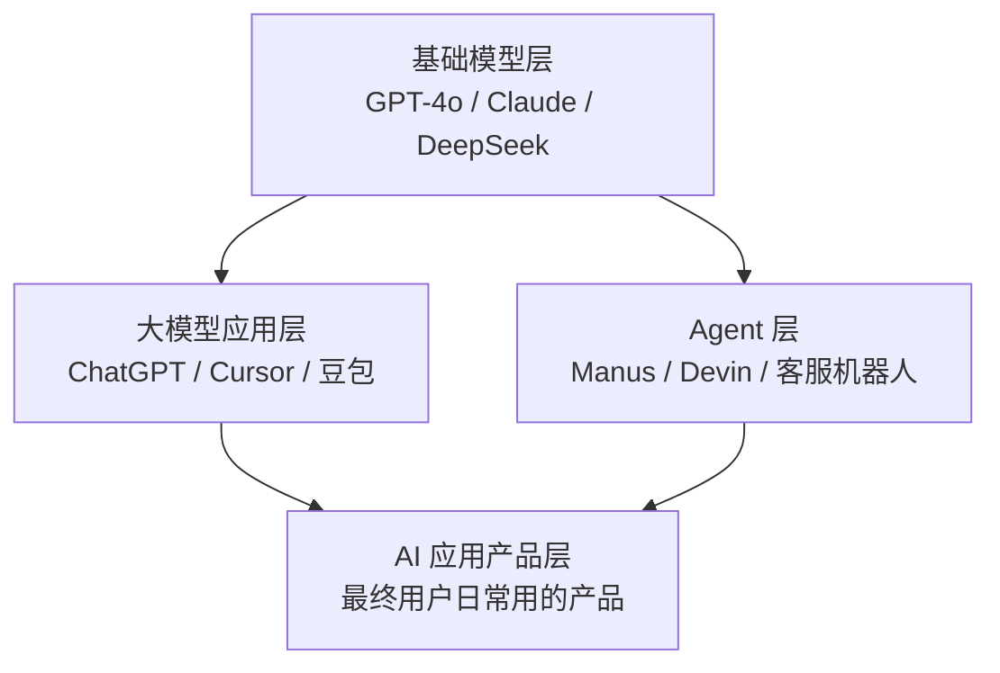
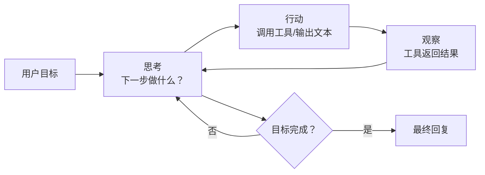

# Ch1 · 基础认知

> **TL;DR**：
> 1. 本章解决"看到 Agent 招聘 JD 不知道是啥"的困惑——给读者一张"基础模型 / 大模型应用 / Agent / AI 应用"地图。
> 2. 核心结论：基础模型是发动机；大模型应用是直接给用户用的车；Agent 是装了工具、能自主决策的机器人。
> 3. 读完能做：能向同事 5 分钟讲清楚"Agent 是什么"，并画出一张 AI 应用生态金字塔图。

> 📌 **前置阅读**：本章是入门第 1 章，无前置依赖。读者只需要会写业务代码（任何语言），不需要深度学习或 NLP 背景。

## 1. 背景 & 问题

前端小王最近很焦虑。他去年开始用 ChatGPT 辅助写代码，觉得这东西"挺神奇但也就那样"。上周刷招聘网站，发现 90% 的 AI 岗位 JD 都写"有 Agent 开发经验优先"，他点开岗位描述，看到"ReAct / Function Calling / MCP / RAG / 多 Agent 协作 / 工具编排"——每一个词都认识，组合在一起就像天书。

小王困惑的有三件事：

1. **"大模型应用"和"Agent"是一回事吗？** 既然 ChatGPT 已经能写代码、画图、做翻译，为什么还要单独造一个叫"Agent"的概念？是不是营销噱头？
2. **"不学 LangChain / Dify 是不是就上不了车？"** 他打开知乎，看到有人背 LangChain 源码，有人聊 AutoGPT 复现，感觉不把框架啃完就不算"懂 Agent"。
3. **"我做的 ChatGPT 套壳页算 Agent 吗？"** 老板让他两周搭一个"AI 客服"出来，他用 Vite + Express + OpenAI API 三天就搭完了，能对话、能记住上下文、看着挺好用——但他心里没底：这到底算"AI 应用"还是"Agent"？能不能拿这个去面试？

这三个问题，就是本章要解决的核心。读完你应该能：

- 用一张金字塔图把"基础模型 / 大模型应用 / Agent / AI 应用"四层关系说清楚；
- 判断一个产品"算不算 Agent"——标准不是"它有多智能"，而是"它会不会自主决定下一步做什么"；
- 知道自己现在站在哪一层、下一步该学什么，不需要背任何框架的源码。

## 2. 核心概念

### 2.1 一张图看懂 AI 应用版图

先看金字塔。从下往上是"被封装得越来越少、能力越来越通用、调用门槛越来越低"：



**这张图说了什么**：基础模型（Foundation Model）是最底层的"会说话的超级大脑"，它本身没有 UI、不会主动干活。大模型应用是给这个大脑"装一个聊天框"——你问它答。Agent 是给这个大脑"装上手脚和工具箱"——它能自己决定要不要查天气、发邮件、跑代码。AI 应用产品则是用户真正打开手机/浏览器看到的那个产品，可以由 L2 或 L3 支撑。

### 2.2 三者关系对比

| 维度 | 基础模型（LLM） | 大模型应用 | Agent |
|------|----------------|-----------|-------|
| **是什么** | 经过海量文本训练的概率生成器 | 给模型套上 UI，让用户聊天 | 给模型套上工具，让它自己决策 |
| **关键差异** | 只有 API，没有界面 | 被动回答，单轮/多轮对话 | 主动规划，可调用外部工具 |
| **典型例子** | GPT-4o、Claude 3.5、DeepSeek、豆包基座 | ChatGPT 网页、Claude.ai 桌面端 | Manus、Devin、Cursor Agent Mode |
| **前端小王做的** | —— | 套壳 ChatGPT 的客服页（V1） | 加上"自动查订单 / 退款 / 转人工"的客服机器人（V2） |
| **类比** | 像一个博学但只会在脑子里回答的顾问 | 顾问坐在玻璃窗后，你问一句他答一句 | 顾问带了一个工具箱，能去翻书、查系统、跑程序 |

**关键判断标准**：一个东西"算不算 Agent"，不看它"看起来多智能"，看它"是否会自主决定下一步做什么"。

- 套壳 ChatGPT 网页（用户问什么、模型答什么）→ **大模型应用**
- 客服机器人收到"我要退款"，自己决定先查订单、查退款政策、再生成话术 → **Agent**
- Cursor 补全模式（你写半句，它补全下半句）→ **大模型应用**
- Cursor Agent Mode（你说"帮我重构这个模块"，它自己读代码、写代码、跑测试）→ **Agent**

### 2.3 术语卡片

| 术语 | 一句话解释 | 生活类比 |
|------|----------|---------|
| **Token** | 模型处理文字的最小单位，约等于 1 个汉字或半个英文单词 | 像火车票——一篇文章要占多少"座位"按 token 算 |
| **Prompt** | 你发给模型的输入文字 | 像给顾问的提问邮件 |
| **LLM**（Large Language Model） | 大语言模型，即上面金字塔 L1 的基础模型 | 像一个读过千万本书的博学助手 |
| **Agent** | 能自主规划、调用工具、完成多步任务的 AI 系统 | 像一个带了工具箱的管家，你说"准备晚饭"，他自己决定做什么菜、去哪买、怎么做 |
| **RAG**（Retrieval-Augmented Generation） | 让模型在回答前先查一份资料库 | 像开卷考试——先翻书再答题 |
| **Function Calling** | 模型按你给的 JSON 格式输出"要调用哪个函数、传什么参数" | 像管家递给你一张购物清单："请帮我买 A、B、C" |
| **MCP**（Model Context Protocol） | Anthropic 提出的"工具描述标准协议"，让模型能发现并调用工具 | 像 USB 接口标准——一个协议通吃各种工具 |

> 💡 **记忆口诀**：Prompt 是输入，Token 是计量单位，LLM 是大脑，Agent 是大脑+手脚，RAG 是开卷考，Function Calling 是传纸条，MCP 是 USB 标准。

### 2.4 一个 Agent 决策循环（流程图）

下面是 Agent 最常见的"思考-行动-观察"循环（也叫 ReAct 模式），后文 Ch6 会详细展开，这里先建立直觉：



**这张流程图说了什么**：Agent 不会一次答完，而是"想一步、做一步、看结果、再想下一步"，直到目标完成或卡住——这和 ChatGPT 单轮问答最大的区别是"它会反复看自己做的事情对不对"。

## 3. 最小可运行示例

下面是 `examples/00-hello-llm/` 里的核心代码（5 行能跑通），完整可运行版本请看仓库：

```python
# examples/00-hello-llm/py/main.py
from openai import OpenAI

client = OpenAI()  # 读取环境变量 OPENAI_API_KEY
resp = client.chat.completions.create(
    model="gpt-4o-mini",
    messages=[{"role": "user", "content": "用一句话介绍你自己"}],
)
print(resp.choices[0].message.content)
```

**这一段代码在做什么？** 它在调用"基础模型层"的 LLM API，发了一句 prompt，收回一段文本。这就是一个**最小的大模型应用**——没有记忆、没有工具、没有规划。

**怎么升级成 Agent？** 改三处就能感受到区别：

1. **加 system prompt** → 告诉模型"你是客服，遇到退款请求先调工具"，约束它的角色。
2. **加 function calling** → 在 `tools=` 参数里声明 `query_order` / `refund` 等函数，让模型自己决定要不要调用。
3. **加循环** → 把"模型输出 → 解析工具调用 → 调真实函数 → 把结果塞回 messages → 再调模型"包成 while 循环，就是个能自主决策的 Agent 雏形了。

具体代码和工程实践会在 Ch5（工具调用）和 Ch6（Agent 架构）展开。本章只需要你建立"5 行代码是大模型应用，加循环和工具调用就是 Agent"的心智模型。

## 4. 常见陷阱

### 陷阱 1：把"大模型应用"和"Agent"混着用

**现象**：面试时被问"你做过 Agent 吗？"，你说"我做过一个 ChatGPT 套壳页"，面试官不置可否；或者反过来，你写了一个能查订单的客服机器人，但介绍时只说"我做的是大模型应用"——这两种说法都会让懂行的面试官皱眉。

**原因**：行业里这两个词已经分化得很清楚了。**大模型应用 = 模型被调用，回答问题**；**Agent = 模型被允许自己决定调用什么工具、调用几次、什么时候停**。把套壳页叫"Agent"会被觉得概念不清，把能查订单的机器人叫"应用"会被低估能力。

**解法**：用一句固定句式介绍你的项目——"我做的是一个**【大模型应用 / Agent】**，它的核心能力是【...】，用户交互是【...】"。判断标准简单粗暴：

- 模型只能被动回答 → 大模型应用
- 模型会自己选择调用工具、循环多步 → Agent

### 陷阱 2：不学 LangChain / Dify 就不算懂 Agent

**现象**：打开知乎/B 站 Agent 教程，10 篇有 8 篇是 LangChain 或 Dify 入门，剩下 2 篇是 AutoGPT 复现。前端小王看了三天文档，发现自己花 80% 的时间在学框架 API，而不是在学"Agent 是什么"。

**原因**：教程生态偏向"框架教学"，因为框架好用、能跑出 demo。但 LangChain / Dify 只是"工具箱"，**Agent 的核心概念（规划-行动-观察循环、工具调用、记忆）和具体框架解耦**。先学概念再挑框架，效率高 10 倍；先背框架 API，遇到框架升级版本就全废。

**解法**：本教程的设计是"先概念后框架"。Ch1-Ch6 全程用纯 OpenAI/Anthropic SDK 写最小代码，Ch7 才对比 LangChain / Dify / CrewAI 等框架——到那时候你已经知道"我要解决什么问题"，选框架就是顺手的事。

### 陷阱 3：用"能不能上线"判断 Agent

**现象**：小王做完客服机器人 V1（套壳页），兴冲冲找老板汇报，老板问"它能上线吗"，小王愣了一下："我用的就是 ChatGPT 的 API，能跑就能上线啊？"——但其实这中间隔着**稳定性、成本、安全、内容审核**四道墙。

**原因**：判断一个 AI 项目"成熟度"的维度很多，常见的有：

- **能跑**：本地起个服务，调用一次 API 成功（Ch1 水平）
- **能用**：能处理边界情况（用户骂人、问无关问题、回复超长）
- **能上线**：有错误重试、成本控制、日志监控、prompt 版本管理（Ch7+ 水平）
- **能规模化**：A/B 测试、效果评估、Prompt 自动优化、流量削峰（生产进阶水平）

很多新人把"能跑"等同于"能上线"，结果一上线就翻车——并发一高就 rate limit、用户问刁钻问题就输出违规内容、每月账单突然翻 3 倍。

**解法**：用"成熟度阶梯"自评（详见 Ch7 和生产进阶篇）。本章只需要你记住一点：**ChatGPT 套壳页和真正的生产级 AI 应用，差的不是 AI 能力，是工程能力**。

## 5. 本章速查表

| 概念 | 关键点 | 一句话速记 |
|------|-------|-----------|
| 基础模型（LLM） | 金字塔最底层，只有 API | 博学助手的大脑 |
| 大模型应用 | 套 UI，被动问答 | 玻璃窗后的顾问 |
| Agent | 自主规划 + 工具调用 | 带工具箱的管家 |
| AI 应用产品 | 用户真正用的产品 | 顾问/管家所在的"店" |
| Token | 计量单位，1 字 ≈ 1 token | 火车票 |
| Prompt | 模型的输入 | 提问邮件 |
| RAG | 开卷考试 | 先查资料再回答 |
| Function Calling | 模型输出结构化"调函数"指令 | 管家递购物清单 |
| MCP | 工具描述协议 | USB 标准 |
| 判断 Agent 标准 | 自主决定下一步 | 会不会"自己拿主意" |

> **验证方法**：合上文档，能不能不看笔记画出 §2.1 的金字塔图？如果能，本章基础认知过关；如果画不出或画错层级，回 §2.1 重读一遍。

## 6. 下章预告 & 关键术语桥接

> 🔜 **下章 [Ch2 LLM 基础](/getting-started/01-basics/02-llm-fundamentals)**

本章埋了几个概念种子，会在 Ch2 一起收割：

- 本章说"**Token 像火车票**" → Ch2 会解释一节车厢 = 1024 tokens、按 token 计费、不同模型上限不同（GPT-4o 128K、Claude 200K）
- 本章说"**模型推理**" → Ch2 会讲推理时 GPU 占用、首 token 延迟、为什么流式输出能"边生成边显示"
- 本章说"**模型回复的创造性**" → Ch2 会展开 **Temperature** 参数的数学直觉：Temperature=0 是"选概率最高的字"，Temperature=1 是"按真实分布采样"
- 本章说"**Function Calling**" → Ch2 会顺便讲 Tool Use / Structured Output 的本质——为什么模型能"输出符合 JSON Schema 的字符串"
- 本章说"**MCP**" → Ch2 不展开，但 Ch5 工具调用会讲为什么需要这个协议

学完 Ch2，你对 LLM 的"脾气"会有更具体的体感——它什么时候胡说（幻觉）、什么时候稳定、什么时候贵、什么时候慢。这些体感是后面学 RAG、工具调用、Agent 架构的物理基础。

---

> **本章对应 example**：[`examples/00-hello-llm/`](examples) — 5 行代码跑通你的第一次 LLM 调用。
