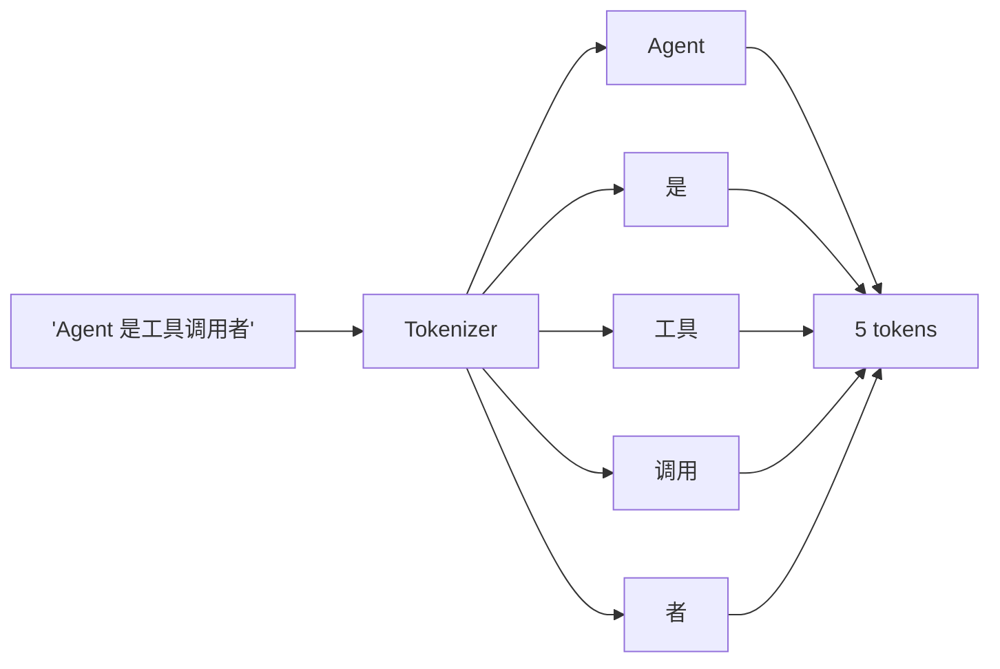
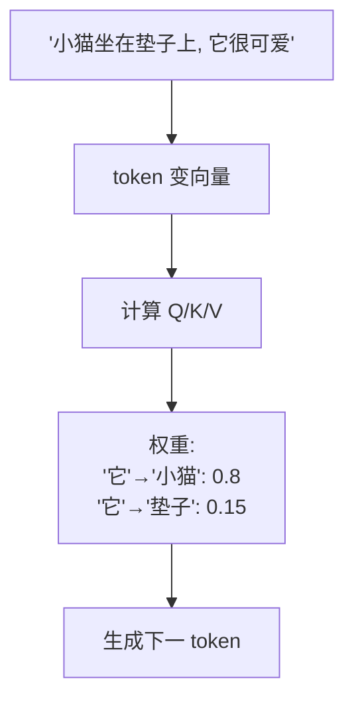
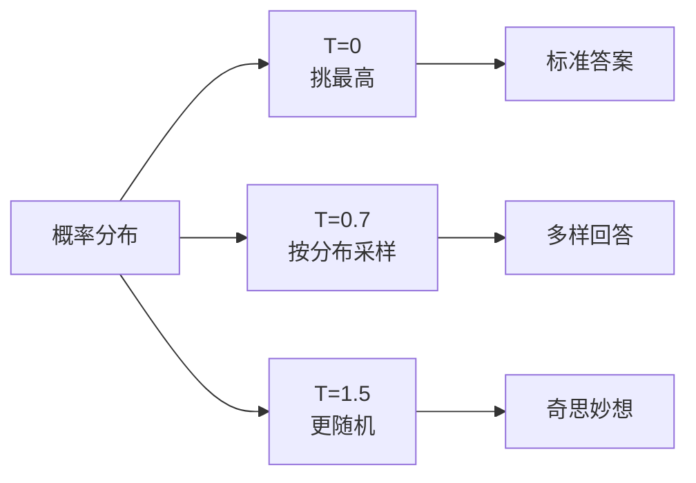

# Ch2 · LLM 基础

> **TL;DR**：
> 1. 本章解决"产品要 1000 字回答用户，为什么 LLM 按 token 计费？我设 Temperature=0 为什么模型开始复读？"两类困惑。
> 2. 核心结论：**Token** 是模型处理文字的最小单位（中文 1 字 ≈ 1-2 tokens）；**Attention** 决定"看上下文时关注哪里"；**Temperature** 决定"输出多随机"。
> 3. 读完能做：正确选择 Temperature 与上下文窗口大小，用 tiktoken 实测 token 数与成本。

> 📌 **前置阅读**：[Ch1 基础认知](/getting-started/01-basics/01-llm-and-agent) § 2.3 术语卡片（Token、Prompt、LLM 一句话定义）。本章把它们展开成"能算账、能调参"的可操作概念。

## 1. 背景 & 问题

前端小王做完 Ch1 客服套壳页后，老板抛了三个新问题：

1. **"每月要花多少钱？"** OpenAI 账单写 `4,213,000 tokens × $0.15/M`——token 是啥？
2. **"为什么有时死板有时跳脱？"** 同一句"我可以退款吗"，模型有时简短答"可以，请提供订单号"，有时啰嗦"亲，退款流程是这样的呢～"。
3. **"用户连续问 30 轮后开始胡说？"** 第 30 轮已塞 12000 字历史，模型像是"忘了"前面说过什么。

这三个问题对应 LLM 三个最易踩坑的概念：**Token / Temperature / 上下文窗口（&Attention）**。本章一次讲清。

## 2. 核心概念

### 2.1 Token：模型处理文字的最小单位

**生活类比**：坐地铁按"站"算票，不按"米"。模型的"一站"叫 **Token**。



**这张图说了什么**：模型按 token 读不按字。英文常用词 1 词 = 1 token，中文常用字 1 字 = 1 token，组合词可能 1 字 = 2-3 tokens。**经验值**：英文 1 token ≈ 3-4 字符；中文 1 字 ≈ 1-2 tokens。按 token 计费是因为推理算力与 token 数线性相关。

### 2.2 Attention：模型如何"看"上下文

**生活类比**：在嘈杂咖啡厅听朋友讲话，会自动屏蔽周围、聚焦在朋友的嘴上。**Attention** 做同样的事——生成下一个 token 时，决定"前面所有 token 哪些值得关注"。



**这张图说了什么**：模型读到"它"时计算与前面 token 的相关性权重（"小猫" 0.8、"垫子" 0.15），靠数学加权而非规则。**应用层影响**：上下文越长注意力越分散；中间部分易被忽略（Lost-in-the-Middle）；重要信息要放显眼位置（system prompt 开头或 user prompt 末尾）。

### 2.3 Temperature 与 Top-p：控制输出随机性

**生活类比**：让学生答"今天天气怎么样"——T=0 永远说"晴天"（标准派），T=1 可能说"晴朗、阳光明媚"（自由派），T=2 说"像火星上的紫薯"（胡说派）。模型生成每个 token 时本质是从**概率分布**采样，Temperature 改变分布陡峭程度。



**Temperature 对比表**（同一 prompt："起 3 个咖啡店名字"）：

| Temperature | 输出示例 | 适用场景 |
|---|---|---|
| **0** | 蓝山咖啡、星巴克、雀巢 | SQL/JSON 提取、代码补全 |
| **0.3** | 晨光咖啡、慢时光、豆香屋 | 客服、知识问答 |
| **0.7-1.2** | 拾光咖啡、墨绿研究所、月光酿啡 | 创意写作、起名、Brainstorm |

**Top-p（nucleus sampling）是 Temperature 的搭档**：采样前先砍低概率尾巴。Top-p=0.9 即"只从累计概率 90% 的 token 里挑"。OpenAI 建议**二选一调节**。**经验组合**：确定任务 T=0；客服问答 T=0.3 + Top-p=0.9；创意写作 T=0.8 + Top-p=0.95。

### 2.4 术语卡片

| 术语 | 一句话解释 | 生活类比 |
|---|---|---|
| **Token** | 模型处理文字的最小单位 | 地铁的"一站" |
| **Attention** | 决定"看上下文时关注哪里" | 聚光灯 |
| **Temperature** | 控制输出随机性 | 创造力旋钮 |
| **上下文窗口** | 单次推理 token 上限 | 车厢载客量 |
| **TTFT / 流式输出** | 首 token 延迟 / 边生成边返回 | 上菜速度 / 打字机 |

> 💡 **记忆口诀**：Token 是地铁站、Attention 是聚光灯、Temperature 是创造力旋钮、上下文窗口是车厢载客量。

## 3. 最小可运行示例

下面是 `examples/00-hello-llm/py/token_count.py` 核心代码（可直接运行）：

```python
# examples/00-hello-llm/py/token_count.py
import tiktoken


def count_tokens(text: str, model: str = "gpt-4o-mini") -> int:
    """用 tiktoken 统计文本的 token 数。"""
    encoding = tiktoken.encoding_for_model(model)
    return len(encoding.encode(text))


if __name__ == "__main__":
    samples = [
        "Agent 是能调用工具、自主决策的 AI",
        "RAG is retrieval-augmented generation",
        "Hello, world!",
    ]
    for s in samples:
        print(f"[{count_tokens(s):2d} tokens] {s}")
```

**输出与解读**：用 `tiktoken`（OpenAI 官方开源库、本地运行）实测三段文本。预期输出：

```
[15 tokens] Agent 是能调用工具、自主决策的 AI
[ 7 tokens] RAG is retrieval-augmented generation
[ 4 tokens] Hello, world!
```

中文每字基本吃 1-2 tokens——这是中文成本天然比英文高 1.5-2 倍的原因。**算钱**（GPT-4o-mini 2024）：输入 $0.15/1M、输出 $0.60/1M。1500 输入 + 500 输出 ≈ ¥0.004/次，"日活 1 万 × 5 次 × 30 天" ≈ ¥600/月——生产必须算清 token 账。

> **完整示例**：[`examples/00-hello-llm/`](examples)

## 4. 常见陷阱

### 陷阱 1：误以为 token 数 = 字符数

**现象**：产品定"输入限制 1000 字"，工程师配上下文窗口 1000 tokens，结果用户输入 800 字中文就报 "context length exceeded"。

**原因**：中文每字 ≈ 1-2 tokens，800 字 ≈ 1200-1500 tokens 已超上限。加 system prompt 和历史后，真实可用空间远小于窗口大小。

**解法**：用 tiktoken 实测换算比；预留 30% 缓冲（8K 窗口按 5.5K 规划）；前端用 `text.length × 1.5` 粗估。

### 陷阱 2：Temperature = 0 反而开始"复读"

**现象**：客服想"更稳定"把 Temperature 设 0，用户反馈"回答总是一模一样，有时卡在某句话上反复说"。

**原因**：Temperature=0 即 **greedy decoding**——每次只挑最高概率 token。某状态下"下一个最可能始终是 A"，模型陷入 `A→B→A→B→…` 循环，长输出（>500 tokens）尤其明显。

**解法**：生产用 0.2-0.7；配合 `frequency_penalty` / `presence_penalty` 惩罚重复；只在 SQL/JSON 提取场景用 0，并配合 `max_tokens` 限制长度。

### 陷阱 3：长上下文 ≠ 把所有信息都塞进去

**现象**：看到 Claude 200K 窗口就把"产品文档 + 全部历史 + 用户提问"一股脑塞——模型答得**慢**（TTFT 1s→8s）、**贵**（成本×20）、**差**（Lost in the Middle）。

**原因**：推理成本随上下文长度线性增长；Attention 权重被噪声稀释；中间 60% 内容易被忽略。

**解法**：能用 4K 就别开 32K（压缩历史，留最近 5 轮 + 摘要）；关键信息放头尾；用 RAG 替代"全量塞"（Ch4 展开）。

## 5. 本章速查表

| 概念 | 关键点 |
|---|---|
| **Token** | 模型处理文字最小单位，中文 1 字 ≈ 1-2 tokens |
| **Attention** | 决定"看上下文时关注哪里"；中间易被忽略 |
| **Temperature** | 0=确定，0.3-0.7=日常，1+=创意 |
| **Top-p** | 砍低概率尾巴，与 Temperature 二选一 |
| **上下文窗口** | 单次推理 token 上限（输入+输出共用） |
| **成本估算** | 输入×单价 + 输出×单价 × 日活，`tiktoken` 实测最准 |

**验证方法**：能不能答出 1000 字中文约多少 tokens（1500-2000）、日常 Temperature 选 0 还是 0.3（除 SQL/JSON 提取，日常 0.3-0.7）、8K 上下文能塞多少历史（扣除 system 和输出后 ≤5K，约 3000-4000 字）。

## 6. 下章预告 & 关键术语桥接

> 🔜 **下章 [Ch3 提示工程](/getting-started/02-core/03-prompt-engineering)**

本章讲了"模型是什么、怎么计费、怎么调参"，下章讲"怎么和模型说话"。Ch3 展开：**system/user/assistant 三种角色**差异、**CoT 推理**与 Temperature 配合、**黄金顺序**解决 Lost-in-the-Middle。所有 Agent 本质都是"精心设计的 prompt + 解析输出的 loop"——Prompt Engineering 是 Ch4 RAG、Ch5 工具调用、Ch6 Agent 架构的共同前置。

---

> **本章对应 example**：[`examples/00-hello-llm/py/token_count.py`](examples) — 用 tiktoken 实测 token 数。
