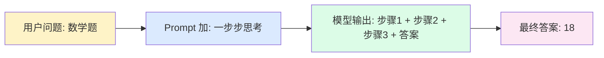
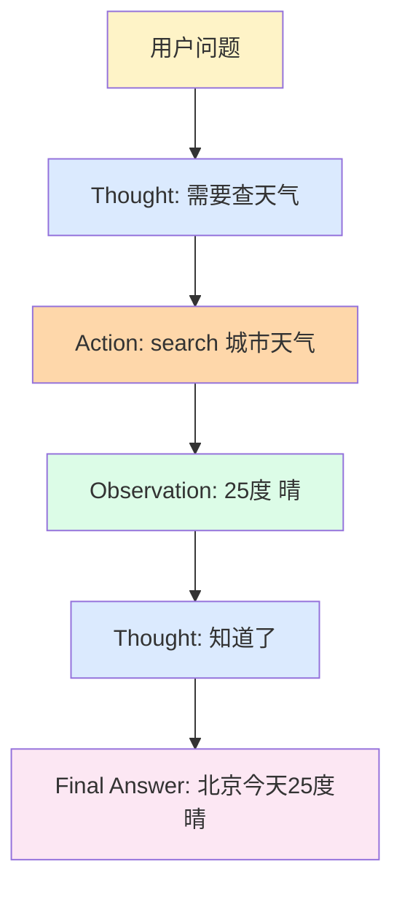
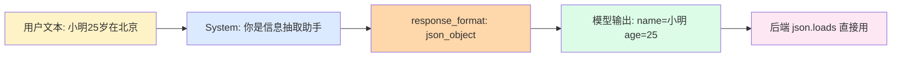

# Ch3 · 提示工程

> **TL;DR**：
> 1. 本章解决"模型回复不靠谱——瞎编格式、漏步骤、答错题"
> 2. 核心结论：CoT 让模型分步思考；ReAct 让模型"思考 + 行动"循环；JSON mode 强制结构输出
> 3. 读完能做：用 20 行代码让模型从"瞎猜"变"按步骤推理 + 按格式输出"

> 📌 **前置阅读**：[Ch2 LLM 基础](/getting-started/01-basics/02-llm-fundamentals) § 2.3 Temperature（提示工程对 Temperature 敏感）

---

## 1. 背景 & 问题

产品经理拿着客服 demo 找你："我让模型答'小明 5 个苹果，吃了 2 个，又买了 3 倍的数量，现在几个？'，它回'10'——正确答案是 18。客服问题要么一句话打发、要么跑题；输出时而 markdown、时而 `【】`、时而又给一段前言——后端解析全崩。"

你盯着终端上"模型为什么这么蠢"的报错，第一反应是"换更大的模型"。但 200 美元换回来的是更自信的错误。问题真出在模型身上吗？

其实出在 **Prompt**。大语言模型默认是"一题一答"的快速反应模式——你给它问题，它跳过中间过程直接给最终答案。闲聊够用，多步推理和结构化输出场景就翻车。本章解决三件事：

1. **怎么让模型分步推理**（CoT）
2. **怎么让模型在推理时调用外部工具**（ReAct）
3. **怎么让模型输出稳定成可解析的结构**（JSON mode）

这三件事有一个共同的名字——**提示工程（Prompt Engineering）**。

---

## 2. 核心概念

### 2.1 CoT（Chain of Thought）— 让模型分步思考

**核心思想**：在 Prompt 里加一句"一步步思考"，模型就会先输出推理步骤，最终答案准确率显著提升。

这背后不是模型"学会了"推理，而是 Prompt 改变了输出空间。模型本是基于前文预测下一个 token 的语言模型——当 Prompt 要求"先列条件、再列步骤、最后给答案"时，输出被强行约束为"推理 + 结论"两段式。中间的推理步骤充当"草稿纸"，让答案可回溯。



**图 2.1 CoT 工作流**：Prompt 是"助推器"，不是"开关"。模型本来就有推理能力，CoT 把它"逼"出来。

> 💡 **关键认知**：CoT 不是模型新能力，是 **Prompt 模板技巧**。零额外成本，不改代码，只改 Prompt。

经典的 CoT 模板可简单到一句"让我们一步步思考"（Let's think step by step）。但更稳妥的做法是给出明确的步骤框架——"先列已知条件、再列推理步骤、最后给答案"——这种**结构化 CoT** 比开放式 CoT 在生产环境更可靠（参见 Wei et al. 2022）。

CoT 适用边界清晰：**对需要多步推理的任务显著提升**（数学、逻辑、规划、复杂问答），**对简单任务反而拖慢**（"北京是哪个国家的首都"这种题，分步思考纯属浪费）。生产环境通常先用分类器判断"是否需要 CoT"，再决定 Prompt 模板。

### 2.2 ReAct — 让模型"思考 + 行动"循环

**核心思想**：CoT 解决了"分步思考"，但模型仍只能依赖训练时学到的知识——问"今天北京天气怎么样"它只能瞎猜。**ReAct（Reasoning + Acting）** 让模型在推理时能"暂停一下、调用工具、拿到结果再继续"。

ReAct 工作模式是循环：

1. **Thought**：模型先思考"我现在需要什么信息？"
2. **Action**：模型决定调用哪个工具、传什么参数
3. **Observation**：工具返回结果
4. 回到第 1 步，模型基于 Observation 再思考
5. 直到模型输出 **Final Answer**，循环结束



**图 2.2 ReAct 循环**：Thought + Action + Observation 三段式，直到 Final Answer。

> 💡 **关键认知**：ReAct = Reasoning + Acting。**模型自己决定"要不要查 / 调哪个 / 传什么"**——这是 Agent 思想雏形，Ch5、Ch6 都是这条路的延伸。

ReAct 论文（Yao et al. 2022）的关键贡献是把"思考"和"行动"统一到同一个 Prompt 模板里——模型输出 `Thought: ... Action: ... Observation: ...` 三段式，外部代码负责解析 Action、调用工具、把 Observation 塞回 Prompt。

ReAct 实现成本不高——30 行 Python 就能写一个最简单的循环（见 § 3）。但生产环境通常会引入"最大步数限制"、"工具调用失败重试"、"循环检测"等防御措施，避免陷入死循环。

### 2.3 稳定输出 — JSON mode 强制结构

**核心思想**：模型输出"是一段文本"给后端解析带来无穷麻烦——时而包在 markdown 里、时而带前言、时而字段缺失。**JSON mode** 直接让模型强制输出合法 JSON。

实现上，主流模型（OpenAI、Anthropic、智谱等）都提供 `response_format={"type": "json_object"}` 之类的参数。模型生成时只被允许从"合法 JSON token 序列"中采样，从源头杜绝"半句话夹在 JSON 里"。



**图 2.3 JSON mode 工作流**：从源头约束输出空间，后端不再需要正则清洗。

> ⚠️ **关键认知**：JSON mode **只保证"是合法 JSON"，不保证"是预期 schema"**。模型可能返回 `{"age": "25"}`（字符串而非数字）或 `{"name": "小明", "身高": 175}`（多字段）。强 schema 约束要靠 **Pydantic 校验 + Tool Calling**（Ch5 详述）。

稳定输出的另一层含义是"可重现"——同样 Prompt + Temperature=0 多次调用，结果高度一致。Ch2 § 2.3 提到 Temperature 是提示工程的"地基参数"——多步推理、结构化输出、Agent 决策都强烈建议 Temperature=0 或接近 0。

### 2.4 术语卡片

| 术语 | 一句话定义 | 适用场景 | 关键约束 |
|------|----------|---------|---------|
| **Zero-shot** | 不给示例直接问 | 简单问题、闲聊 | 模型已有能力即可 |
| **Few-shot** | Prompt 里塞 3-5 个示例 | 教模型新格式 | 示例要覆盖边界 |
| **CoT** | 加"一步步思考"触发分步输出 | 数学 / 逻辑 / 多步推理 | 步骤框架更稳 |
| **ReAct** | Thought + Action 循环 | 需要外部信息 | 必加最大步数 |
| **System Prompt** | 角色 / 风格 / 约束的高层指令 | 几乎所有场景 | 放 messages 第一条 |
| **JSON mode** | 强制输出合法 JSON | 结构化抽取下游 | 仍需 Pydantic |

---

## 3. 最小可运行示例

完整代码见 `examples/01-prompt-cot/`。下面展示三个最小片段。

### 3.1 CoT：让模型分步推理

```python
# examples/01-prompt-cot/py/cot.py
COT_PROMPT = """一步步思考下面问题：
{question}

要求：
1. 先列出已知条件
2. 再列出推理步骤
3. 最后给出答案
"""


def solve_with_cot(question: str) -> str:
    """用 CoT 提示让模型分步回答。"""
    return call_llm(COT_PROMPT.format(question=question))
```

关键看 Prompt 结构：**先讲规则、再列要求、最后用 `{question}` 占位**——这就是 CoT 的全部秘密。

### 3.2 ReAct：让模型"思考 + 行动"循环

```python
# examples/01-prompt-cot/py/react.py
REACT_PROMPT = """你是一个能使用工具的助手。可用工具：
- search(query): 搜索
- calc(expr): 计算

格式：每次先输出 Thought，再输出 Action：
Thought: <你的思考>
Action: <工具名>(<参数>)

或者当有答案时：
Thought: 我知道答案了
Final Answer: <答案>

问题：{question}
{history}
"""


def react_loop(question: str, tools: dict, max_steps: int = 5) -> str:
    """ReAct 循环：每步让模型决定 thought + action。"""
    history = ""
    for _ in range(max_steps):
        prompt = REACT_PROMPT.format(question=question, history=history)
        step = call_llm(prompt)
        history += f"\n{step}\n"
        if "Final Answer:" in step:
            return step.split("Final Answer:")[1].strip()
        m = re.search(r"Action:\s*(\w+)\(([^)]*)\)", step)
        if m:
            tool_name, arg = m.group(1), m.group(2).strip("'\"")
            if tool_name in tools:
                obs = tools[tool_name](arg)
                history += f"Observation: {obs}\n"
    return "未在限定步数内得到答案"
```

关键看三部分：**Prompt 模板定义协议**（Thought / Action / Final Answer）、**`max_steps` 是防御措施**、**正则解析 Action 后用 Python 函数执行**。

### 3.3 稳定输出：用 JSON mode 强制结构

```python
# examples/01-prompt-cot/py/stable_output.py
def extract_person(text: str) -> dict:
    """从文本中抽取人物信息，强制返回 JSON。"""
    response = client.chat.completions.create(
        model="gpt-4o-mini",
        messages=[
            {"role": "system", "content": "你是一个信息抽取助手。"},
            {"role": "user", "content": f"从下面文本抽取人物姓名和年龄：\n{text}"},
        ],
        response_format={"type": "json_object"},  # 关键：强制 JSON
    )
    return json.loads(response.choices[0].message.content or "{}")
```

关键看 `response_format={"type": "json_object"}`——它在模型输出空间层面做约束，从源头杜绝"半句话夹在 JSON 里"。再配合 `json.loads`，后端解析从"几十行正则"简化到一行。

---

## 4. 常见陷阱

### 陷阱 1：CoT 在简单问题上反而拖慢

**现象**：让模型回答"1+1=？"，它先列"已知条件：1 和 1"、再列"推理步骤：个位数相加"、最后给"答案：2"。一问一答用了 5 秒。

**原因**：CoT 是"强制推理"——无论题是否需要都要求输出推理步骤。"1+1"这种题，步骤是噪声。

**解法**：**按问题类型分流**。简单题用 Zero-shot，复杂题用 CoT。常见做法：先用小模型分类（"需要 CoT 吗？"），再决定 Prompt。**或用"Conditional CoT"**——Prompt 加"如果问题简单，直接给答案；多步推理才一步步思考"，让模型自己判断。

### 陷阱 2：ReAct 循环不收敛

**现象**：跑 ReAct 任务，模型陷入 `Thought: ... Action: search 同一关键词 ... Observation: ...` 的死循环，30 秒耗光 token。

**原因**：模型没学会"我已经知道答案了"。ReAct 的 Prompt 必须明确给出"何时停止"信号——通常是 `Final Answer: ...`。但模型有时"忘记"这个信号。

**解法**：三道防线。**Prompt 显式约束**——写"当你认为已有足够信息时，必须输出 Final Answer"。**代码层设最大步数**（`max_steps=5` 或 10）。**循环检测**——记录最近 N 次 Action，重复就强制中断。

### 陷阱 3：JSON mode 不保证字段类型

**现象**：用 JSON mode 抽 "小明今年 25 岁"，模型返回 `{"name": "小明", "age": "25"}`——`age` 是字符串不是数字。后端 `result["age"] + 1` 直接 TypeError。

**原因**：JSON mode 只保证"是合法 JSON"，不保证"符合预期 schema"。

**解法**：**永远不要相信模型返回的数据结构**。Python 用 Pydantic、TypeScript 用 Zod 做强校验：

```python
from pydantic import BaseModel, ValidationError

class Person(BaseModel):
    name: str
    age: int

try:
    person = Person.model_validate(extract_person("小明 25 岁"))
except ValidationError:
    # fallback：重试 / 默认值 / 上报
    ...
```

更强约束用 Ch5 的 **Tool Calling**——连字段类型都受约束。

---

## 5. 本章速查表

| 技术 | 适用场景 | 关键 Prompt 模板 | 注意事项 |
|------|---------|----------------|---------|
| **Zero-shot** | 模型已掌握的任务 | `问题：{q}` | 简单任务首选 |
| **Few-shot** | 教模型新格式 | `示例1：... 示例2：... 现在：{q}` | 示例要变量化 |
| **CoT** | 数学 / 逻辑 / 多步推理 | `一步步思考：先列条件 → 列步骤 → 给答案` | 简单题别用 |
| **ReAct** | 需要查外部信息 | `Thought / Action / Final Answer` 三段式 | 必加 max_steps |
| **JSON mode** | 结构化抽取下游 | `response_format={"type": "json_object"}` | 仍需 Pydantic |
| **System Prompt** | 所有场景的"元规则" | `你是 X，遵守 Y，输出 Z` | 放 messages 第一条 |

**验证方法**：用 CoT 答对 3 步数学题；用 ReAct 跑 `react_loop` 不超 max_steps；用 JSON mode 跑 `extract_person` 100 次全部合法 JSON。✓

---

## 6. 下章预告 & 关键术语桥接

> 🔜 **下章 [Ch4 RAG](/getting-started/02-core/04-rag)**

本章的三个核心概念会在 Ch4 被展开：

- **"ReAct 调工具"** → Ch4 解释 RAG 是一种**特殊工具**——检索文档。Ch4 演示"用 ReAct 思路让模型决定要不要查 / 查哪段 / 怎么用"
- **"JSON mode 强制结构"** → Ch4 演示 RAG pipeline 的"检索结果怎么结构化"——5 段文档怎么拼到 Prompt、怎么用 JSON 表达"相关性得分 + 文档片段 + 来源"
- **"Prompt 模板"** → Ch4 解释 RAG 的 Prompt 模板：**检索文档 + 用户问题 + 引用规则**三段式，这是 RAG 系统准确率的最大杠杆
- **"CoT 分步推理"** → Ch4 演示 RAG 场景的 CoT——"先判断相关文档 → 再提取关键事实 → 最后回答"

> 💡 **学习提示**：Ch3 是 Ch4（检索）/ Ch5（工具调用）/ Ch6（Agent 架构）的**共同前置**。掌握 CoT 和 ReAct 的"Prompt 模板 + 协议解析"思路后，你会发现 Ch4 的"检索 → 推理"和 Ch5 的"工具调用"本质都是这套思路的延伸——只是把"用正则解析 Action"换成了"用框架解析 Function Call"。

---

**本章练习**：

1. 跑 `cot.py`，对比"加 CoT"和"不加 CoT"的输出
2. 跑 `react.py`，把 `max_steps` 设成 2，观察 ReAct 在步数不够时的行为
3. 跑 `stable_output.py`，给含多人的文本（"小明 25 岁，小红 30 岁"），观察 JSON mode 怎么处理
4. 选做题：把 § 4 陷阱 3 的 Pydantic 校验加到 `stable_output.py` 里，验证"字段类型错"能被 catch
