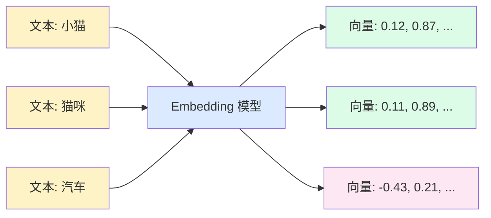
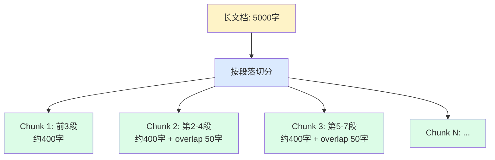
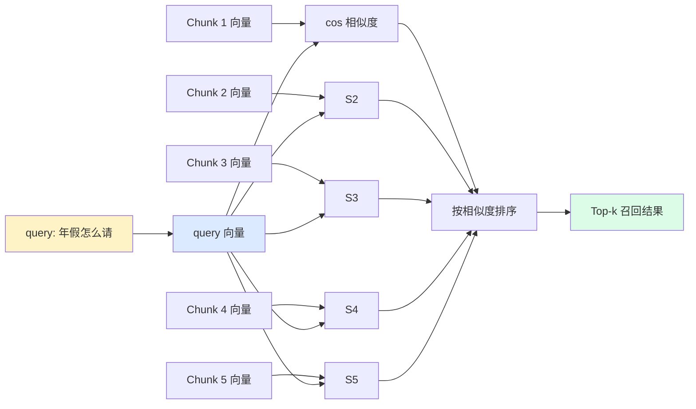
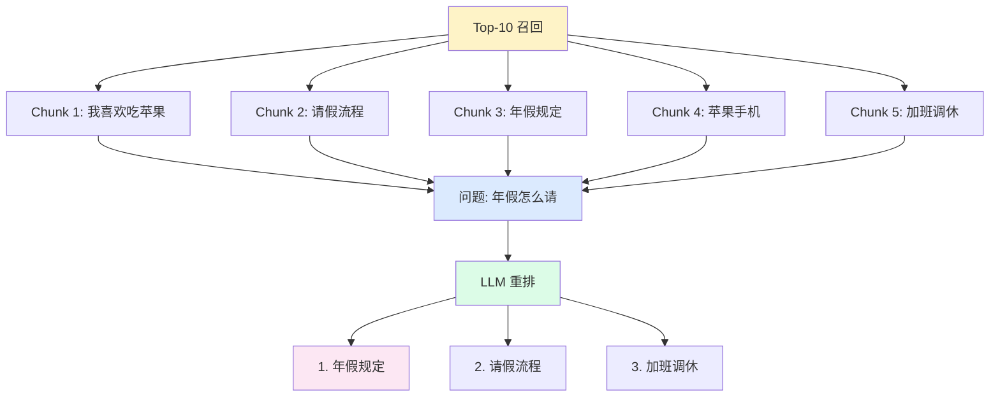

# Ch4 · RAG 检索增强

> **TL;DR**：
> 1. 本章解决"模型不知道公司内部知识"——给模型"开卷考试"
> 2. 核心结论：RAG = 检索相关文档 + 让模型基于检索结果回答。4 个核心环节：Embedding（向量化）/ Chunk（切片）/ 召回（向量相似度）/ Rerank（精排）
> 3. 读完能用 30 行代码搭一个 RAG pipeline，让模型基于自有文档回答问题

> 📌 **前置阅读**：[Ch3 提示工程](/getting-started/02-core/03-prompt-engineering) § 2.3 稳定输出（JSON mode）、§ 3.2 ReAct（"思考+行动"循环）

---

## 1. 背景 & 问题

老板把你叫进会议室："咱们 HR 系统里 200 篇制度文档，新员工天天问'年假怎么请''加班费怎么算'，客服接不住。你搞个 AI 问答 Bot。"

你打开 ChatGPT 试——"我们公司年假怎么请？"它编："请提前 3 天向直属上级提交申请……"但跟你司《员工手册 v3.2》第 4.2 条完全对不上。这就是大模型的"知识截止"和"幻觉"——**没有你司的具体制度**，不知道的也编一个最像的。

解法有两条：**Fine-tuning**（用公司数据再训一遍）和 **RAG**（检索增强生成）。前者贵、慢、改一次重训几天；后者轻、快、文档更新即生效。RAG 把"开卷考试"工程化——**先从公司文档里找相关段落，再让模型"看着资料"回答**。本章讲 RAG。

---

## 2. 核心概念

RAG 本质是"搜索 + 生成"。拆开看，4 个核心环节：Embedding（把文本变向量）/ Chunk（把长文档切短）/ 召回（向量相似度找相关）/ Rerank（精排）。理解了 4 个环节，就理解了 RAG。

### 2.1 Embedding — 把文本变成坐标

**核心思想**：Embedding 模型把一段文本映射成固定维度的浮点数向量。语义相近的文本，向量在空间里也相近——这是用数学算"语义相似度"的前提。训完后它"理解"了语义关系：例 `"小猫"` 和 `"猫咪"` 向量几乎重合，`"小猫"` 和 `"汽车"` 距离很远。主流模型：`text-embedding-3-small`（1536 维，便宜）、`text-embedding-3-large`（3072 维，精度高）、`BGE`/`M3E`（开源）。



**图 2.1 Embedding 工作流**：文本 → Embedding 模型 → 1536 维向量。"小猫"和"猫咪"向量接近，"小猫"和"汽车"距离远。

> 💡 **关键认知**：Embedding 把"语义"压缩成"坐标"，让"语义相似度"变成"向量距离"。

### 2.2 Chunk — 怎么切文档

**核心思想**：Embedding 模型有输入长度限制（OpenAI 8191 tokens），更关键的是**整篇长文档平均成一个向量会丢失细节**。所以要把长文档切成"小段"（chunk），每段单独做 embedding。

切多长？经验值 **300-500 字 / chunk**，**overlap 50-100 字**——避免切在关键句中间。



**图 2.2 Chunk 切片**：长文档 → 段落切分 → chunks 列表，overlap 防止切碎语义。

> ⚠️ **关键认知**：**Chunk 太长 → 检索精度低**（向量被"平均"）；**太短 → 语义不全**。300-500 字是甜点区。

### 2.3 召回 — 向量相似度

**核心思想**：用户提问"年假怎么请"——把问题也做 embedding，然后在向量空间里找"距离最近"的 top-k 个 chunk。这就是**召回**。

"距离"用**余弦相似度**衡量——值域 [-1, 1]，越接近 1 越相似。代表"方向一致"而非"距离远近"。



**图 2.3 召回流程**：query 向量化 → 与所有 chunks 算余弦相似度 → 排序 → 取 top-k。

> 💡 **关键认知**：召回是"粗筛"——百万 chunk 里快速挑出 5-10 个候选。**召回只追求"不漏"（recall），不追求"不错"（precision）**——精排交给 Rerank。

百万级数据召回**别用 Python 循环算余弦**——用专用向量数据库（Chroma / Milvus / Pinecone / pgvector），HNSW、IVF 等近似最近邻算法。

### 2.4 Rerank — 用 LLM 精排

**核心思想**：向量相似度是"几何距离"，不是"语义相关"——"我喜欢吃苹果"和"苹果公司发布新手机"方向接近（都含"苹果"），但前者是水果、后者是公司。

**Rerank** 让 LLM 对 top-k 候选"再判一次"，按"是否真的回答了用户问题"重排序，识别"假阳性"。



**图 2.4 Rerank 工作流**：top-k 召回 → LLM 用语义判断重排 → 过滤假阳性 → top-3 喂给生成模型。

> ⚠️ **关键认知**：**Rerank 不是必须**。Top-k=5 时已够准，Rerank 增加延迟但提升微弱。Top-k>20 时才显出价值——**小 top-k 跳过，大 top-k 才需要**。生产用 **Cross-Encoder Rerank 模型**（BGE Reranker / Cohere Rerank）替代 LLM 精排，快 10 倍、质量更稳。

### 2.5 术语卡片

| 术语 | 一句话定义 | 关键约束 |
|------|----------|---------|
| **Embedding** | 把文本变成固定维度向量 | 维度由模型决定 |
| **Cosine Similarity** | 衡量两向量方向一致性 | 值域 [-1, 1] |
| **Top-k** | 召回阶段取最相关的 k 个 | k=5-10 是甜点区 |
| **Chunk Size** | 单个切片的字符数 | 300-500 字 |
| **Rerank** | 用 LLM/精排模型重排候选 | k<=5 跳过 / k>20 必加 |

---

## 3. 最小可运行示例

完整代码见 `examples/02-rag-pipeline/`。下面把 5 个文件串成"切片 → embedding → 召回 → rerank → 生成"5 步。

### 3.1 切片：长文档 → chunks

```python
# examples/02-rag-pipeline/py/chunk.py
def chunk_by_paragraph(text: str, max_chars: int = 500) -> list[str]:
    """按段落切片。"""
    paragraphs = text.split("\n\n")
    chunks: list[str] = []
    current = ""
    for p in paragraphs:
        if len(current) + len(p) > max_chars and current:
            chunks.append(current.strip())
            current = p
        else:
            current += "\n\n" + p
    if current:
        chunks.append(current.strip())
    return chunks
```

**关键看**：`max_chars=500` 是经验阈值；按 `\n\n`（段落）切分。

### 3.2 Embedding & 召回

```python
# py/embed.py
def embed(text):
    r = client.embeddings.create(model="text-embedding-3-small", input=text)
    return r.data[0].embedding

# py/retrieve.py
def cosine_similarity(a, b):
    return float(np.dot(a, b) / (np.linalg.norm(a) * np.linalg.norm(b)))

def retrieve(query, chunks, k=3):
    qv = embed(query)
    scored = sorted([(c, cosine_similarity(qv, embed(c))) for c in chunks],
                    key=lambda x: x[1], reverse=True)
    return scored[:k]
```

**关键看**：`np.dot / np.linalg.norm` 算的就是余弦相似度。**百万级数据用向量数据库**。

### 3.3 Rerank & 完整 pipeline

```python
# py/rerank.py
def rerank(query, candidates):
    numbered = "\n".join(f"[{i}] {c[:200]}" for i, c in enumerate(candidates))
    r = client.chat.completions.create(model="gpt-4o-mini",
        messages=[{"role":"user","content":
            f"问题：{query}\n\n候选：\n{numbered}\n\n按相关度从高到低输出编号：3,1,2"}])
    order = [int(x) for x in (r.choices[0].message.content or "").split(",")]
    return [candidates[i] for i in order]

# py/pipeline.py
def rag_answer(question, document):
    """5 步：切片 → 召回 → 精排 → 取 top-3 → LLM 回答。"""
    chunks = chunk_by_paragraph(document)             # 1
    top = retrieve(question, chunks, k=5)              # 2
    reranked = rerank(question, [c for c, _ in top])   # 3
    ctx = "\n\n".join(reranked[:3])                    # 4
    r = client.chat.completions.create(model="gpt-4o-mini",
        messages=[{"role":"user","content":
            f"参考资料：\n{ctx}\n\n问题：{question}\n\n基于参考资料回答，不要编造。"}])  # 5
    return r.choices[0].message.content or ""
```

**关键看 Prompt 模板**：**资料 + 问题 + "不要编造"**——减少幻觉的关键。

---

## 4. 常见陷阱

### 陷阱 1：Chunk 切太大，检索不到重点

**现象**：1000 字一个 chunk，问"年假怎么请"命中到 chunk，但 chunk 里 80% 是"病假""婚假""事假"——年假只占 2 句。模型把病假流程也讲了。

**原因**：Embedding 把整段平均成一个向量，**1000 字的细节被"抹平"**。

**解法**：`chunk_size=300-500` 字、`overlap=50`；进阶按 Markdown 标题先切大块（如"第 4 章 年假"），再按段落切小块。

### 陷阱 2：召回只看相似度不看 metadata

**现象**：问"2025 年年假政策"，命中到 2022 年旧文档——文字几乎一样，相似度极高。员工按错政策请假被 HR 打回。

**原因**：召回只算**向量相似度**，没看**时间/部门/版本**。

**解法**：**召回时加 metadata 过滤**：

```python
results = vector_db.search(
    query=query_vec,
    filter={"year": {"$gte": 2024}, "department": "HR"},
    k=10,
)
```

文档入库务必带上 `source / time / version` 等元数据。

### 陷阱 3：Rerank 反而拖慢且没明显提升

**现象**：top-10 召回后用 LLM 重排，**延迟从 1.2s 翻到 2.8s，准确率只提升 1%**。

**原因**：Top-5 召回里 90% 已相关，重排边际收益小，LLM 调用成本（延迟 × 2、token 费 × 1）是实打实的。

**解法**：**按 top-k 决定要不要 Rerank**——`k <= 5` 跳过；`5 < k <= 20` 可选；`k > 20` 必加。生产环境**别用 LLM 做 Rerank**，用 Cross-Encoder（BGE Reranker / Cohere Rerank），快 10 倍。

---

## 5. 本章速查表

| 环节 | 关键点 | 推荐参数 | 替代方案 |
|------|--------|---------|---------|
| **Chunk** | 段落切分 + overlap | 300-500 字 / overlap 50 | 按 Markdown 标题切大块 |
| **Embedding** | OpenAI text-embedding-3 | small(1536) / large(3072) | BGE / M3E（本地） |
| **向量库** | 百万级用专用 DB | Chroma（入门）/ Milvus（生产） | pgvector（已有 Postgres） |
| **召回** | cos 相似度 top-k | k=5-10 | 召回 k 大 + 精排筛 |
| **Rerank** | LLM 或 Cross-Encoder | k<=5 跳过 / k>20 必加 | BGE Reranker（推荐） |
| **生成 Prompt** | 资料 + 问题 + 约束 | "不要编造"必加 | JSON mode 强 schema |
| **Temperature** | RAG 场景必须确定性 | temperature=0 | — |

**验证方法**：用 1 个 1000 字文档 + 5 个问题，5 个都能基于文档回答；问 1 个文档**不包含**的问题，模型明确说"资料中未提及"。

---

## 6. 下章预告 & 关键术语桥接

> 🔜 **下章 [Ch5 工具调用](/getting-started/02-core/05-tool-calling)**

本章的 4 个核心概念会在 Ch5 / Ch6 被展开：

- **"召回 top-k"** → Ch5 解释 **Function Calling**：让模型自己决定"要不要查 / 调哪个函数 / 传什么参数"。RAG 是特殊工具——`retrieve(query)` 返回 top-k。
- **"Rerank"** → Ch5 演示 **MCP 协议**：让不同 LLM 都能调统一工具。"rerank 函数"在 Ch5 会被注册成"标准工具"。
- **"RAG pipeline"** → Ch6 演示 **Agent 架构**：RAG 是 Agent 的**可选工具**——Agent 决定"问政策 → 调 RAG；问操作 → 调 API"。
- **"Chunk + Embedding 离线索引"** → 进阶篇讨论**向量数据库选型**与**多模态 Embedding**。

> 💡 **学习提示**：Ch4 是 Ch5 / Ch6 的**核心前置**。下章你会发现"工具调用"就是把"用 LLM 排序"换成了"用框架解析 Function Call"——同一套思路的工程化升级。

---

**本章练习**：

1. 跑 `pipeline.py`，问"什么是 RAG？"，观察 5 步链路
2. 把 `chunk.py` 的 `max_chars` 改成 50 vs 500，对比召回质量
3. 把 `retrieve.py` 的 `k` 改成 1 vs 10，对比 top-1 vs top-10
4. 选做题：去掉"不要编造"约束，问文档不包含的问题，观察幻觉
