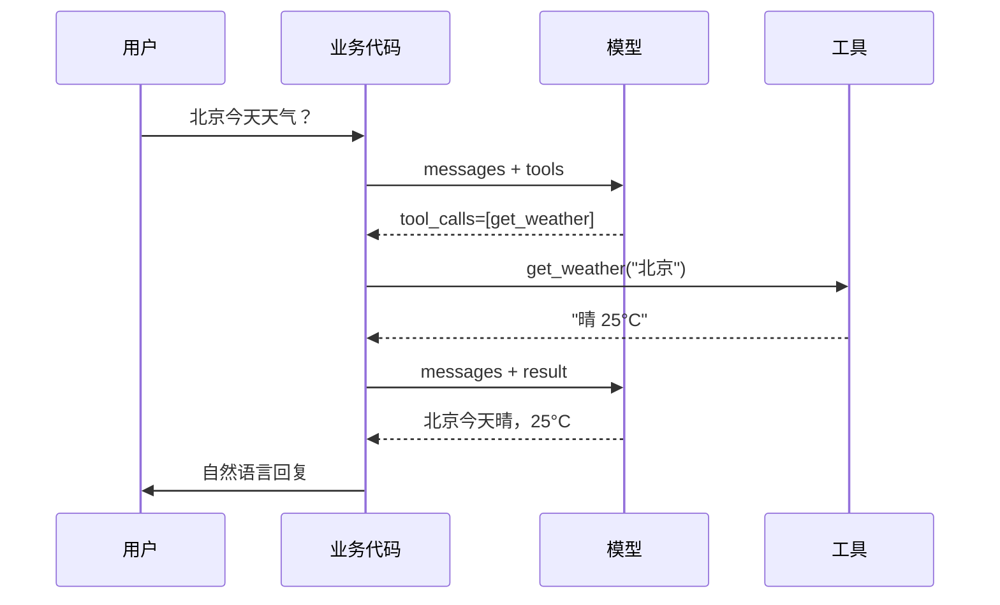
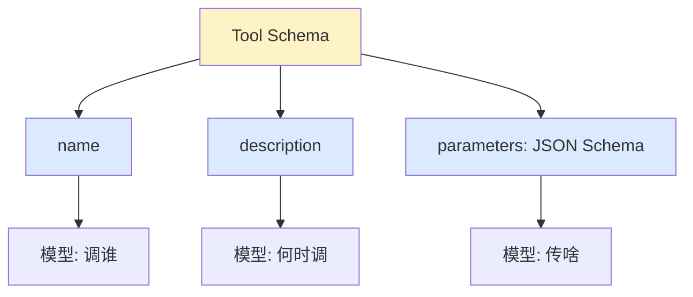
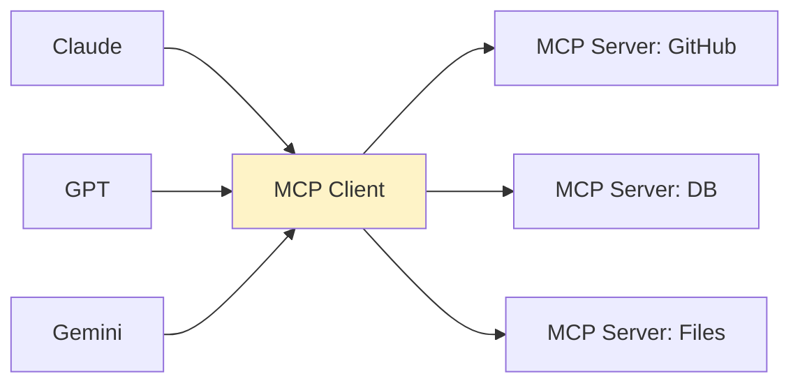

# Ch5 · 工具调用

> **TL;DR**：
> 1. 本章解决"模型能回答但不能做事"——让模型自己决定要不要调工具、调哪个、传什么参数
> 2. 核心结论：**Function Calling** 把 Ch3 ReAct 的 Prompt 协议"工程化"；**MCP** 统一不同 LLM 调用工具的接口；**Tool Schema** 是模型看得懂的工具说明书
> 3. 读完能做：让 Agent 调用真实工具，并解释 Function Calling 取代 ReAct 正则解析的原因

> 📌 **前置阅读**：[Ch3 提示工程](/getting-started/02-core/03-prompt-engineering) § 2.2 ReAct

---

## 1. 背景 & 问题

产品经理拿着 Ch3 的 ReAct demo 找你："我让模型查'北京天气'，回'Final Answer: 北京 25 度晴'，前端怎么展示？正则解析 `Final Answer:` 后面那段，遇到模型多说一句'希望对你有帮助'就崩。**有没有办法让模型直接给我结构化结果？**"

Ch3 ReAct 是"Prompt 协议 + 正则切字符串"——脆弱、依赖模型遵循格式。**Function Calling 是模型原生支持的结构化工具调用**——业务代码只需解析 `tool_calls` 字段，**无需正则**。本章讲三件事：**Function Calling 流程**、**Tool Schema**、**MCP 协议**。

---

## 2. 核心概念

工具调用 = 模型按 schema 调工具 + 业务执行 + 结果喂回。

### 2.1 Function Calling 流程

模型看到 `tools` 字段会插入特殊 token 表示"我要调 X、参数 Y"——**不把调用写进自然语言回复**。业务代码拿到结构化 `tool_calls` 数组，无需正则解析。



**图 2.1 Function Calling 流程**：4 步闭环。

> 💡 **关键认知**：Function Calling = **结构化的 ReAct**——后者"Prompt 协议 + 正则解析"，前者"模型原生协议 + 框架解析"，更准更稳。

### 2.2 Tool Schema

Tool Schema 是工具说明书——用 JSON Schema 描述工具。**写得糊，模型就瞎调**。



**图 2.2 Tool Schema 结构**：name + description + parameters。缺一，模型就懵。

> ⚠️ **关键认知**：**description 是模型选工具的唯一线索**，必须**互斥且具体**。

### 2.3 MCP（Model Context Protocol）

每个 LLM 厂商都有自己的 tools 字段格式——同一个工具要为 Claude、GPT、Gemini 各写一份。**MCP 是 Anthropic 2024 年提出的统一协议**——任何支持 MCP 的 LLM 都能调用任何 MCP server 上的工具，像 USB-C。



**图 2.3 MCP 协议架构**：MCP Client ↔ MCP Server。

> 💡 **关键认知**：**MCP 是 Function Calling 的标准化**——主流 LLM/IDE（Claude Desktop、Cursor）都支持。

MCP 三大角色：**MCP Host** → **MCP Client** → **MCP Server**（暴露 `list_tools / call_tool`）。

---

## 3. 最小可运行示例

完整代码见 `examples/03-tool-calling/`。

### 3.1 OpenAI Function Calling

```python
# py/function_calling.py
import json
from openai import OpenAI

client = OpenAI()
TOOLS = [{"type": "function", "function": {
    "name": "get_weather",
    "description": "查询某城市实时天气",  # 关键：具体且互斥
    "parameters": {"type": "object", "properties": {"city": {"type": "string"}}, "required": ["city"]}
}}]


def chat_with_tools(user_message: str) -> str:
    messages = [{"role": "user", "content": user_message}]
    r = client.chat.completions.create(model="gpt-4o-mini", messages=messages, tools=TOOLS)
    msg = r.choices[0].message
    if msg.tool_calls:                              # 模型决定调工具
        for tc in msg.tool_calls:
            args = json.loads(tc.function.arguments)
            result = get_weather(**args)            # 业务执行
            messages.append(msg)                    # 把 tool_call 喂回
            messages.append({"role": "tool", "tool_call_id": tc.id, "content": result})
        r = client.chat.completions.create(model="gpt-4o-mini", messages=messages)
    return r.choices[0].message.content or ""
```

**关键看 4 件事**：`tools` 声明 / `msg.tool_calls` 判断 / `tool_call_id` 关联 / 二次调用让模型组织自然语言。`get_weather` 业务函数见完整版文件。

### 3.2 MCP Server

```python
# py/mcp_server.py
from mcp.server import Server
from mcp.types import Tool

server = Server("demo-server")


@server.list_tools()
async def list_tools() -> list[Tool]:
    return [Tool(name="add", description="两数相加",
        inputSchema={"type": "object",
                     "properties": {"a": {"type": "integer"}, "b": {"type": "integer"}},
                     "required": ["a", "b"]})]


@server.call_tool()
async def call_tool(name: str, arguments: dict) -> list:
    if name == "add":
        return [{"type": "text", "text": str(arguments["a"] + arguments["b"])}]
    raise ValueError(f"Unknown tool: {name}")
```

**关键看 2 个装饰器**：`@server.list_tools()` 声明 / `@server.call_tool()` 执行。`inputSchema` 与 OpenAI `parameters` 字段名不同，本质都是 JSON Schema。

---

## 4. 常见陷阱

### 陷阱 1：Schema description 写得太糊，模型永远只调一个

**现象**：定义 5 个 tool（`get_weather` / `get_traffic` / `get_news` / `get_stock` / `get_route`），模型收到"今天怎么样"这类模糊问题时，**永远只调 `get_weather`**，其他 4 个命中率近 0。

**原因**：5 个 description 都写"查询相关信息"——**只能靠 description 判断何时调哪个**。

**解法**：每个 description 至少 1 句**具体 + 互斥**的说明。差：`"查询天气信息"`；好：`"查询某城市实时天气（温度、湿度、PM2.5），仅限今天。历史天气用 get_weather_history"`。

### 陷阱 2：参数类型不严格，模型传 string 数字

**现象**：`get_user_age(user_id: int)` 期望整数 ID，模型传 `user_id: "12345"`（带引号字符串）。`int("12345")` 还能转；但 `query_db("12345")` 直接 SQL 语法错。

**原因**：JSON Schema 只声明 `type: "string"`，模型就传字符串。

**解法**：**每个参数必须严格声明 type + enum**——`user_id: {"type": "integer"}` / `currency: {"type": "string", "enum": ["USD","CNY","EUR"]}`。**业务侧 Pydantic / Zod 兜底**。

### 陷阱 3：忽略权限边界，Agent 真把账号删了

**现象**：用户问"帮我把账号注销了"，Agent 二话不说调 `delete_account(user_id)`——**真删了**。

**原因**：所有 tool 暴露给模型，无白名单/黑名单/二次确认。模型不区分"读"和"写"。

**解法**：**分层工具权限**——`safe_call` 对 `DESTRUCTIVE_TOOLS` 做二次确认。Ch6 会做成"工具白名单 + 风险评估模块"。

---

## 5. 本章速查表

| 概念 | 一句话定义 | 关键点 / 速记 |
|------|----------|---------|
| **Function Calling** | 模型原生支持的结构化工具调用 | "ReAct 的工程版" |
| **Tool Schema** | JSON Schema 描述工具 | 模型"读懂"的工具书 |
| **tool_calls** | 模型响应里的结构化调用数组 | 取代正则解析 |
| **tool_choice** | 业务控制模型是否必调 | `auto / required / none` |
| **MCP** | 跨 LLM 厂商统一工具协议 | "USB-C for AI" |
| **description** | 模型选工具的唯一线索 | 写具体 + 互斥 |
| **权限分层** | 只读放行 / 写入确认 / 破坏审批 | 别让 Agent 删账号 |

---

## 6. 下章预告 & 关键术语桥接

> 🔜 **下章 [Ch6 Agent 架构](/getting-started/02-core/06-agent-architecture)**

本章的三个核心概念会在 Ch6 被收口：

- **"Function Calling 调单个工具"** → Ch6 演示 **Agent 调多个工具的协调**（5 个 tool_calls 并行 / 编排 / 容错）
- **"MCP 统一工具接口"** → Ch6 演示 **Agent 4 大能力闭环**（规划-记忆-执行-反思）——MCP 是"执行"层
- **"工具权限边界"** → Ch6 演示 **记忆模块**管理权限与历史
- **"ReAct 思维链"** → Ch6 用 Function Calling 实现"Plan-and-Execute"——模型先输出计划，再按计划调工具

> 💡 **学习提示**：Ch5 是 Ch6 的**核心前置**。工具层 = Function Calling + MCP。
