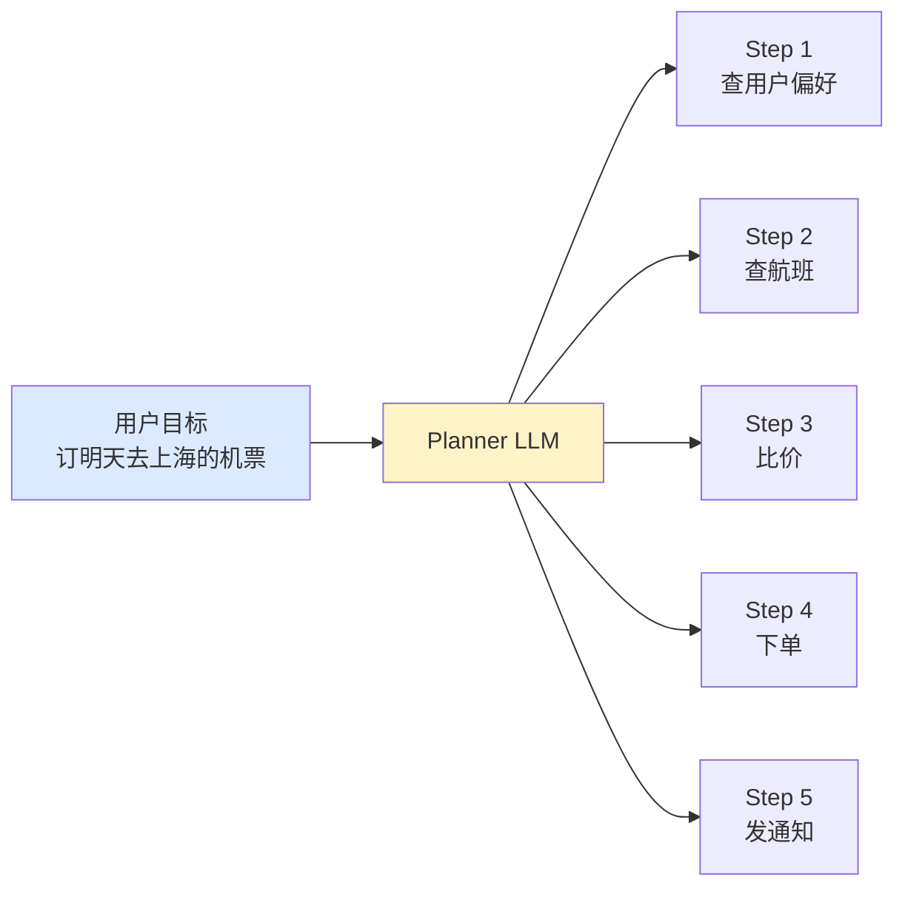
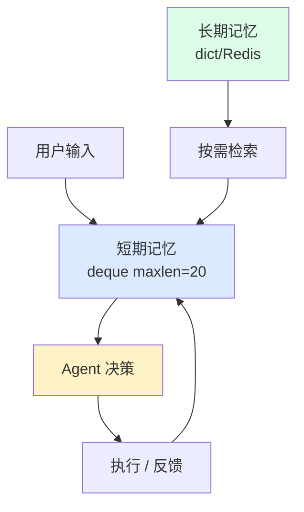
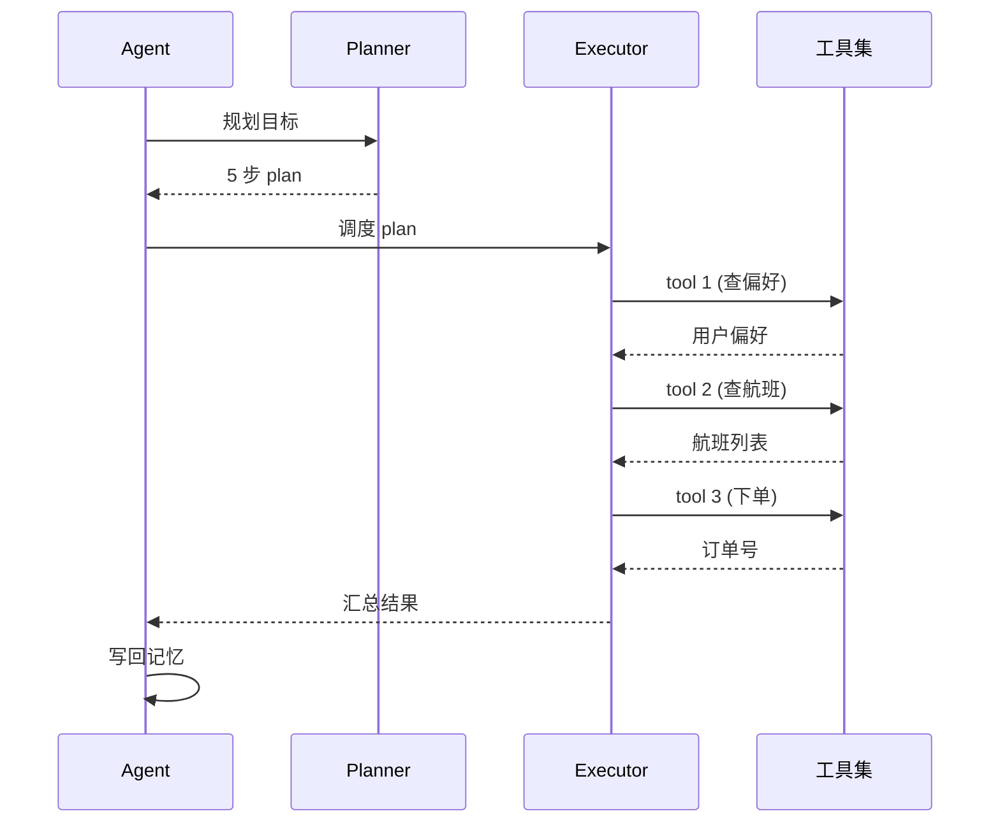
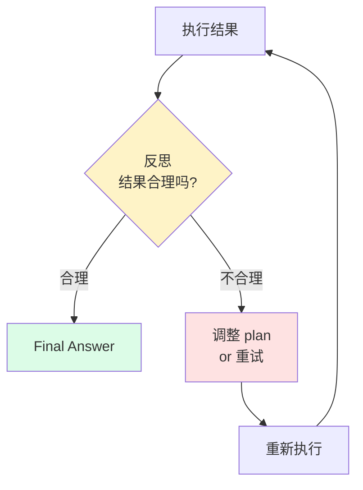

# Ch6 · Agent 架构

> **TL;DR**：
> 1. 本章解决"前面 3 章的能力怎么拼成一个能跑的产品"——给 Agent 一个清晰架构
> 2. 核心结论：完整 Agent = **规划（拆任务）+ 记忆（保留上下文）+ 执行（调工具）+ 反思（重试/调整）**。4 个能力闭环
> 3. 读完能做：用 50 行代码搭一个能自动"订机票 + 改签"的 Agent，把 Ch3-Ch5 的能力收口

> 📌 **前置阅读**：[Ch3 提示工程](/getting-started/02-core/03-prompt-engineering) + [Ch4 RAG](/getting-started/02-core/04-rag) + [Ch5 工具调用](/getting-started/02-core/05-tool-calling)。本章是**收口章**

---

## 1. 背景 & 问题

产品经理在评审会上打开飞书文档，把 Ch3、Ch4、Ch5 的 demo 排成一行："咱们现在有 ReAct、CoT、RAG、Function Calling、MCP。**能不能把这些拼成一个能订机票 + 自动改签的 Agent？** 用户说'帮我把明天去上海的航班改到下午 3 点'，Agent 自己查订单、比价、调用改签 API、改完发短信通知。"

你心里算了一笔账：用户一句话背后至少有 5 步——查订单、调航班 API、对比价格、调改签 API、发通知。**如果模型只会"想一句、答一句"，中间任何一步断了就崩**。比如"改到下午 3 点"只改了日期、改签接口返回"余额不足"被原样甩回、改签成功却忘了发通知——这些都是**单步 LLM 调用解决不了**的问题。要让 Agent 能处理 5 步以上、跨多个工具、有上下文状态、能从失败中恢复的任务，必须引入**架构**——把"模型调用"变成"Agent 循环"。

那么，**一个完整的 Agent 应该长什么样？**

业界经过几年实践，给出了清晰的答案：**规划（Planning）+ 记忆（Memory）+ 执行（Execution）+ 反思（Reflection）**。4 个能力首尾相连，缺一不可：

- 没有规划——只能处理单步任务，复杂目标拆不开
- 没有记忆——处理到第 3 步忘了第 1 步，跨工具状态全丢
- 没有执行——会想不会做，是"嘴炮 Agent"
- 没有反思——错了不重试，陷入同一个错误循环

本章围绕这 4 个能力展开，并把它们拼成**可运行的 50 行 Agent**。读完你会理解：OpenAI Operator、Anthropic Computer Use、Manus 等产品看起来"很神奇"，本质都是这套 4 能力闭环的工程化封装。

---

## 2. 核心概念

### 2.1 规划（Planning）— 把目标拆成步骤

**规划 = LLM 把模糊目标变成可执行步骤**。

产品说"帮我订明天去上海的机票"——这是个**模糊目标**。要让 Agent 真正做事，必须先把它拆成 3-5 步：查偏好 → 查航班 → 比价 → 下单 → 发通知。LLM 做规划建立在 Ch3 学的**思维链（CoT）+ ReAct** 之上——把"我应该怎么想"显式写在 prompt 里。

```text
你是一个任务规划助手。把下面用户目标拆成 3-5 个步骤，每步用 JSON 描述：
{"step": 1, "action": "做什么", "tool": "调哪个工具"}

用户目标：{goal}
```

**关键设计**：规划必须是**显式的**（可解释、可调试），而不是模型在脑内"自动规划"。这样规划步骤就是 Agent 后续**可重放、可拦截、可修改**的状态。



**图 2.1 规划流程**：把模糊目标拆成有序步骤。

> 💡 **关键认知**：**规划 = LLM 一次调用 + JSON 输出**。不要试图让模型在 1 步规划里"想得太深"——粗规划 + 反思比"一次完美规划"更鲁棒。

### 2.2 记忆（Memory）— 短期 vs 长期

**记忆 = 解决"上下文保留"问题**。

Agent 在执行 5 步任务时，每一步都需要知道：

- 用户最初的目标是什么（**目标记忆**）
- 前几步执行了什么、结果如何（**对话历史**）
- 这个用户的偏好（舱位、支付方式）（**用户偏好**）
- 过去类似的订单是怎么处理的（**历史经验**）

这些信息量很大，全塞进 prompt 会**撑爆 context window**（GPT-4o 128k、Claude 3.5 200k 都有限）。所以实践中**必须分短期 vs 长期**：

| 维度 | 短期记忆 | 长期记忆 |
|------|---------|---------|
| **存储位置** | context window（直接给 LLM 看） | 外部存储（DB / Redis / 字典） |
| **保留范围** | 当前对话（最近 N 轮） | 跨会话、跨用户 |
| **典型数据** | 当前任务的执行历史、模型思考链 | 用户偏好、历史订单、领域知识 |
| **检索方式** | 全量（按时间序截断） | 按需（RAG / SQL / 向量检索） |
| **失效时机** | 会话结束 | 显式删除或定期压缩 |



**图 2.2 双层记忆**：短期 deque + 长期 dict + 按需检索。

> ⚠️ **关键认知**：**短期记忆一定要"按时间截断"**，否则 100 轮对话后 prompt 长度爆炸。**长期记忆一定要"按需检索"**，全量塞进去同样爆。两者结合才是工业级做法。

### 2.3 执行（Execution）— 工具调用

**执行 = Ch5 Function Calling 的应用**。

模型根据规划结果，调用 `get_weather` / `query_database` / `send_sms` 等工具。Agent 架构下有 3 个新特性：**批量执行**（`asyncio.gather` 并行 N 个 tool）/**容错执行**（try/except + 重试）/**结果回流**（写回记忆，否则后续步骤"失忆"）。



**图 2.3 执行序列**：plan 驱动工具调用，结果回流到 Agent。

> 💡 **关键认知**：**执行 = "Ch5 Function Calling + 调度循环"**。单 tool 调用你已经会了，Agent 是把 N 个 tool 调用**串/并行**起来。

### 2.4 反思（Reflection）— 重试与调整

**反思 = 让 Agent 自己 review 自己的输出，不行就再来**。

这是 Agent 和"普通 LLM 应用"最本质的区别。LLM 一次性输出，错了就错了。Agent 输出后会**自检**：

- "我刚才调的工具返回的是错误码，这个结果不对"
- "用户说改到下午 3 点，但我实际改到的是下午 5 点"
- "下单成功了，但没发通知，任务还没完成"



**图 2.4 反思循环**：执行 → 反思 → 调整 → 重试。

反思的主流方式：**LLM-as-judge**（灵活但贵）/ **规则断言**（快但繁琐）/ **混合**（推荐——余额不足等硬错误用规则，订单完整性等软评估用 LLM）。生产中通常 `max_retries=3`，第 3 次还失败就降级到"请人工确认"。

注意箭头方向：反思失败时**回到规划**（不是回到执行），因为失败往往意味着**计划本身有问题**——比如"查航班"返回空，可能要换成"查火车票"或"问用户预算"。

### 2.5 完整闭环

把规划-记忆-执行-反思拼起来，就是完整的 Agent 闭环：

```
用户目标 → Plan → Memory 检索 → Execute → Reflect
                                              ↓ (失败)
                                            回到 Plan
                                              ↓ (成功)
                                       Final Answer
```

> 💡 **关键认知**：**4 能力是 4 个能力点，不是 4 个步骤**——可以串行、可以并行、可以省略（简单任务可省去反思）。**架构是模板，不是流程**。

### 2.6 术语卡片

| 术语 | 定义 | 关键点 |
|------|------|--------|
| **规划（Planning）** | LLM 把目标拆成步骤 | 输出必须可解释（JSON） |
| **短期记忆（Short-term）** | 当前对话上下文 | deque(maxlen=20) 截断 |
| **长期记忆（Long-term）** | 跨会话用户偏好/历史 | dict + RAG 按需检索 |
| **执行（Execution）** | 调工具并处理结果 | 复用 Ch5 Function Calling |
| **反思（Reflection）** | 评估执行结果 | LLM-as-judge + 规则断言 |
| **ReAct Loop** | Reasoning + Acting 交替 | Ch3 学过，是 Agent 基础 |
| **Plan-and-Execute** | 先规划后执行 | 比纯 ReAct 更结构化 |
| **Agent 闭环** | 4 能力首尾相连循环 | 规划-记忆-执行-反思 |

---

## 3. 最小可运行示例

完整代码在 `examples/04-agent-architecture/`，本节贴核心 50 行。

### 3.1 文件结构

```
examples/04-agent-architecture/
├── README.md
├── requirements.txt
├── py/
│   ├── planner.py      # 规划
│   ├── memory.py       # 记忆
│   ├── executor.py     # 执行
│   ├── reflector.py    # 反思
│   └── agent.py        # 完整闭环
└── tests/
    └── test_agent.py   # 冒烟测试
```

### 3.2 4 个能力模块

```python
# py/planner.py — 规划（LLM 拆任务，返回步骤列表）
def plan(goal: str) -> list[dict]:
    raw = call_llm(PLANNER_PROMPT.format(goal=goal))
    start, end = raw.find("["), raw.rfind("]") + 1
    return json.loads(raw[start:end]) if start != -1 else [{"step": 1, "action": goal, "tool": None}]

# py/memory.py — 记忆（短期 deque + 长期 dict）
class Memory:
    def __init__(self, short_term_size: int = 20) -> None:
        self.short_term: deque = deque(maxlen=short_term_size)
        self.long_term: dict[str, Any] = {}
    def add_turn(self, role: str, content: str) -> None: ...
    def get_context(self) -> str: ...  # 拼成给 LLM 的上下文

# py/executor.py — 执行（包装 Ch5 Function Calling）
def execute(tool_name: str | None, **kwargs) -> str:
    if tool_name == "get_weather":
        return get_weather(kwargs.get("city", ""))  # 复用 Ch5
    return kwargs.get("action", "")

# py/reflector.py — 反思（LLM-as-judge + JSON 解析）
def reflect(goal: str, result: str) -> tuple[bool, str]:
    raw = call_llm(REFLECTOR_PROMPT.format(goal=goal, result=result))
    obj = json.loads(raw[raw.find("{"):raw.rfind("}") + 1])
    return bool(obj.get("ok", True)), obj.get("reason", "")
```

完整实现见 `examples/04-agent-architecture/py/` 下的 4 个文件。

### 3.3 完整闭环

```python
# py/agent.py — 完整 Agent
def run_agent(goal: str, max_retries: int = 3) -> str:
    memory = Memory()                          # 记忆初始化
    steps = plan(goal)                         # 1. 规划
    for attempt in range(max_retries):
        for step in steps:
            result = execute(step.get("tool"), action=step.get("action", ""))
            memory.add_turn("assistant", f"Step {step['step']}: {result}")  # 2. 执行
        final = "\n".join(t["content"] for t in memory.short_term if t["role"] == "assistant")
        ok, reason = reflect(goal, final)      # 3. 反思
        if ok: return final                    # 4. 终止
        memory.add_turn("system", f"反思失败（{reason}），重试 {attempt + 1}/{max_retries}")
    return f"[重试 {max_retries} 次仍失败] 请人工确认"


if __name__ == "__main__":
    print(run_agent("查北京天气并告诉用户"))
```

**4 步走读**（以"查北京天气"为例）：
1. **规划**：`plan("查北京天气并告诉用户")` → `[{"step": 1, "action": "查天气", "tool": "get_weather"}]`
2. **执行**：`execute("get_weather", city="北京")` → `"北京 天气：晴，25°C"`
3. **反思**：`reflect(goal, final)` → `{"ok": true, "reason": "ok"}`
4. **终止**：返回 final 答案

### 3.4 验证方法

```bash
pip install -r requirements.txt
export OPENAI_API_KEY=sk-...
python py/agent.py        # 跑 Agent：输出 [Step 1 完整内容]
pytest tests/ -v          # 跑测试：test_run_agent_succeeds_on_first_try PASSED
```

---

## 4. 常见陷阱

### 陷阱 1：规划粒度太细，token 爆炸

**现象**：让模型拆 50 步任务——"先查 A、再查 B、再合并、再校验、再保存、再通知……"。prompt 长度 8000+ token，**单次 LLM 调用花了 6 秒**。

**原因**：每步都要写进 prompt，50 步 × 100 token/步 = 5000 token。

**解法**：**分层规划**——先粗后细；把"已完成"步骤压成 summary（只保留"已完成 A/B/C"，不保留具体内容）。

```python
# 错：一次性拆 50 步
steps = plan(detailed_goal)  # 50 步

# 对：先粗规划 5 步，必要时再展开
steps = plan(high_level_goal)  # 5 步
if any_uncertain(step):
    sub_steps = plan_subgoal(step)  # 单步细化
```

### 陷阱 2：记忆无限增长，吃光 context

**现象**：用户用了 1 周，长期 dict 存了 1000 条偏好。**每次调 LLM 都把所有偏好塞进 prompt**，3 万 token 起步。

**原因**：长期记忆没有"压缩"和"按需检索"机制。

**解法**：**定期压缩 + RAG 检索**。

```python
# 对：按需检索 + 定期压缩
relevant = retrieve_relevant(goal, all_preferences)  # top 5，不是全部
prompt = goal + "\n" + str(relevant)
preferences = prune_old(preferences, ttl_days=180)  # 半年没用的丢弃
```

**生产建议**：用户偏好超过 100 条时，启用 RAG（Ch4 学过的向量检索）。**Ch4 学的 RAG 就是用来解决这个问题的**。

### 陷阱 3：反思模块死循环重试

**现象**：模型说"我需要更多上下文"，重试 10 次还是这句话——**token 账单爆了 30 块**。

**原因**：反思 prompt 太宽松（`"这个结果好不好？"`）+ 缺少兜底机制。

**解法**：**双重兜底**——`max_retries=3` + 第 3 次失败时降级到人工确认 + 反思 prompt 严格化为"3 项硬检查"（关键词 / 报错 / 事实错误）。

```python
def run_agent(goal, max_retries=3):
    for attempt in range(max_retries):
        ...
        if ok: return final
        if attempt == max_retries - 1:
            return f"已尝试 {max_retries} 次仍失败，请人工确认"
```

**另一个常见错误**：反思"OK"标准太严——要求结果"完美无缺"——结果模型永远说"不 OK"，陷入死循环。**OK 标准要"够用即可"**，不要求完美。

**陷阱 4（精简版）**：把"反思"和"再调一次 LLM"混为一谈。开发者以为多调一次 LLM 就是反思，但**那次调用没拿到执行结果**——反思是凭空想。**正确做法**：反思 prompt 必须包含 `result`，否则反思无意义。

---

## 5. 本章速查表

| 能力 | 关键点 | 推荐实现 |
|------|--------|---------|
| **规划** | LLM 拆任务 | Plan-and-Execute 模式 |
| **短期记忆** | 当前对话 | `deque(maxlen=20)` |
| **长期记忆** | 跨会话偏好 | `dict` + 定期压缩 |
| **执行** | Function Calling | 复用 Ch5 |
| **反思** | 检查结果 | LLM-as-judge + 规则 |
| **完整闭环** | 4 能力循环 | `run_agent()` 函数 |
| **容错** | max_retries=3 | 失败降级到人工 |
| **可观测** | 每步都写日志 | 用于调试 + 评估 |

| 关键决策 | 推荐 | 不推荐 |
|---------|------|--------|
| 规划粒度 | 3-5 步 | 50 步 |
| 短期记忆大小 | 20 轮 | 100 轮 |
| 反思方式 | LLM + 规则混合 | 纯 LLM |
| 重试次数 | 3 | 10+ |
| 反思 OK 标准 | 够用即可 | 完美无缺 |

**验证方法**：能画完整闭环图（图 2.5），并解释每步在做什么。

---

## 6. 下章预告 & 关键术语桥接

> 🔜 **下章 [Ch7 框架横评](/getting-started/03-advanced/07-frameworks)**

本章自己实现的 Agent 闭环（50 行代码），在 Ch7 会被对比**主流框架**：自己写 `planner.py` → Ch7 演示 **LangChain Agents**；自己写 `memory.py` → Ch7 演示 **LangGraph Checkpointer + Store**；自己写 `reflector.py` → Ch7 演示 **LangGraph** 把反思做成 state machine 节点；自己写 `executor.py` → Ch7 演示 **LangChain Tools / Vercel AI SDK**。**Ch6 是原理，Ch7 是工程**——先会手写再上框架，否则框架报错时调不动。

---

**延伸阅读**：[ReAct Paper (Yao et al., 2022)](https://arxiv.org/abs/2210.03629) | [Plan-and-Execute](https://arxiv.org/abs/2305.04091) | [Anthropic: Building Effective Agents](https://www.anthropic.com/research/building-effective-agents) | [OpenAI Operator System Card](https://openai.com/index/operator-system-card/)
