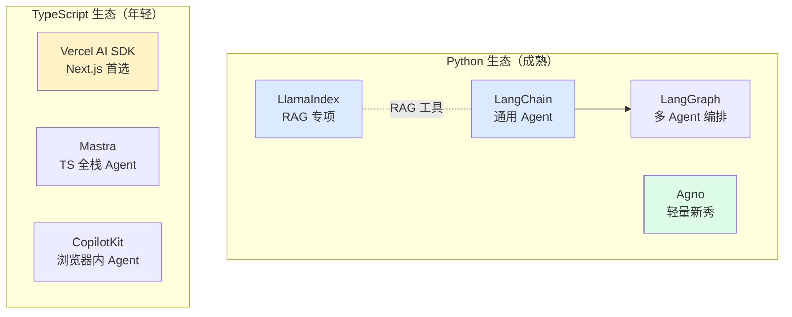
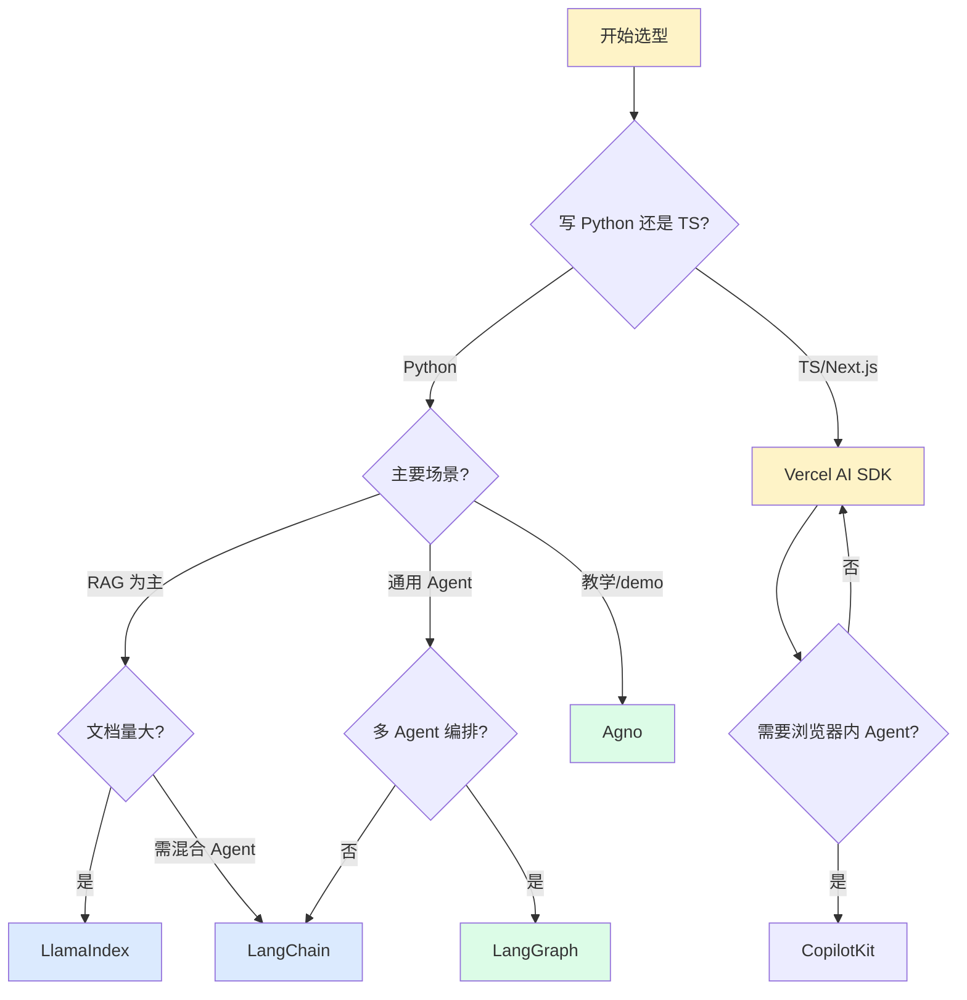
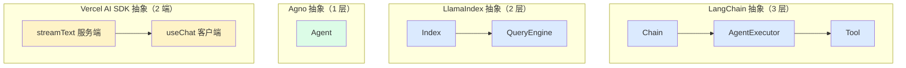

# Ch7 · Agent 框架横评

> **TL;DR**：
> 1. 本章解决"LangChain / LlamaIndex / Agno / Vercel AI SDK 到底选谁"——给读者一张选型地图
> 2. 核心结论：**LangChain** 生态最全但抽象重，**LlamaIndex** RAG 流水线最强，**Agno** 是 Python 轻量新秀，**Vercel AI SDK** 是 TS/Next.js 端首选；选型不是"哪个最强"而是"哪个最匹配你的语言 + 场景 + 维护周期"
> 3. 读完能做：根据 4 维度（语言 / 场景 / 维护周期 / 性能）做选型决策

> 📌 **前置阅读**：[Ch4 RAG](/getting-started/02-core/04-rag) + [Ch5 工具调用](/getting-started/02-core/05-tool-calling) + [Ch6 Agent 架构](/getting-started/02-core/06-agent-architecture)。本章基于前三章的能力做"框架层选型"

---

## 1. 背景 & 问题

Ch6 末尾你刚用 50 行手写完 Agent：自己写 `planner.py` 拆任务、`executor.py` 调工具、`reflector.py` 做反思。能跑、能改、能 debug。技术评审会上，隔壁组小李凑过来："你还在手写？LangChain 一行搞定 ReAct，LangGraph 把状态机也包了。"

你打开 LangChain 文档——`from langchain.agents import create_react_agent`，加上一堆 `PromptTemplate / Tool / AgentExecutor / Memory` 的 import，3 层抽象、5 个 callback hook。**还没写出一行业务代码，import 就报了 3 个错**。换 LlamaIndex 试试——文档说"主攻 RAG"，但也有 Agent；再看 Agno——声称"30 行搭 Agent"；Vercel AI SDK——前端同事说"流式 UI 体验最好"，但你后端是 Python。**到底怎么选？**

每个框架都说自己"对新手友好"——LangChain 强调"生态最全"，LlamaIndex 强调"RAG 最强"，Agno 强调"极简"，Vercel AI SDK 强调"TS 原生"。听起来都对，但互相矛盾。**问题不在"哪个框架更好"，而在"我的项目到底需要什么"**。

本章给你一张选型地图：**语言（Python vs TS）→ 场景（RAG vs 通用 Agent）→ 阶段（demo vs 生产）→ 维护周期**。4 维度筛完，答案自然出来。我们横评 4 个最主流框架：**LangChain**（Python 通用 Agent）/ **LlamaIndex**（Python RAG 专项）/ **Agno**（Python 轻量新秀）/ **Vercel AI SDK**（TS 端首选），并给出每个框架的"什么时候用、什么时候别用"。

---

## 2. 核心概念

### 2.1 框架生态地图

Agent 框架生态有两条主线：Python 生态（成熟、抽象重）和 TypeScript 生态（年轻、体验好）。**两条线不是替代关系，是分工关系**。



**图 2.1 Agent 框架生态地图**：Python 生态（4 个代表）vs TypeScript 生态（3 个代表）。Python 生态有"父子关系"（LangChain ↔ LangGraph），TS 生态各自独立。

> 💡 **关键认知**：**Python 生态成熟但抽象重**——LangChain 1.x 改 API 改到开发者哀嚎；**TS 生态年轻但 DX（开发者体验）好**——Vercel AI SDK 的流式 API 是行业标杆。

### 2.2 4 个框架一句话定位

| 框架 | 一句话 | 优势 | 劣势 | 适用场景 |
|------|--------|------|------|---------|
| **LangChain** | Python 通用 Agent 框架 | 生态最全、文档最全 | 抽象重、API 频繁变更 | Python 后端 + 通用 Agent + 长期维护 |
| **LlamaIndex** | Python RAG 专项框架 | RAG 流水线最成熟 | 通用 Agent 弱、工具生态薄 | Python + 主要是 RAG / 知识库 |
| **Agno** | Python 轻量新秀 | API 简洁、性能好 | 生态小、文档少 | Python 教学 / demo / 小型生产 |
| **Vercel AI SDK** | TS/Next.js 端首选 | TS 原生、流式 UI 最佳 | 不适合纯 Python 后端 | TS/Next.js 前端 + 端到端 LLM 应用 |

**图 2.2 4 框架核心对比**：定位、优势、劣势、适用场景一览。

> 💡 **关键认知**：**"生态最全"≠"项目最适合"**。LangChain 生态最全但你可能只用 10%——剩下 90% 的抽象是负担。选框架是选"最匹配的约束"，不是选"最强的能力"。

### 2.3 选型决策树



**图 2.3 框架选型决策树**：起点 → 语言分流 → 场景分流 → 推荐框架。

**决策树导读**：
- **TS/Next.js 前端** → 直接 Vercel AI SDK
- **Python + RAG 为主 + 文档量大** → LlamaIndex
- **Python + 通用 Agent + 长期维护** → LangChain
- **Python + 多 Agent 复杂编排** → LangGraph
- **Python + 教学 / 轻量 demo** → Agno

### 2.4 4 框架抽象层次对比

理解框架最直观的方式是看"它把 LLM 调用封装成什么对象"。



**图 2.4 4 框架抽象层次**：LangChain 最复杂（3 层），LlamaIndex 中等（2 层），Agno 最简（1 个 Agent 类），Vercel AI SDK 客户端/服务端配对。

> ⚠️ **关键认知**：**抽象越多 ≠ 越强大**。Agno 只有一个 `Agent` 类，但它能做 LangChain 80% 的事——只是少了 20% 边界场景。**简单项目用 Agno，复杂项目用 LangChain**。

### 2.5 术语卡片

| 术语 | 一句话定义 | 关键认知 |
|------|----------|---------|
| **LangChain** | Python 通用 Agent 框架，主打 Chain / Agent / Tool 抽象 | 1.x 后拆成 `langchain-core` / `langchain` / `langgraph` 4 个包 |
| **LlamaIndex** | Python RAG 专项框架，主打数据加载 / 索引 / 查询 | 也能做 Agent，但工具生态比 LangChain 弱 |
| **Agno** | 2024 年出现的轻量 Agent 框架 | 30 行代码可跑通带工具的 Agent |
| **Vercel AI SDK** | TS/Next.js AI SDK，主打流式 UI | `useChat` / `streamText` 是行业标杆 |
| **LangGraph** | LangChain 子项目，把 Agent 抽象成状态机 | 多 Agent 编排 / 循环 / 条件分支的工业级方案 |
| **Mastra** | TypeScript 全栈 Agent 框架，对标 LangChain TS 版 | 生态比 Vercel AI SDK 全，但比 LangChain 年轻 |
| **CopilotKit** | 浏览器内 Agent 框架，专注"AI 副驾驶" UI 组件 | 把 Agent 嵌入 SaaS 前端最快路径 |
| **AutoGen** | 微软出品的多 Agent 协作框架 | 研究属性强，生产案例比 LangGraph 少 |

---

## 3. 最小可运行示例

> ⚠️ **重要提示**：以下代码是 **API 风格演示**——展示 4 框架的"调用风格"差异，**不一定能直接跑**（网络问题无法验证最新版本号）。完整可运行代码见后续 `examples/05-frameworks-compare/`。本章目的是"看一眼就知道框架味道"。

### 3.1 LangChain — Python 通用 Agent 风格

**风格：组装链（Chain）**——把 LLM、Prompt、Tool、Memory 拼成一条链。

```python
# py/langchain_rag.py — 同一份 RAG 任务在 LangChain 里
from langchain_openai import ChatOpenAI, OpenAIEmbeddings
from langchain_community.vectorstores import FAISS
from langchain.chains import RetrievalQA

llm = ChatOpenAI(model="gpt-4o-mini")
vectorstore = FAISS.from_texts(docs, OpenAIEmbeddings())  # 假设 docs 已切片
qa = RetrievalQA.from_chain_type(llm=llm, retriever=vectorstore.as_retriever(k=3))
answer = qa.invoke({"query": "什么是 RAG？"})
```

**关键看**：`from_chain_type` 一行组装 chain，但**你不知道它背后做了什么**（prompt 模板、retriever、parser 都被藏起来）。

### 3.2 LlamaIndex — Python RAG 专项风格

**风格：数据索引 → 查询引擎**——把 RAG 拆成 2 步：先建索引，再查索引。

```python
# py/llamaindex_rag.py — 同样 RAG 任务在 LlamaIndex 里
from llama_index.core import VectorStoreIndex, SimpleDirectoryReader, Settings
from llama_index.llms.openai import OpenAI
from llama_index.embeddings.openai import OpenAIEmbedding

Settings.llm = OpenAI(model="gpt-4o-mini")          # 1. 全局配置
Settings.embed_model = OpenAIEmbedding()
documents = SimpleDirectoryReader("data").load_data()
index = VectorStoreIndex.from_documents(documents)   # 2. 一行建索引
answer = index.as_query_engine(similarity_top_k=3).query("什么是 RAG？")  # 3. 一行查
```

**关键看**：`Settings` 一次性配齐 LLM + Embedding + chunk_size，**比 LangChain 的"传参地狱"干净**。

### 3.3 Agno — Python 轻量新秀风格

**风格：Agent = 模型 + 工具 + 描述**——最少代码，最少抽象。

```python
# py/agno_agent.py — 带搜索工具的 Agent
from agno.agent import Agent
from agno.models.openai import OpenAIChat
from agno.tools.duckduckgo import DuckDuckGoTools

agent = Agent(
    model=OpenAIChat(id="gpt-4o-mini"),
    tools=[DuckDuckGoTools()],
    description="搜索助手：会主动查最新信息",
    instructions=["先想清楚要查什么，再调搜索工具"],
)
agent.print_response("北京今天天气怎么样？", stream=True)
```

**关键看**：4 个核心参数 `model / tools / description / instructions`——**没有 LangChain 的 5 层抽象**。`print_response(stream=True)` 一行流式输出，**默认就把可观测性做好了**。

### 3.4 Vercel AI SDK — TypeScript 端首选风格

**风格：声明式 + 流式**——前端友好的 `streamText` / `useChat`。

```ts
// ts/vercel-stream.ts — 服务端流式
import { openai } from '@ai-sdk/openai'
import { streamText } from 'ai'

export async function POST(req: Request) {
  const { messages } = await req.json()
  const result = await streamText({ model: openai('gpt-4o-mini'), messages })
  return result.toDataStreamResponse()
}
```

```ts
// ts/vercel-client.tsx — 客户端 useChat（流式 UI 行业标杆）
import { useChat } from 'ai/react'

export default function Chat() {
  const { messages, input, handleInputChange, handleSubmit } = useChat()
  return (
    <form onSubmit={handleSubmit}>
      {messages.map(m => <p key={m.id}>{m.content}</p>)}
      <input value={input} onChange={handleInputChange} />
    </form>
  )
}
```

**关键看**：**服务端 `streamText` + 客户端 `useChat` 配对**——流式 UI 开箱即用，**业务代码只关心"输入消息 → 拿到流式文本"，不用手写 SSE / WebSocket / fetch 状态机**。

### 3.5 选型建议

- **Python 后端 + 通用 Agent + 长期维护** → **LangChain**
- **Python 后端 + 主要是 RAG / 知识库** → **LlamaIndex**
- **Python + 教学 / demo / 小型生产** → **Agno**
- **Python + 多 Agent 复杂编排（>3 Agent）** → **LangGraph**
- **TS/Next.js 前端 + 端到端 LLM 应用** → **Vercel AI SDK**
- **TS + 浏览器内 Agent（AI 副驾驶）** → **CopilotKit**

---

## 4. 常见陷阱

### 陷阱 1：LangChain 学不动，因为抽象太多

**现象**：花一周学 LangChain，翻完 3 篇 tutorial、读完 2 本书，**还没写出一行业务代码**。`PromptTemplate / Chain / AgentExecutor / Tool / Memory / Callback` 6 个抽象互相嵌套，改一处崩三处。

**原因**：LangChain 早期设计目标是"成为 LLM 应用的操作系统"——把 Chain、Tool、Memory、Callback、Retriever、Document Loader、Output Parser 全做成可替换的"乐高积木"，**灵活性极高，但学习曲线极陡**。1.x 之后又拆成 4 个包，新手连 import 哪个包都搞不清。

**解法**：
1. **先学原理，再上框架**——Ch6 手写 Agent 后再学 LangChain，**你会发现"哦原来 LangChain 就是封装了我自己写的"**
2. **用 LCEL（LangChain Expression Language）**——`| prompt | llm | parser` 管道式写法比老版 `LLMChain` 直观
3. **别一次学全套**——只用你需要的那 20%，**剩下 80% 抽象当不存在**

```python
# LCEL 写法：管道式，可读性高
chain = (
    {"context": retriever, "question": RunnablePassthrough()}
    | prompt | llm | StrOutputParser()
)
```

### 陷阱 2：选 LlamaIndex 做通用 Agent

**现象**：产品要做"智能客服 Agent"——查订单、调 API、回答问题。你查文档发现 LlamaIndex 也有 `FunctionAgent` / `ReActAgent`，于是选了 LlamaIndex。**3 个月后**：客服 Agent 调外部 API 时报错、Agent 状态没保存、多轮对话接不上——LlamaIndex 的工具生态和 Agent 基础设施远不如 LangChain 成熟。

**原因**：LlamaIndex 命名误导——**它本质是"LLM 数据框架"**，主打"数据加载 → 索引 → 查询"3 步。Agent 能力是后来加的，但工具链（tool calling / memory / callback）和 LangChain 比差一个量级。

**解法**：
- **RAG 为主** → 选 LlamaIndex（`SimpleDirectoryReader` / `VectorStoreIndex` 是行业标杆）
- **通用 Agent** → 选 LangChain（工具生态 + Memory + Callback 全套）
- **RAG + Agent 混合** → 选 LangChain，把 LlamaIndex 当 retriever 接入

### 陷阱 3：被"新框架"诱惑，每季度重构一次

**现象**：看到 Agno 说"30 行搭 Agent"，立刻把 LangChain 项目重构；3 个月后看到 Mastra 说"TS 全栈 Agent 框架"，又把 Python 后端拆成 TS；**项目代码在 4 个框架间反复横跳，团队疲于奔命，业务反而没进展**。

**原因**：每个新框架都强调"简洁"和"性能"，**但框架的真正价值是"生态稳定 + 长期维护"**。LangChain 慢、抽象重、API 改得频繁——但它有 **300+ 集成、10 万+ Star、5 年沉淀**。新框架看起来更美，但**生产环境换框架 = 重写一遍**。

**解法**：
1. **选 1 个生态最稳的，用 2 年再换**——LangChain 是 Python 生态最稳的选择
2. **新框架只用于 demo / 副业项目**——不要在生产项目追新
3. **框架是工具，不是信仰**——Ch6 自己写的 50 行 Agent 在简单场景下**比任何框架都稳**
4. **迁移成本评估**：换框架 = 重写业务代码 + 重训团队 + 重新集成工具链。**问自己 3 次"值吗"再动手**

### 陷阱 4：选 Vercel AI SDK 写 Python 后端

**现象**：用 TS 写 Vercel AI SDK 后端，3 个月后发现要接入内部 Python 微服务，要写一堆 HTTP client 反向调用 Python 库，**性能差、维护难、Python 后端团队看不懂 TS**。

**原因**：Vercel AI SDK 定位是"Next.js / 前端集成"，**不是通用后端框架**。Python 微服务 + 内部 SDK 的场景强行用 TS 写中间层会复杂度爆炸。

**解法**：
- **TS/Next.js 一条龙** → Vercel AI SDK
- **Python 后端 + React/Next.js 前端** → 后端 LangChain/FastAPI 出 SSE，前端 Vercel AI SDK `useChat` 接收
- **架构分工**：Vercel AI SDK 做"前端 ↔ LLM 最后一公里"，**别让它承担业务逻辑**

---

## 5. 本章速查表

| 场景 | 推荐框架 | 备选 | 场景 | 推荐框架 | 备选 |
|------|---------|------|------|---------|------|
| Python + 通用 Agent | **LangChain** | Agno | TS/Next.js 端到端 | **Vercel AI SDK** | Mastra |
| Python + RAG 专项 | **LlamaIndex** | LangChain | TS + 浏览器内 Agent | **CopilotKit** | Mastra |
| Python + 多 Agent 编排 | **LangGraph** | AutoGen | 小项目 / 简单脚本 | **自己写**（Ch6） | Agno |
| Python + 教学 / demo | **Agno** | 自己写 | — | — | — |

| 关键决策 | 推荐 | 不推荐 |
|---------|------|--------|
| 学习起点 | Ch6 自己写 → 再学框架 | 直接啃 LangChain 文档 |
| 抽象选择 | 够用即可 | "生态最全"=用 10% 抽象 |
| 换框架频率 | 2 年换一次 | 每季度换 |
| 流式 UI | Vercel AI SDK `useChat` | 手写 SSE |

**验证方法**：
1. 能根据 4 维度（**语言 / 场景 / 维护周期 / 性能**）做选型
2. 能解释为什么"LangChain 生态最全"≠"项目最适合 LangChain"
3. 能在 1 分钟内画出 2.3 的选型决策树
4. 能说清 Vercel AI SDK 的 `useChat` 为什么是流式 UI 标杆

---

## 6. 下章预告 & 关键术语桥接

> 🔜 **下章 [Ch8 场景题](/getting-started/03-advanced/08-scenarios)**

本章的"4 框架选型"在 Ch8 会被实战——**每个场景对应一个推荐框架**：

- **本章说"LangChain 适合长期项目"** → Ch8 演示用 **LangChain 写智能客服**（多轮对话 + 工具调用 + RAG 检索公司文档）
- **本章说"Vercel AI SDK 是 TS 端首选"** → Ch8 演示用 **Vercel AI SDK 写代码生成 IDE 插件**（流式 UI + 上下文管理）
- **本章说"多 Agent 编排用 LangGraph"** → Ch8 演示用 **LangGraph 写多 Agent 客服系统**（规划 Agent + 工具 Agent + 反思 Agent 协作）
- **本章说"Agno 适合教学"** → Ch8 演示用 **Agno 写研究助手**（30 行跑通，串 search + 总结 + 引用）

| 本章概念 | Ch8 实战 |
|---------|---------|
| LangChain Chain | Ch8 智能客服的 `ConversationChain` |
| LlamaIndex Index | Ch8 知识库的 `VectorStoreIndex` |
| Vercel AI SDK `useChat` | Ch8 IDE 插件的流式代码补全 |
| LangGraph StateGraph | Ch8 多 Agent 系统的状态机 |
| 选型决策树 | Ch8 每个场景的"为什么选这个框架" |

> 💡 **学习提示**：Ch7 是"选型地图"，Ch8 是"按图索骥"——**Ch6 自己写过 Agent 后再学框架，再去 Ch8 实战，你会理解"框架 = 我自己写代码的工程化封装"**。

---

**延伸阅读**：

- [LangChain 官方文档](https://python.langchain.com/) — 生态最全，但 API 频繁变更
- [LlamaIndex 官方文档](https://docs.llamaindex.ai/) — RAG 专项
- [Agno 官方文档](https://docs.agno.com/) — 2024 年新秀
- [Vercel AI SDK 官方文档](https://sdk.vercel.ai/docs) — TS 端首选
- [LangGraph 官方文档](https://langchain-ai.github.io/langgraph/) — 多 Agent 编排
- [Anthropic: Building Effective Agents](https://www.anthropic.com/research/building-effective-agents) — 框架层之上的设计原则

> **本章练习**：
> 1. 画 2.3 的选型决策树，**不查资料凭记忆**画对
> 2. 选 1 个你手头的项目，按 4 维度做选型，写出"选 X 框架，因为 Y"
> 3. 跑通 Ch6 自己写的 Agent，对比"如果换成 LangChain"代码量差多少
> 4. 选做题：用 Vercel AI SDK 写 1 个最小流式聊天页面（哪怕只是 echo）
