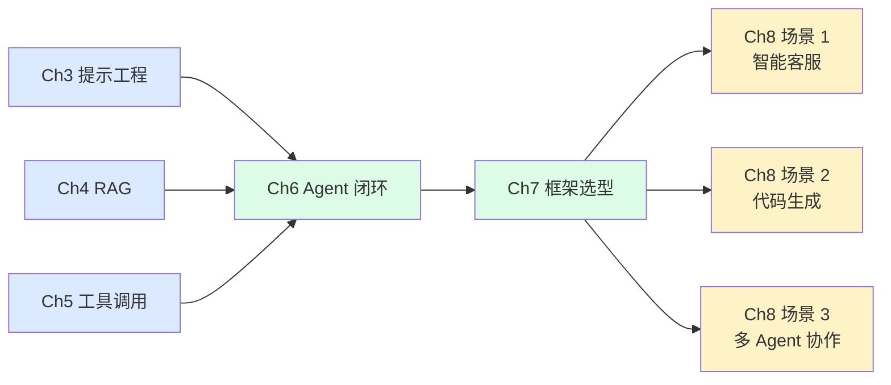
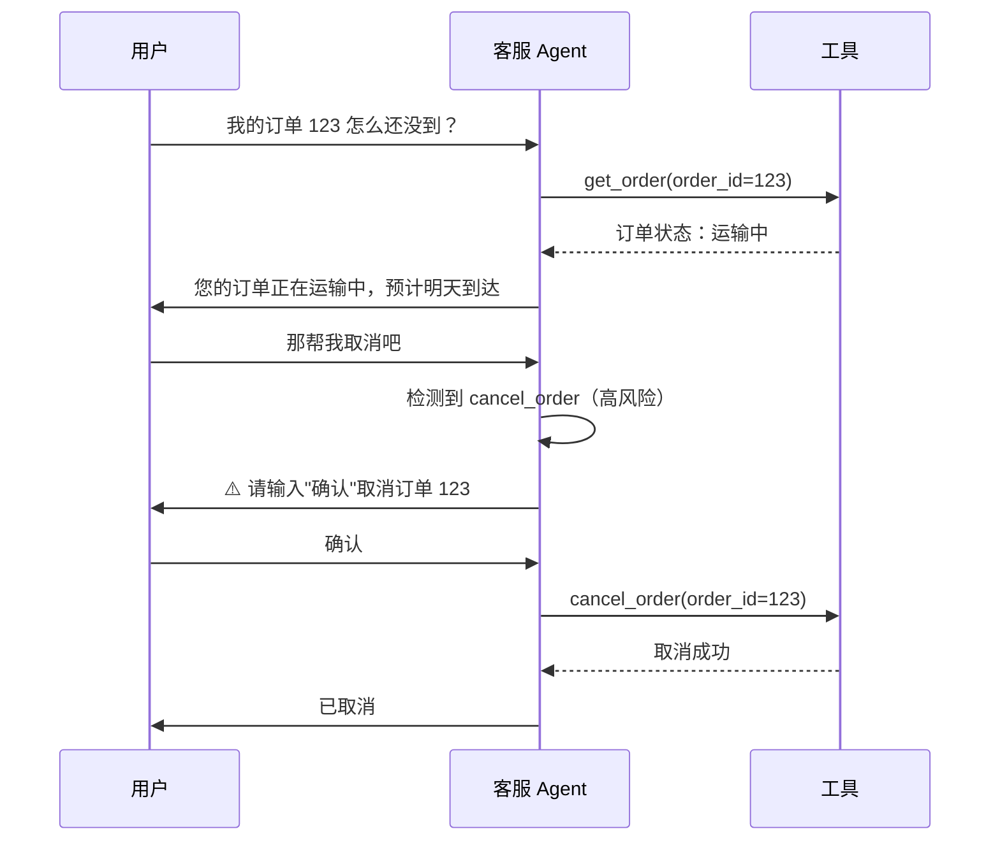
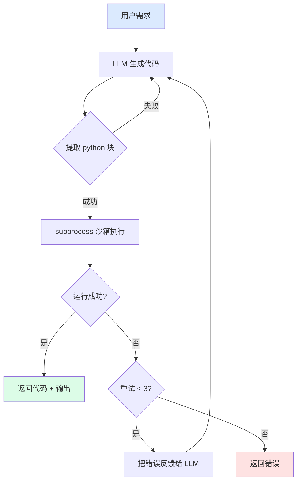
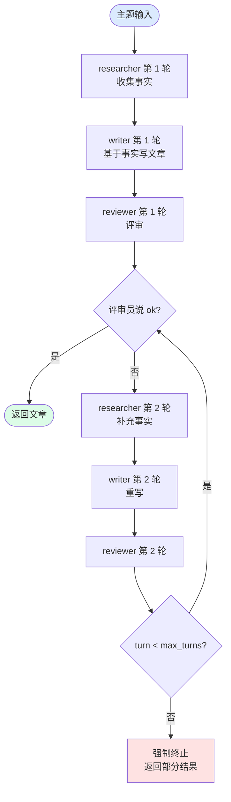

# Ch8 · 场景题

> **TL;DR**：
> 1. 本章用 3 个真实场景（智能客服、代码生成、多 Agent 协作）展示 Agent 在生产中的样子
> 2. 核心结论：3 个场景共享 Ch6 的"规划-记忆-执行-反思"闭环，但**业务领域**决定**工具组合**与**风险等级**
> 3. 读完能做：把前面学的能力拼成"能上线的最小 Agent 产品"

> 📌 **前置阅读**：[Ch6 Agent 架构](/getting-started/02-core/06-agent-architecture) + [Ch7 框架](/getting-started/03-advanced/07-frameworks)。本章是实战章

---

## 1. 背景 & 问题

Ch6 末尾你刚用 50 行手写完 Agent 闭环：planner 拆任务、memory 存上下文、executor 调工具、reflector 反思。Ch7 横评完 4 个框架后，你以为可以休息了——产品经理在群里 @ 你："下周客户要 demo，能不能接 3 个活：智能客服、代码生成 IDE 插件、多 Agent 协作系统？"

你盯着需求列表，3 个项目看起来完全不同：客服是"对话 + 查订单"、代码生成是"自然语言转可执行代码"、多 Agent 是"几个模型分工干活"。但翻回 Ch6 的闭环图——**它们都是 规划 → 记忆 → 执行 → 反思 的变体**。区别不在架构层，在"工具组合"和"风险边界"。

本章不引入新概念，只演示**同样的能力怎么落地成 3 种不同的产品**。每个场景给一份可跑通的 demo 代码（`examples/06-customer-service`、`07-code-generation`、`08-multi-agent`），目标是：读完你能在 1 周内把 3 个 demo 改成可上线的产品原型。

**为什么把这 3 个场景放一起？** 因为它们代表 Agent 在生产中的 3 种典型形态：人机对话型（客服）、生成执行型（代码）、协作型（多 Agent）。读完这 3 类，再看任何 Agent 产品你都能归到某一类。

---

## 2. 核心概念

### 2.1 场景化思维：从能力到产品

Ch1-Ch7 我们学了"能力"：提示工程、RAG、工具调用、Agent 架构、框架横评。能力是"原子"，场景是"分子"。**框架是工具，场景是目的地**。本章演示能力怎么落地为产品。



**图 2.1 能力 → 场景路径**：原子能力（Ch3-Ch5）→ Agent 闭环（Ch6）→ 框架选型（Ch7）→ 业务场景（Ch8）。本章 3 个场景都基于 Ch6 闭环。

> 💡 **关键认知**：**场景不同不意味着重写代码，只意味着换工具和改 prompt**。Ch6 的 `run_agent` 函数换个 tool list、换个 system prompt，就是另一个产品。

### 2.2 3 个场景对比

| 场景 | 关键能力 | 风险等级 | 框架选型 | 典型工具 |
|------|---------|---------|---------|---------|
| **智能客服** | 多轮对话 + RAG + 工具 | 中（不可乱回答） | LangChain | 订单查询、知识库、对话历史 |
| **代码生成** | Agent + 沙箱执行 | 高（代码能跑不能跑） | LangGraph + 沙箱 | LLM 生成、subprocess/Docker 沙箱、pytest |
| **多 Agent 协作** | 消息传递 + 状态机 | 中（消息可能死锁） | LangGraph / AutoGen | 角色 prompt、消息总线、超时控制 |

**图 2.2 3 场景核心对比**：客服偏"对话+查询"、代码生成偏"生成+验证"、多 Agent 偏"协作+编排"。风险等级从"中"到"高"递增。

> 💡 **关键认知**：**风险等级决定要不要加"二次确认"**。客服的"取消订单"是高风险动作，必须用户确认；代码生成的"运行代码"也高风险，必须沙箱隔离；多 Agent 的"互相调用"中风险，必须加 max_turns。

### 2.3 术语卡片

| 术语 | 一句话 | 在哪个场景 |
|------|--------|-----------|
| **多轮对话** | 模型记住上文，跨轮次回答 | 客服 |
| **RAG-as-tool** | 把 RAG 封装成工具让 Agent 调用 | 客服 |
| **沙箱执行** | 隔离环境跑生成的代码 | 代码生成 |
| **多 Agent** | 多个独立 LLM 角色协作 | 多 Agent |
| **消息总线** | Agent 间传递消息的通道 | 多 Agent |
| **状态机** | Agent 流转的有限状态图 | 代码生成、多 Agent |
| **工具权限分层** | 区分"读类工具"和"写类工具" | 客服 |
| **deadline 终止** | 给循环设 max_turns 防止死锁 | 多 Agent |

---

## 3. 最小可运行示例

### 3.1 场景 1：智能客服

**业务问题**：用户在网页问"我的订单 123 怎么还没到？"——客服 Agent 要：调订单查询工具、查知识库标准回答、保留对话历史让用户继续追问。

**核心代码**（来自 `examples/06-customer-service/py/agent.py`）：

```python
def chat(user_message: str, history: list[dict]) -> str:
    """客服多轮对话，工具权限分层。"""
    messages = history + [{"role": "user", "content": user_message}]
    response = client.chat.completions.create(
        model="gpt-4o-mini", messages=messages, tools=TOOLS
    )
    msg = response.choices[0].message
    if msg.tool_calls:
        for tc in msg.tool_calls:
            if tc.function.name in DANGEROUS_TOOLS:
                return f"⚠️ 检测到 {tc.function.name}，请用户输入'确认'"
            messages.append({
                "role": "tool",
                "tool_call_id": tc.id,
                "content": f"[{tc.function.name} 模拟结果]"
            })
        return client.chat.completions.create(
            model="gpt-4o-mini", messages=messages
        ).choices[0].message.content or ""
    return msg.content or ""
```

**关键设计**：
- `SAFE_TOOLS`（查询类）自动执行；`DANGEROUS_TOOLS`（修改类）必须用户二次确认
- `history` 参数由调用方持久化（数据库 / Redis），保留多轮记忆
- 工具调用是 Ch5 学的 Function Calling，prompt 模板是 Ch3 学的角色设定

**Mermaid 流程图**：



**图 3.1 客服 Agent 流程**：用户问 → Agent 调查询工具 → 高风险动作触发二次确认。

### 3.2 场景 2：代码生成

**业务问题**：用户说"写个脚本，把当前目录下所有 .txt 文件改名加前缀 backup_"——Agent 要：生成 Python 代码、在沙箱里跑、失败重试。

**核心代码**（来自 `examples/07-code-generation/py/codegen.py`）：

```python
def codegen_with_retry(requirement: str, max_retries: int = 3) -> str:
    """生成 → 沙箱执行 → 失败重试。"""
    for attempt in range(max_retries):
        code = generate_code(requirement)
        ok, output = run_in_sandbox(code)
        if ok:
            return f"✅ 代码运行成功：\n```python\n{code}\n```"
        if attempt == max_retries - 1:
            return f"❌ {max_retries} 次重试仍失败：\n{output}"
    return ""
```

**关键设计**：
- `subprocess.run([..., timeout=5])` 沙箱执行，超时强杀
- 失败重试最多 3 次（防止模型写死循环代码）
- 提取 ```python``` 块：模型输出常有"看这个：```python\n...\n```"等解释文字

**Mermaid 流程图**：



**图 3.2 代码生成 Agent 流程**：生成 → 提取 → 沙箱执行 → 失败重试带错误反馈。

### 3.3 场景 3：多 Agent 协作

**业务问题**：产品经理要求"研究 AI 在教育行业的应用，输出一篇文章"——一个 Agent 干不完：研究、写稿、评审是 3 个不同任务。让 3 个 Agent 协作：研究员收集事实、写作者写文章、评审员检查质量。

**核心代码**（来自 `examples/08-multi-agent/py/crew.py`）：

```python
def run_crew(topic: str, max_turns: int = 5) -> str:
    """3 Agent 协作：researcher → writer → reviewer，最多 max_turns 轮。"""
    history: list[dict] = []
    for turn in range(max_turns):
        for role, system in AGENT_PROMPTS.items():
            messages = [
                {"role": "system", "content": system},
                {"role": "user", "content": f"主题：{topic}\n历史：{history}"},
            ]
            response = client.chat.completions.create(
                model="gpt-4o-mini", messages=messages
            )
            content = response.choices[0].message.content or ""
            history.append({"role": role, "content": content})
            if role == "reviewer" and "ok" in content.lower():
                return "\n".join(f"[{m['role']}] {m['content']}" for m in history)
    return f"[max_turns={max_turns} 仍未收敛]"
```

**关键设计**：
- 3 个 Agent 通过共享 `history` 列表传递消息（最简单的"消息总线"）
- `max_turns=5` 防止死循环：评审员说 ok 就退出，否则 5 轮后强制终止
- 角色 prompt 不同：`researcher` 找事实、`writer` 写文章、`reviewer` 做质检

**Mermaid 流程图**：



**图 3.3 多 Agent 协作流程**：3 角色顺序执行 + 评审员主导退出 + max_turns 兜底。

---

## 4. 常见陷阱

### 陷阱 1：客服 Agent 越权调用

**现象**：用户问"我的订单呢"，Agent 顺手调 `cancel_order` 把订单取消。

**原因**：所有工具暴露给模型，模型分不清"查询"和"修改"的边界。模型看到用户抱怨"等太久"，就"贴心"地执行了取消。

**解法**：
- 工具权限分层：`SAFE_TOOLS = ["get_order", "search_kb"]` 自动放行；`DANGEROUS_TOOLS = ["cancel_order", "refund"]` 必须用户输入"确认"才执行
- 用户确认词检测：等待"确认 / 同意 / yes" 才调危险工具
- 审计日志：所有工具调用记录到数据库，事后可追溯

### 陷阱 2：代码生成 Agent 写出能跑但有安全漏洞的代码

**现象**：模型生成 `import os; os.system(user_input)`——能跑，但用户在 prompt 注入 `; rm -rf /` 就删库了。

**原因**：模型只看"能不能跑"，不审计安全性。模型甚至不知道 `os.system` 是个危险 API。

**解法**：
- 沙箱执行：`subprocess` + `timeout=5` 至少防止死循环；生产环境用 Docker / Firecracker 强隔离
- 静态分析：生成后用 `bandit` 扫危险 API（`os.system`、`eval`、`exec`）
- 关键代码人工 review：模型生成的"删数据 / 改权限"类代码，必须人工签字才执行
- 输出脱敏：用户输入不直接拼到 `os.system`，用参数化 API 替代

### 陷阱 3：多 Agent 死锁 / 无限循环

**现象**：Agent A 等 Agent B 回复，Agent B 等 Agent A 回复——对话永远停不下来，token 费 100 块后用户才发现。

**原因**：消息传递没设超时、没设 max_turns、没设"评审员说 ok 就退出"的终止条件。

**解法**：
- `max_turns=5` 硬限制：5 轮后强制终止，返回部分结果
- 终止条件显式化：评审员的 prompt 明确"如果满意就回复 ok，不满意就列出修改点"
- Token 预算监控：`if total_tokens > 50000: break`
- 死锁检测：若 2 轮内没新内容输出，提示"可能死锁"并退出

### 陷阱 4（附加）：客服 Agent 答非所问

**现象**：用户问"我的订单 123 状态"，Agent 答"我们提供 24 小时客服"——答非所问。

**原因**：模型被训练成"友好 + 完整"，面对查不到信息时倾向"打太极"而非说"不知道"。

**解法**：prompt 中明确"如果工具没返回数据，直接说'查询失败，请提供订单号'，不要编造"。同时给工具返回值加"未找到"的明确信号（而非空字符串）。

---

## 5. 本章速查表

| 场景 | 启动模板 | 必加能力 | 风险兜底 |
|------|---------|---------|---------|
| **智能客服** | LangChain Agent + RAG | 工具权限分层 + 多轮记忆 | 高风险工具二次确认 |
| **代码生成** | LangGraph + subprocess 沙箱 | 代码静态分析 + 测试用例 | timeout + 沙箱隔离 |
| **多 Agent 协作** | LangGraph StateGraph | 终止条件 + max_turns | token 预算监控 |

**验证方法**：
- 智能客服：mock 模型调 `cancel_order` → 验证返回"请确认"
- 代码生成：mock LLM 输出含 bug 的代码 → 验证重试 3 次后放弃
- 多 Agent：mock 评审员说 "ok" → 验证第 1 轮就退出

**一句话记住本章**：3 个场景共享 Ch6 闭环，**业务领域决定工具组合，风险等级决定兜底机制**。

---

## 6. 下章预告 & 关键术语桥接

> 🔜 **下章 [Ch9 开放问题](/getting-started/03-advanced/09-open-questions)**

本章的"3 个场景"在 Ch9 会被开放问题收口：
- 本章说"智能客服" → Ch9 讨论"Agent 在客服领域 5 年后长啥样"——是替代人工还是辅助人工？
- 本章说"代码生成沙箱" → Ch9 讨论"Agent 的代码可执行性能否泛化到物理世界"——机器人 + Agent 是什么形态？
- 本章说"多 Agent" → Ch9 讨论"AGI 路径与多 Agent 关系"——多 Agent 协作是 AGI 的必要条件吗？

Ch9 不写代码、不写 demo，专门写"看完前面 8 章后你应该独立思考什么"——5 个开放问题、5 个延伸方向、3 本推荐书。

---

## 7. 总结

本章用 3 个 demo 演示"能力怎么变产品"：
1. **智能客服**（`06-customer-service`）：多轮对话 + 工具权限分层
2. **代码生成**（`07-code-generation`）：生成 + 沙箱执行 + 重试
3. **多 Agent 协作**（`08-multi-agent`）：3 角色顺序执行 + max_turns 兜底

3 个 demo 都用 `gpt-4o-mini` + `openai==1.40.0`，依赖极少，方便你 fork 后改造成自己的产品原型。

下一步：跑 3 个 demo 看看实际效果，再用 Ch6 的"规划-记忆-执行-反思"框架对照自己手头的业务需求，画一张闭环图——90% 的 Agent 产品需求都能被这张图覆盖。
