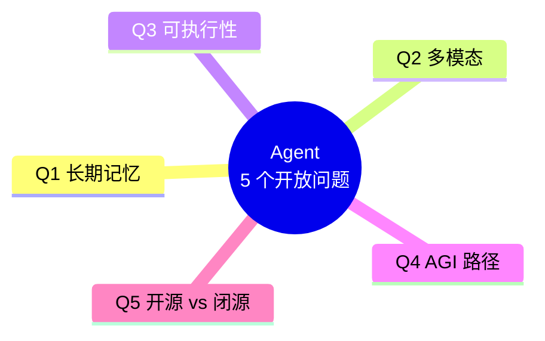
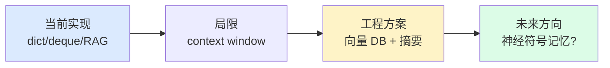
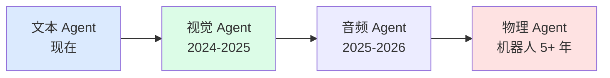
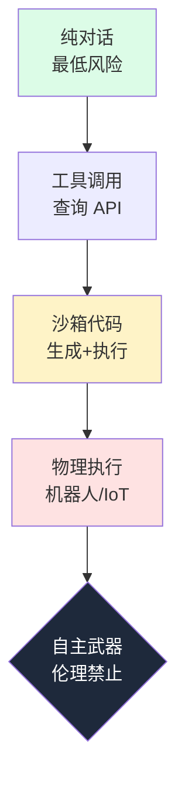
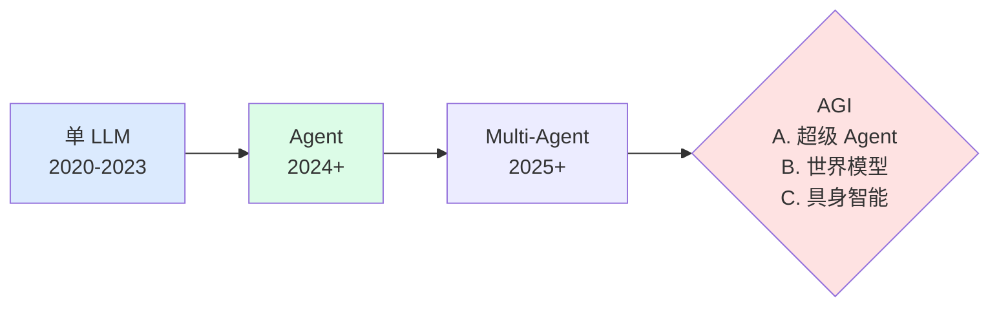
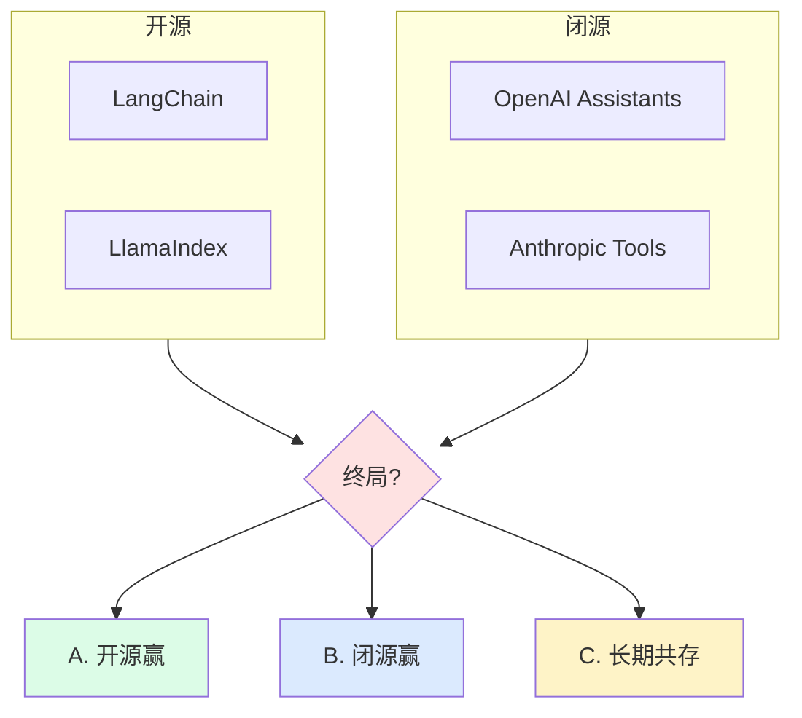
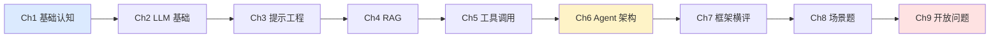

# Ch9 · 开放问题

> **TL;DR**：
> 1. 本章用 **5 个开放问题** 给读者一个"未来视角"——大模型会不会让 Agent 失业？AGI 还有多远？这些没有标准答案，但有思考框架
> 2. 核心结论：**Agent 领域还在早期**（类比 1995 年的互联网）；**选框架看场景不追新**；**学完入门已具备"搭 demo + 选型"能力**，但上生产还需 4 章进阶
> 3. 读完能做：形成自己的 Agent 行业判断框架；准备进入生产进阶

> 📌 **前置阅读**：[Ch1-Ch8 全部 8 章](/getting-started/00-roadmap)。本章是**入门收官章**——不讲新代码，只讲"看完 8 章后你应该独立思考什么"

---

## 1. 背景 & 问题

学完 Ch1 到 Ch8，你已经知道：Agent = 规划 + 记忆 + 工具 + 反思，主流框架是 LangChain / LlamaIndex / Agno / Vercel AI SDK，能搭智能客服、代码生成、多 Agent 协作 3 类 demo。**但你大概率还在想 5 个开放问题**：

1. 大模型越来越强，Agent 还有价值吗？——o1 / GPT-5 自己就能"想 5 步"了
2. Agent 的"长期记忆"是真的吗？——Ch6 的 `deque` / `dict` 本质都是 hack
3. AGI 还有几年？——Sam Altman 说 5 年，Yann LeCun 说 30 年
4. 多 Agent 协作是真的有"涌现"，还是炒作？
5. 一年后我学的 LangChain 还在不在？——框架 API 改得比模型还快

这些**没有标准答案**。但你需要一套思考框架——下次看到"某框架 v2.0"、"某专家说 AGI 5 年内到来"时，你要有自己的判断。本章给你 **5 个开放问题的展开 + 入门 9 章路径回顾 + 生产进阶 4 章预告**。

---

## 2. 核心概念

### 2.1 5 个开放问题全景

**图 2.1 5 个开放问题全景**：5 个问题彼此独立但都指向同一个元问题——"Agent 行业 5 年后长啥样"。

### 2.2 Q1：Agent 能否真正"长期记忆"？

**问题**：Ch6 学的"长期记忆"是 `dict` 存用户偏好、`RAG` 检索历史对话——本质上是"工程模拟"，不是 LLM 自己"记住"。

**图 2.2 长期记忆路径**：从工程模拟到神经记忆的演进。**我的判断**：**短期（1-3 年）**没有"神经记忆"，全是 RAG + 向量 DB + 摘要压缩；**中期（3-5 年）**可能出现"模型内嵌记忆层"；**长期（5+ 年）**如果 AGI 实现，"长期记忆"和"意识"会一起被解决。

> 💡 **关键认知**：**别相信"AI 助手能记住你说的话"这种产品宣传**——背后都是 RAG + DB，模型本身没有持久记忆。读者可学**向量 DB**（Pinecone / Milvus）+ **摘要压缩**。

### 2.3 Q2：多模态 Agent 何时普及？

**问题**：GPT-4V、Gemini 1.5 Pro 已经能"看图"，但端到端多模态 Agent 还没成熟。

**图 2.3 多模态 Agent 演进**：文本（现在）→ 视觉（进行中）→ 物理（未来）。

| 模态 | 现状 | 成熟时间 | 关键瓶颈 |
|------|------|---------|---------|
| **文本** | 全面普及 | 现在 | — |
| **图像** | GPT-4V/Gemini 商用 | 2024-2025 已成熟 | 视觉推理准确度 |
| **音频** | Whisper 商用 | 2025-2026 | 多说话人分离 |
| **视频** | Sora 演示级 | 2025-2027 | 长视频一致性 |
| **物理** | Figure 1 / Tesla Optimus | 5+ 年 | 硬件 + 安全性 |

> 💡 **关键认知**：**多模态 Agent 的瓶颈不在"能不能看图"，在"能不能基于图像做决策"**。决策需要 3D 推理 + 物理知识 + 责任归属。读者可关注 **GPT-4V / Gemini**（多模态 RAG）和 **Figure / Tesla** 具身智能。

### 2.4 Q3：Agent 可执行性边界在哪里？

**问题**：Ch8 演示了"代码生成 Agent"——沙箱里的代码和**物理世界**之间有巨大鸿沟。

**图 2.4 可执行性光谱**：从"纯对话"（安全）到"自主武器"（伦理禁止）的风险递增。

| 层级 | 典型场景 | 风险等级 | 当前状态 |
|------|---------|---------|---------|
| **对话** | 客服 / 写作 | 极低 | 全面商用 |
| **查询 API** | 查天气 / 查订单 | 低 | 全面商用 |
| **沙箱代码** | 代码生成 / SQL 生成 | 中 | 已商用（Ch8 demo） |
| **物理执行** | 扫地机器人 / 工业臂 | 高 | 部分商用 |
| **自动驾驶** | L4+ 无人车 | 极高 | 试点中 |
| **自主武器** | 致命决策 | — | 伦理禁止 |

> ⚠️ **关键认知**：**"代码 → 物理" 的鸿沟 = 不可逆性差异**。代码 bug 可以 revert，物理动作不可逆。读者可学**沙箱技术**（Docker / Firecracker）+ **权限分层**（Ch8 客服 Agent 的 `SAFE_TOOLS` / `DANGEROUS_TOOLS`）。

### 2.5 Q4：AGI 路径——Agent 是中间产物还是终态？

**问题**：Yann LeCun 说"LLM 永远不会到 AGI"；Sam Altman 说"5 年内实现 AGI"；Dario Amodei 说"AGI 可能是 Agent"。

**图 2.5 AGI 路径猜想**：3 种主流观点。

| 观点 | 代表人物 | 核心论证 | 时间预测 |
|------|---------|---------|---------|
| **A. AGI = 超级 Agent** | Sam Altman、Karpathy | 继续 scaling 就能涌现 AGI | 5-10 年 |
| **B. AGI ≠ LLM** | Yann LeCun、Bengio | LLM 是语言模型不是世界模型，缺物理常识 | 30+ 年 |
| **C. AGI = 具身智能** | Rodney Brooks | 智能必须从身体+环境交互中涌现 | 10-20 年 |

**我的判断**：**Agent 至少是 5-10 年内的"中间产物"**——LLM 单独不够强，需要 Agent 框架补足规划/记忆/反思能力。但 Agent 不是终态——一旦模型具备世界模型和因果推理，很多 Agent 框架会消失。

> 💡 **关键认知**：**作为工程师，关心 AGI 时间表没太大意义**——你能做的是"在当前 LLM 能力下，用工程手段做出最好的产品"。读者可关注**AI 安全研究**、学**因果推理**、关注 **JEPA**。

### 2.6 Q5：开源 vs 闭源 Agent 框架的终局？

**问题**：LangChain / LlamaIndex 是开源，OpenAI Assistants / Anthropic Tools 是闭源。开源框架 API 频繁变更，闭源 vendor lock-in。

**图 2.6 开源 vs 闭源 Agent 框架**：3 种可能终局。

| 终局猜想 | 概率 | 论据 |
|---------|------|------|
| **A. 开源赢** | 30% | 历史规律：操作系统、数据库、Web 框架都是开源赢 |
| **B. 闭源赢** | 30% | 反例：iOS 在移动端赢；模型能力比生态更稀缺 |
| **C. 长期共存** | 40% | 推理层开源（LangChain）+ 模型层闭源（OpenAI） |

> 💡 **关键认知**：**框架是工具，不是信仰**。读者可**学透 1 个生态**（Python 后端选 LangChain，TS 端选 Vercel AI SDK），**保留切换能力**（Ch6 自己手写 50 行 Agent 不依赖任何框架）。"理解规划-记忆-执行-反思闭环"的能力不会过时。

### 2.7 5 个问题的元分类

| 问题 | 时间维度 | 不确定性 | 读者可做什么 |
|------|---------|---------|-----------|
| **Q1 长期记忆** | 1-3 年 | 中 | 学 RAG + 向量 DB |
| **Q2 多模态** | 1-5 年 | 中 | 关注 GPT-4V / Gemini / 具身智能 |
| **Q3 可执行性** | 5-10 年 | 高 | 关注机器人 ROS + 伦理 |
| **Q4 AGI 路径** | 5-20 年 | 极高 | 关注 AI 安全 + 因果推理 |
| **Q5 开源闭源** | 持续 | 中 | 不追新，学透 1 个生态 |

**图 2.7 5 问题优先级矩阵**：Q1/Q2 短期值得追，Q3/Q4 长期关注，Q5 保持灵活。

### 2.8 术语卡片

| 术语 | 一句话 | 适用问题 |
|------|--------|---------|
| **长期记忆 / 神经符号** | LLM 跨会话保留信息 / 神经网络+符号推理 | Q1 / Q4 |
| **多模态 / 具身智能** | 文本图像视频统一处理 / 智能体+物理身体 | Q2 / Q3 / Q4 |
| **沙箱 / 可执行性边界** | 隔离环境执行 / Agent 能安全执行的动作范围 | Q3 |
| **世界模型 / AGI / 因果推理** | 模拟物理世界 / 人类水平智能 / 因果识别 | Q4 |
| **Vendor Lock-in / 生态稳定性** | 单一供应商依赖 / 框架 API 稳定度 | Q5 |

---

## 3. 框架评价（入门教程收官）

### 3.1 入门教程走过的路径

**图 3.1 入门教程 9 章路径**：从"什么是 Agent"到"5 个未来视角"。前 4 章打地基，中间 4 章核心能力，最后 1 章未来视野。

### 3.2 4 框架的最终评价

| 框架 | Ch7 评价 | Ch9 补充（未来视角） | 长期押注建议 |
|------|---------|--------------------|------------|
| **LangChain** | 生态最全，抽象重 | 1.x 后拆 4 个包；生态最稳但学习曲线陡 | **长期押注**（Python 后端首选） |
| **LlamaIndex** | RAG 专项 | RAG 仍是 LLM 应用主流，工具链无对手 | **长期押注**（RAG 项目首选） |
| **Agno** | 轻量新秀 | 出现 1 年生态尚未稳定，生产案例少 | **观察**（不押注） |
| **Vercel AI SDK** | TS 端首选 | 流式 UI 标杆，Next.js 一条龙优势大 | **长期押注**（TS 端首选） |

**图 3.2 4 框架最终评价**：当下评价 + 未来 3 年 + 长期押注建议。**元规则**：**生态稳定 > 技术新颖**；**场景匹配 > 能力全面**；**可迁移性 > 性能**——Ch6 自己手写 Agent 仍是 2026 年最稳的"看家本领"。

### 3.3 你现在有 / 还缺的能力

| 维度 | 入门做到 | 进阶要补 |
|------|---------|---------|
| **能力** | 搭 demo + 选框架 | 上线生产 + 评估 + 防攻击 |
| **代码** | 50-100 行 demo | 高并发 + 缓存 + 降级 |
| **成本 / 安全 / 监控** | 没讲 | Token 预算 / 注入防护 / 日志告警 |

**图 3.3 入门 vs 进阶能力对比**："能跑通 demo"和"能上线生产"之间有 10 倍距离。

> ⚠️ **关键认知**：**入门教程的终点是生产进阶的起点**。9 章入门让你"能搭 demo"，4 章进阶让你"能上产品"。

---

## 4. 本章速查表

### 4.1 5 个开放问题速查

| 开放问题 | 1 句话答案 | 给读者的建议 |
|---------|-----------|------------|
| **Q1 长期记忆** | 暂无神经记忆，全是 RAG 模拟 | 学向量 DB + 摘要压缩 |
| **Q2 多模态** | 视觉/语音已成熟，物理需 5+ 年 | 关注具身智能 |
| **Q3 可执行性** | 代码层能跑，物理层卡在硬件 | 学 Docker 沙箱 + ROS |
| **Q4 AGI 路径** | 未知，Agent 是中间产物 | 关注 AI 安全 + 因果推理 |
| **Q5 开源闭源** | 长期共存概率最大 | 学透 1 个生态（推荐 LangChain） |

### 4.2 延伸阅读

| 问题 | 关键项目 / 论文 |
|------|--------------|
| **Q1** | **LangChain Zep**、**Letta**、**MIRIX** |
| **Q2** | **GPT-4V / Gemini 1.5 Pro**、**GPT-4o**、**Figure 01** |
| **Q3** | **Docker / Firecracker**、**ROS** |
| **Q4** | **Anthropic / MIRI**、**Yann LeCun JEPA** |
| **Q5** | **LangChain / LlamaIndex**、**OpenAI Assistants** |

### 4.3 验证方法

1. 能用 1 段话向同事讲清 5 个开放问题 + 自己的判断
2. 能画出 Ch7 的选型决策树 + Ch9 的 5 问题优先级矩阵（凭记忆）
3. 能列出 3 项"学完入门已具备的能力"和 3 项"学完进阶才能有的能力"

**一句话记住本章**：**5 个开放问题没有标准答案，但有思考框架——保持工程视角 > 追行业新闻；学透 1 个生态 > 追新框架；学完入门能搭 demo，进阶才能上生产**。

---

## 5. 下一步 → 生产进阶

读到这里，**恭喜你完成了入门教程 9 章**。

**你已经能做的**：搭一个 RAG + 工具调用 Agent（demo 级别，30-100 行）；读懂 LangChain / LlamaIndex 源码做选型；判断行业新闻真伪。

**你还不能做的（要进生产）**：

| 能力 | 生产进阶章节 |
|------|------------|
| **高并发 / 缓存 / 降级 / 成本控制** | 进阶 Ch1 |
| **Agent 质量评估 + 反馈闭环** | 进阶 Ch2 |
| **防注入 / 越狱 / 数据隔离** | 进阶 Ch3 |
| **异步 / 限流 / 监控 / 告警** | 进阶 Ch4 |

**入门到进阶的过渡建议**：

1. **1-2 周把入门 demo 跑起来**——拿到 `OPENAI_API_KEY` 实际跑 Ch3-Ch8 的 13 个 example
2. **写一篇博客总结"5 个最重要的 take-away"**——能讲出来才算真懂
3. **找 1 个产品原型**——用 Ch6 的"规划-记忆-执行-反思"框架画闭环图
4. **然后进入生产进阶 4 章**——重点补"上线生产"和"质量评估"

---

## 6. 下章预告 & 关键术语桥接

> 🔜 **下一步：[生产进阶 Ch1 系统设计](/production/01-system-design)**

本章的"上线生产"在进阶 Ch1 会被展开：

| 本章说 | 进阶 Ch1 演示 |
|-------|------------|
| 上线生产还不行 | **高并发 + 缓存 + 降级** 的真实生产架构 |
| 成本没讲 | **Token 预算 + 模型选择 + 批处理** 的省钱技巧 |
| 评估没讲 | 进阶 Ch2 演示 **Benchmark + LLM-as-judge + 反馈闭环** |
| 安全没讲 | 进阶 Ch3 演示 **防注入 + 防越狱 + 数据隔离** |
| 监控没讲 | 进阶 Ch4 演示 **异步队列 + 限流 + 告警** |

---

## 7. 🎓 入门教程正式收官

**9 章路径**：Ch1 基础认知 → Ch2 LLM → Ch3 提示工程 → Ch4 RAG → Ch5 工具调用 → Ch6 Agent 架构 → Ch7 框架横评 → Ch8 场景题 → Ch9 开放问题。

**你现在能做的事**：解释 Agent / RAG / Function Calling；写 prompt 模板、搭 30 行 RAG；写 50 行 Agent、选 4 框架之一；跑通 3 类业务 demo（客服/代码生成/多 Agent）；独立思考 5 个行业开放问题。

**你接下来要做的事**：跑 13 个 example + 写 1 篇博客总结"5 个 take-away" + 去 [📗 生产进阶](/production/00-prerequisites) 继续学习。

> 🎓 **入门教程正式结束**。生产进阶 4 章才是"从 demo 到产品"的真正考验。

---

**延伸阅读**：

- [Anthropic: Building Effective Agents](https://www.anthropic.com/research/building-effective-agents)（必读）
- [OpenAI o1 System Card](https://openai.com/index/openai-o1-system-card/) — 推理模型对 Agent 的影响
- [Yann LeCun: A Path Towards Autonomous Machine Intelligence](https://arxiv.org/abs/2304.04263) — 世界模型派核心论文
- [Anthropic Computer Use](https://docs.anthropic.com/en/docs/agents-and-tools/tool-use/computer-use) — 物理 Agent 早期实践

> **本章练习**：
> 1. 画 2.7 的 5 问题优先级矩阵，**不查资料凭记忆**画对
> 2. 选 1 个你最关心的开放问题，**搜 2 篇 2024-2026 论文**，写出"我现在的判断 vs 论文观点"
> 3. 写 1 段话向非技术同事讲清"Agent 行业 5 年后会怎样"（用 5 个开放问题作为论据）
