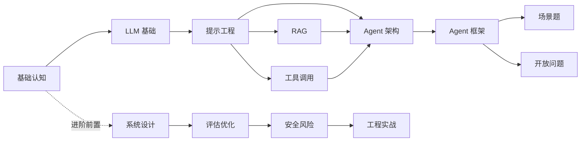

# 大模型 Agent 应用开发学习教程

> 体系化教程，从初级开发者到能搭建生产级 Agent。

> 🎉 **v1.0.0 已发布** — 入门 9 章 + 进阶 4 章 + 13 个最小可运行 examples

## 📘 入门教程

适合初级开发者（含前端），9 章带你从零到能搭出 RAG + 工具调用 Agent。

[进入入门教程 →](getting-started/00-roadmap)

## 📗 生产进阶

适合中级开发者，4 章深入系统设计、评估优化、安全风险与工程实战。

[进入生产进阶 →](production/00-prerequisites)

## 教程全景图

> 入门 9 章螺旋上升 + 进阶 4 章独立成册

## 5 个核心 take-away

- 🎯 **目标**：从"听说过 Agent"到"能搭出生产级 Agent 产品"
- 🧠 **思维**：能力分 4 层（规划/记忆/执行/反思），用框架选型看场景不追新
- 🛠️ **能力**：搭 RAG、调工具、限流缓存、评估优化、安全护栏、异步流式
- 🚀 **路径**：入门 9 章 1 周过完 → 进阶 4 章 2 周深耕 → 实战项目
- 🤝 **适用**：前端想转 Agent 的初中级开发者；有 Python/Node 基础的中级

## 📘 入门教程（9 章）

  <a class="chapter-card" href="getting-started/00-roadmap">
    
🗺️

    
00 三阶段总览

    
入门教程的章节依赖图

  </a>
  <a class="chapter-card" href="getting-started/01-basics/01-llm-and-agent">
    
🎯

    
01 基础认知

    
大模型应用 / Agent / AI 应用三者关系

  </a>
  <a class="chapter-card" href="getting-started/01-basics/02-llm-fundamentals">
    
⚙️

    
02 LLM 基础

    
Transformer、Token、温度等核心概念

  </a>
  <a class="chapter-card" href="getting-started/02-core/03-prompt-engineering">
    
✍️

    
03 提示工程

    
从零样本到思维链的提示技巧

  </a>
  <a class="chapter-card" href="getting-started/02-core/04-rag">
    
📚

    
04 RAG 检索增强

    
向量检索与知识库搭建

  </a>
  <a class="chapter-card" href="getting-started/02-core/05-tool-calling">
    
🔧

    
05 工具调用

    
Function Calling 与外部能力扩展

  </a>
  <a class="chapter-card" href="getting-started/02-core/06-agent-architecture">
    
🏗️

    
06 Agent 架构

    
规划/记忆/执行/反思四大能力分层

  </a>
  <a class="chapter-card" href="getting-started/03-advanced/07-frameworks">
    
📊

    
07 Agent 框架

    
主流框架横向对比与选型

  </a>
  <a class="chapter-card" href="getting-started/03-advanced/08-scenarios">
    
🎬

    
08 场景题

    
真实业务场景的 Agent 解法

  </a>
  <a class="chapter-card" href="getting-started/03-advanced/09-open-questions">
    
🤔

    
09 开放问题

    
待解决的挑战与前沿方向

  </a>

## 📗 生产进阶（4 章）

  <a class="chapter-card" href="production/00-prerequisites">
    
📋

    
前置

    
读者起点与必备知识

  </a>
  <a class="chapter-card" href="production/01-system-design">
    
🏛️

    
01 系统设计

    
生产级 Agent 系统的整体架构

  </a>
  <a class="chapter-card" href="production/02-evaluation">
    
📏

    
02 评估优化

    
指标体系、离线评估与在线监控

  </a>
  <a class="chapter-card" href="production/03-security">
    
🛡️

    
03 安全风险

    
提示注入、越权与防护策略

  </a>
  <a class="chapter-card" href="production/04-engineering">
    
⚡

    
04 工程实战

    
限流、缓存、可观测性与上线

  </a>

