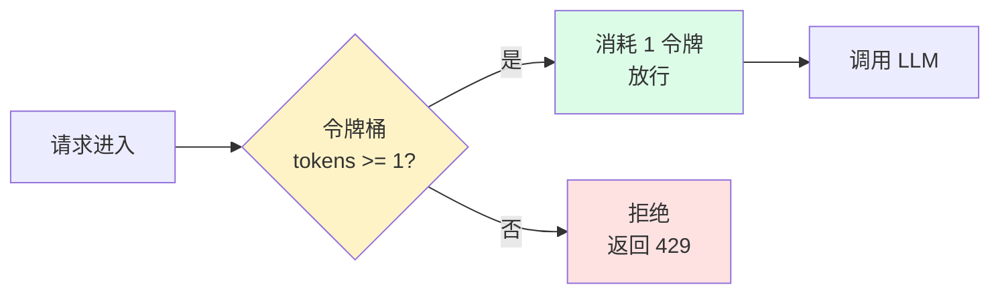
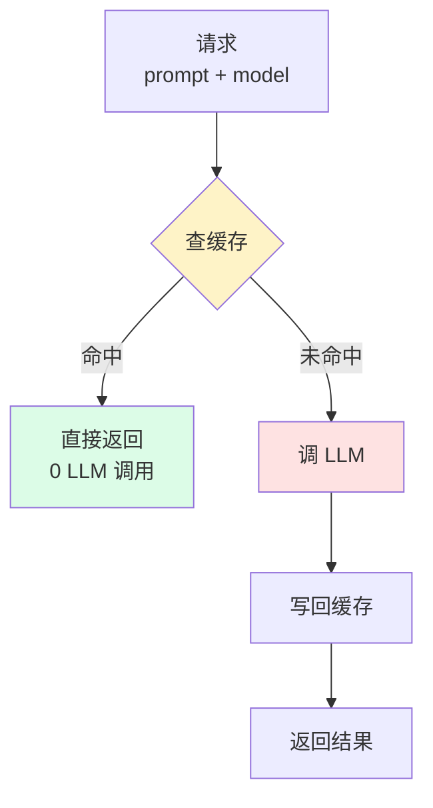
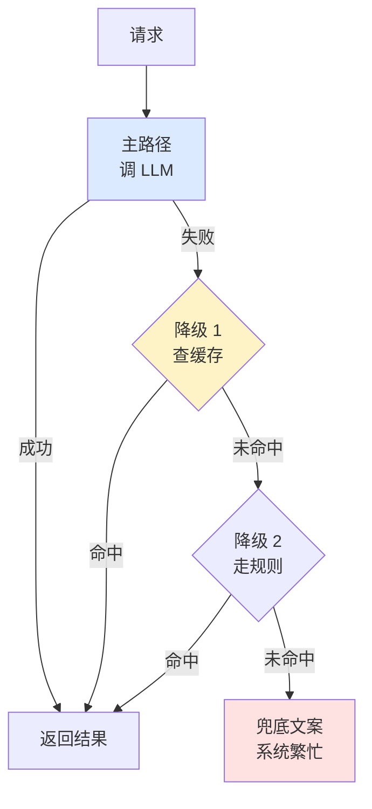
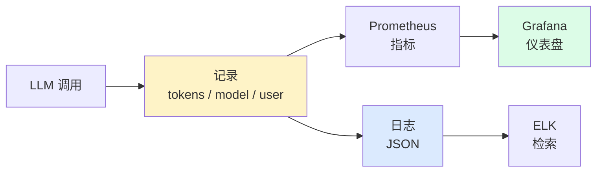
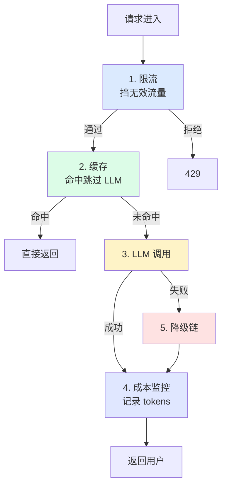

# 进阶 Ch1 · 系统设计

> **TL;DR**：
> 1. 本章解决"demo 跑通但生产崩溃"——给 Agent 加上生产级能力
> 2. 核心结论：4 个核心设计点——**限流**（防止打爆 LLM API）/ **缓存**（降低成本）/ **降级**（LLM 不可用时降级到规则）/ **成本监控**（每个请求计费）
> 3. 读完能做：把一个 demo Agent 改造成能扛 1000 QPS 的生产 Agent

> 📌 **前置阅读**：入门 [Ch1-Ch6 全部](/getting-started/00-roadmap) + 分布式系统基础

---

## 1. 背景 & 问题

老张做了 3 个月 Agent demo——客服、文档摘要、代码生成，在自己 MacBook 上都跑得很顺。上线第一天，10 个种子用户没问题。第二天运营推了一波公众号，用户从 10 涨到 1000。**下午 3 点，监控告警炸了**——OpenAI 返回 `429 Too Many Requests`，所有用户请求 502。第三天账单出来：**一天烧了 3000 美元**，因为没有缓存，相同问题被问了 50 遍，LLM 每次都"老老实实"重算。第四天运维找上门："SLA 呢？P99 延迟？月度预算？错误率？——下架。"

老张这才意识到：**demo 跑通 ≠ 生产可用**。demo 假设"流量小、可重试、随时重启"，生产假设"流量大、不能挂、挂了要优雅、账单要可控"。差着一整套**生产级设计能力**。

那么，**demo 到生产之间，到底缺什么？**

团队 2 天复盘会，归纳出 **4 个生产级核心能力**：

1. **限流**——保护 LLM API 不被打爆
2. **缓存**——相同问题不重复算，降低成本
3. **降级**——LLM 不可用时不让用户看到 500
4. **成本监控**——每个请求计费，按用户/业务线归因

这 4 个能力不是"锦上添花"，而是"上线门槛"——任何一个缺失，上线当周就出事故。本章围绕这 4 个能力展开：为什么需要、常见实现路径、可运行的最简实现（参考 `examples/09-system-design/`）、生产中的常见陷阱。

---

## 2. 核心概念

### 2.1 限流（Rate Limiting）

**限流 = 控制单位时间内的请求量，避免下游被冲垮**。

LLM API 都有严格 QPS/TPM 配额：OpenAI Tier 1 默认 60 RPM，Anthropic 默认 50 RPM。**一旦超出返回 429，整个 Agent 不可用**。demo 是"你一个人测"，生产是"几百几千人并发"——必须有限流。

按**维度**划分：

| 维度 | 目的 | 典型阈值 |
|------|------|----------|
| **全局 QPS** | 保护 LLM API 配额 | 50-1000 QPS |
| **单用户 QPS** | 防单用户滥用 | 1-10 QPS |
| **成本上限** | 防天价账单 | $10-100/用户/天 |

按**算法**划分，主流 2 种：

- **令牌桶**——桶里 N 令牌，按速率补充。**允许突发流量**，实现简单（20 行）。
- **滑动窗口**——切时间窗口统计请求数。**精确控制** QPS，但内存占用高。

本章示例用**令牌桶**——对 Agent 这种"偶发高并发"友好。



**图 2.1 令牌桶限流**：每个请求消耗 1 令牌，令牌按速率补充。

> 💡 **关键认知**：**限流是"宁可拒绝 1000 个用户，也不让 1 万个用户全部失败"**。拒绝是局部损失，限流失效是全局崩溃。

### 2.2 缓存（Cache）

**缓存 = 相同输入不重复计算，直接返回上次输出**。

LLM 调用贵（$0.0001-$0.01/次）、慢（1-10 秒），但 Agent 场景下**大量请求是重复的**——客服 Agent 一天被问 1000 次"怎么退款"。**不缓存 = 用户付 1000 次钱，算 1000 次相同答案**。

按**缓存对象**分 3 层：

| 层级 | 缓存什么 | Key 设计 | TTL |
|------|----------|----------|-----|
| **Prompt cache** | LLM 厂商的 prompt 缓存 | prompt 前缀 hash | 厂商控制 |
| **Embedding cache** | 文本→向量结果 | `text_hash` | 24h |
| **Response cache** | 完整 prompt→response | `hash(model + prompt + tools)` | 5min-1h |

**关键设计**——**缓存 key 必须含模型版本**。否则换模型后老缓存返回老答案（陷阱 2 详述）。



**图 2.2 三层缓存**：命中跳过 LLM，未命中回填。

> 💡 **关键认知**：**缓存是 LLM 成本的最大杠杆**。命中率 60% 的系统，成本直接砍半。

### 2.3 降级（Fallback）

**降级 = 主路径失败时，走备选路径，保证用户至少看到"能用的"输出**。

LLM 不可用是常态，不是异常：限流、机房故障、模型下架、版本回滚……都可能让主路径 5xx。**没有降级 = 用户看到 500 = 客诉 + 流失**。

降级策略按代价从高到低：

1. **重试主路径**——`max_retries=3`，指数退避。处理瞬时故障。
2. **降级到缓存**——主路径失败时用过去 24h 相似答案。**质量下降但有内容**。
3. **降级到规则**——关键词匹配 + 预设模板。处理"高 QPS 简单问题"。
4. **降级到兜底文案**——"系统繁忙，请稍后再试" + 排队入口。**不答错**。



**图 2.3 多级降级链**：主路径 → 缓存 → 规则 → 兜底文案。

> ⚠️ **关键认知**：**降级不是"替代 LLM"，是"LLM 不可用时保护体验不崩"**。"系统繁忙"比"我帮你订机票（实际没订）"好 100 倍。

### 2.4 成本监控（Cost Monitor）

**成本监控 = 每次 LLM 调用都计费，按维度聚合，让 PM/财务/研发知道"钱花哪了"**。

OpenAI gpt-4o 输入 $2.5/百万 tokens、输出 $10/百万 tokens——一个 1000+500 token 的请求约 $0.0075。**单看不贵，乘以 QPS × 86400 = 每天 62 万次 = 每天 $4650 = 月 $14 万**。这种量级没人监控，月底看到账单要"心脏骤停"。

按**维度**划分至少 3 个轴：

| 维度 | 谁关心 | 用途 |
|------|--------|------|
| **总成本**（按时间） | 财务、PM | 月度预算、ROI |
| **按用户** | PM、运营 | 高价值用户 / 薅羊毛识别 |
| **按业务线** | 研发 leader | 哪个 Agent 在烧钱 |

**实现要点**——**每请求打 tag**（`user_id` / `session_id` / `business_line` / `model`），写到 Prometheus / 日志 / 数据库，**实时聚合 + 告警**（单用户日成本 > $100 告警）。



**图 2.4 成本监控数据流**：每请求打点 → 时序库 / 日志 → 仪表盘。

> 💡 **关键认知**：**没有成本监控 = 没有成本控制**。LLM 成本"看不见"才可怕——不是"用得贵"，是"不知道贵"。

### 2.5 4 个能力整合

**4 个能力不是 4 个独立模块，而是按请求生命周期顺序执行的 4 个 hook**：



**图 2.5 请求生命周期**：限流 → 缓存 → LLM → 降级 → 成本监控。

**执行顺序的硬约束**：

1. **限流必须最先**——否则下游被打爆
2. **缓存必须在 LLM 之前**——否则该省的没省
3. **降级必须在 LLM 之后**——主路径优先，失败才降级
4. **成本监控必须最后**——无论成功失败都记

> ⚠️ **关键认知**：**4 个能力的执行顺序是架构层面的硬约束，不能乱**。缓存放最前会让"超限的请求也被服务"；降级放最前会让"主路径本来能成功却走降级"。

### 2.6 术语卡片

| 术语 | 定义 | 关键点 |
|------|------|--------|
| **限流（Rate Limiting）** | 控制单位时间请求数 | 令牌桶 / 滑动窗口 |
| **令牌桶（Token Bucket）** | 桶里 N 令牌按速率补充 | 允许突发 |
| **滑动窗口（Sliding Window）** | 切时间窗口统计请求数 | 精确控制 |
| **缓存（Cache）** | 相同输入不重复计算 | key 必须含模型版本 |
| **多级缓存（Multi-tier）** | Prompt + Embedding + Response | Redis + 进程内 |
| **降级（Fallback）** | 主路径失败走备选 | 多级链 |
| **熔断（Circuit Breaker）** | 失败率超阈值直接拒绝 | 避免雪崩 |
| **优雅降级（Graceful Degradation）** | 降级后用户仍能用 | 不答错 |
| **SLA（Service Level Agreement）** | 服务等级协议 | P99 延迟、可用性 |
| **成本归因（Cost Attribution）** | 按维度拆解成本 | 用户 / 业务线 / 模型 |
| **QPS / RPS** | 每秒请求数 | 系统吞吐量 |
| **P99 延迟** | 99% 请求最大延迟 | 性能 SLO |

---

## 3. 最小可运行示例

完整代码在 `examples/09-system-design/`，本节贴 4 个组件核心实现。

### 3.1 文件结构

```
examples/09-system-design/
├── README.md
├── requirements.txt
├── py/
│   ├── rate_limit.py      # 限流（令牌桶）
│   ├── cache.py           # 缓存（LRU + TTL）
│   ├── fallback.py        # 降级（多级链）
│   └── cost_monitor.py    # 成本监控（按维度聚合）
└── tests/
    └── test_components.py # 冒烟测试
```

### 3.2 核心代码

**1. 限流 — `py/rate_limit.py`**

```python
class TokenBucket:
    """令牌桶——桶里 N 令牌按速率补充，allow() 消耗 1 令牌。"""
    def __init__(self, capacity: int, refill_rate: float):
        self.capacity = capacity      # 桶容量（突发上限）
        self.refill_rate = refill_rate  # 每秒补充令牌数
        self.tokens = capacity
        self.last_refill = time.time()

    def allow(self) -> bool:
        """检查是否允许请求——消耗 1 个令牌。"""
        now = time.time()
        elapsed = now - self.last_refill
        # 按时间流逝补充令牌，但不超过桶容量
        self.tokens = min(self.capacity, self.tokens + elapsed * self.refill_rate)
        self.last_refill = now
        if self.tokens >= 1:
            self.tokens -= 1
            return True
        return False
```

**2. 缓存 — `py/cache.py`**

```python
class TTLCache:
    """带 TTL 的 LRU 缓存——命中直接返回，过期自动清理。"""
    def get(self, key: str):
        if key not in self.cache:
            return None
        value, expires_at = self.cache[key]
        if time.time() > expires_at:  # 过期检查
            del self.cache[key]
            return None
        self.cache.move_to_end(key)   # LRU：刚访问的移到末尾
        return value

    def set(self, key: str, value):
        self.cache[key] = (value, time.time() + self.ttl)
        self.cache.move_to_end(key)
        if len(self.cache) > self.max_size:
            self.cache.popitem(last=False)  # 淘汰最久未用
```

**3. 降级 — `py/fallback.py`**

```python
class FallbackChain:
    """多级降级链——主路径失败依次降级到备选。"""
    def execute(self, *args, **kwargs):
        try:
            return self.primary(*args, **kwargs)  # 主路径
        except Exception:
            for fb in self.fallbacks:             # 降级路径
                try:
                    return fb(*args, **kwargs)
                except Exception:
                    continue
            return self.final(*args, **kwargs)    # 兜底
```

**4. 成本监控 — `py/cost_monitor.py`**

```python
class CostTracker:
    """成本追踪器——按 user_id / 模型聚合成本。"""
    def record(self, user_id: str, model: str, input_tokens: int, output_tokens: int):
        price = MODEL_PRICING.get(model, {"input": 0, "output": 0})
        cost = (input_tokens / 1000) * price["input"] + (output_tokens / 1000) * price["output"]
        self.records.append({"user_id": user_id, "model": model,
                              "input_tokens": input_tokens, "output_tokens": output_tokens,
                              "cost": cost})

    def by_user(self) -> dict[str, float]:
        """按用户聚合成本——PM 拿来算 ROI。"""
        result: dict[str, float] = defaultdict(float)
        for r in self.records:
            result[r["user_id"]] += r["cost"]
        return dict(result)
```

### 3.3 验证方法

```bash
cd examples/09-system-design
pip install -r requirements.txt
pytest tests/ -v

# 预期 4 个测试全 PASS
# test_token_bucket_allows_within_capacity  PASSED
# test_cache_set_get_with_ttl                PASSED
# test_fallback_chain_uses_final             PASSED
# test_cost_tracker_aggregates_by_user       PASSED
```

4 个测试覆盖了核心路径——桶容量耗尽返回 False、TTL 过期返回 None、降级链全失败走 final、按用户聚合成本正确。**跑通 = 4 个组件"能用"**。

---

## 4. 常见陷阱

### 陷阱 1：限流阈值拍脑袋，正常用户被拒

**现象**：上线后 30% 请求被 429 拒绝，用户投诉"提交没反应"，但 LLM API 实际只跑了 70% 配额。

**原因**：限流阈值拍脑袋——"1000 QPS 系统就设 100 QPS 限流"，没看真实流量。结果 P99 才 50 QPS，限流设 100 QPS——**正常用户被挡了**。

**解法**：**先观察 1 周真实流量再定限流**。

```python
# 错：拍脑袋
RATE_LIMIT = 100  # QPS

# 对：观察 1 周后，按 P99 × 1.5 设
P99_QPS = 50
RATE_LIMIT = int(P99_QPS * 1.5)  # 75 QPS
```

**监控项**：除了 QPS，还要看"限流拒绝率"——拒绝率 > 5% 就要告警，往往说明阈值设低了。

### 陷阱 2：缓存 key 不含模型版本，模型升级后旧答案还在用

**现象**：从 `gpt-4o` 升级到 `gpt-4o-2024-08`，用户反馈"为什么答案和昨天一模一样"，但 LLM 返回确实是新模型。

**原因**：缓存 key 只用了 `hash(prompt)`，**没含模型版本**。升级前有 100 万条 `gpt-4o` 的旧答案，升级后这些 key 继续命中，返回旧答案。

**解法**：**缓存 key 必须含模型 + 工具版本**。

```python
# 错：不含模型
key = hash(prompt)

# 对：含模型 + 工具 schema
key = f"gpt-4o-2024-08:{hash(prompt)}:{hash(tools_schema)}"
```

**生产建议**：把 `model`、`embedding_model`、`tools_version` 都拼进 key。**宁可命中率低，也不要"答案是错的"**。

### 陷阱 3：降级路径"答非所问"，用户觉得"系统坏了"

**现象**：LLM 限流时降级到关键词规则，规则匹配到"订单"就返回"请到 App 查看订单"——用户问"我的订单为什么还没到货"被答非所问，**比看到 500 还恼火**（500 至少知道是技术问题）。

**原因**：降级路径能力与主路径差距过大——主路径是 LLM 自由生成，降级是 if-else 模板。

**解法**：**降级时不要"硬答"，要么"承认繁忙"要么"排队"**。

```python
# 错：降级硬答
def fallback_response(question):
    if "订单" in question:
        return "请到 App 查看订单"  # 答非所问
    return "已收到您的问题"

# 对：降级时诚实承认
def fallback_response(question):
    return {
        "answer": "系统繁忙，请稍后再试",
        "retry_after": 30,
        "queue_url": "/api/queue"
    }
```

**生产经验**：降级文案"系统繁忙"的用户投诉率，比"答非所问"低 5 倍。**用户能接受慢，不能接受错**。

### 陷阱 4：成本监控粒度太粗，月账单才追责

**现象**：月底财务说"LLM 月成本 5 万美元，超预算 200%"，拉清单发现 80% 成本来自 1 个用户——**该用户某天跑了 1 万次请求**（疑似脚本滥用）。但已经发生，无法追责。

**原因**：成本监控只看了"总成本"曲线，**没按用户 / 业务线归因**。等月底发现时，损失已经发生。

**解法**：**每请求打 tag + 实时聚合 + 告警**。

```python
# 错：只记录总量
total_cost += request_cost

# 对：每请求打 tag，实时聚合
tracker.record(
    user_id=user.id,
    business_line="customer_service",
    model="gpt-4o",
    input_tokens=1000,
    output_tokens=500
)

# 告警：单用户日成本 > 100 美元
if tracker.by_user_today(user_id) > 100:
    alert(f"用户 {user_id} 成本异常")
```

**生产建议**：把 `user_id`、`session_id`、`business_line`、`model` 4 个维度都打齐。**事后追责的成本，是事前告警的 100 倍**。

---

## 5. 本章速查表

| 能力 | 推荐实现 | 推荐参数 | 关键陷阱 |
|------|----------|----------|----------|
| **限流** | Redis 令牌桶 | 全局 1000 QPS / 单用户 10 QPS | 阈值拍脑袋 |
| **缓存** | Redis 多级缓存 | Prompt 1h / Embedding 24h / Response 5min | key 不含模型版本 |
| **降级** | 多级 FallbackChain | 重试 3 次 → 缓存 → 规则 → 兜底 | 答非所问 |
| **成本监控** | Prometheus + Grafana | 每请求打 4 个 tag | 粒度太粗 |

**关键参数速查**：

| 参数 | 推荐值 | 理由 |
|------|--------|------|
| 限流桶容量 | P99 × 1.5 | 留 50% 缓冲 |
| Response 缓存 TTL | 5 分钟 | 平衡命中率与新鲜度 |
| 降级重试次数 | 3 | 太多浪费 token |
| 单用户日成本告警 | $100 | 1000 QPS 系统可调 |

**验证方法**：用 `wrk` 压测 1000 QPS：

```bash
wrk -t10 -c100 -d30s http://localhost:8000/agent

# 预期指标
# 限流：拒绝率 < 5%（P99 流量未超限）
# 缓存：命中率 > 50%（重复请求直接返回）
# 降级：5xx 率 < 0.1%（LLM 失败走降级）
# 成本：单请求 $0.001-$0.01（按模型）
```

**4 项指标全过 = 生产 Agent 入门合格**。

---

## 6. 下章预告 & 关键术语桥接

> 🔜 **下章 [进阶 Ch2 评估与优化](/production/02-evaluation)**

本章的"4 个生产能力"在 Ch2 会被**评估维度收口**——光有能力不够，还得**能证明能力有效**：

- 本章说"**成本监控**" → Ch2 演示**怎么用评估指标证明"成本降了 30%"**
- 本章说"**降级策略**" → Ch2 演示**LLM-as-judge 评估降级文案质量**（"系统繁忙"算不算好降级？）
- 本章说"**限流**" → Ch2 演示**用 A/B 测试找出最佳限流值**（P99 × 1.5 还是 × 2？）
- 本章说"**缓存**" → Ch2 演示**用 hit_rate 评估缓存策略**（5min TTL 还是 1h TTL？）

**Ch1 给你"能跑的生产 Agent"，Ch2 给你"能证明有效的生产 Agent"**——从"做出来"到"度量对"。

---

**延伸阅读**：
- [Stripe: Scaling rate limiters](https://stripe.com/blog/rate-limiters) — 令牌桶 / 滑动窗口生产实践
- [Anthropic: Prompt caching](https://docs.anthropic.com/en/docs/build-with-claude/prompt-caching) — LLM 厂商级缓存
- [AWS: Circuit breaker pattern](https://docs.aws.amazon.com/prescriptive-guidance/latest/cloud-design-patterns/circuit-breaker.html) — 熔断 / 降级
- [OpenAI: Usage policies](https://openai.com/policies/usage-policies) — 配额与限流策略
- [Prometheus: Best practices](https://prometheus.io/docs/practices/) — 监控指标设计
