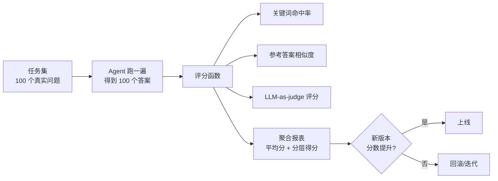
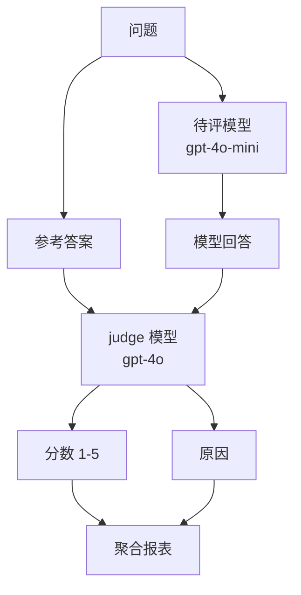
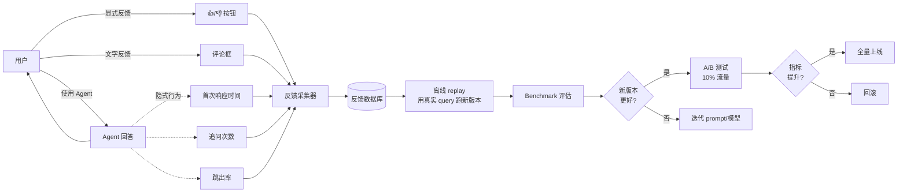
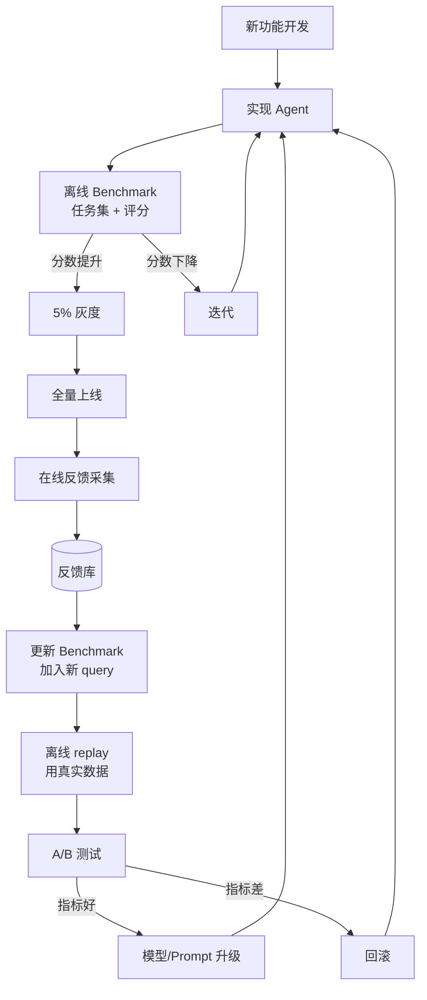

# 进阶 Ch2 · 评估与优化

> **TL;DR**：
> 1. 本章解决"Agent 上线后怎么知道它好不好"——给 Agent 装上仪表盘
> 2. 核心结论：3 个核心能力——Benchmark（任务集+评分函数）/ LLM-as-judge（用模型评模型）/ 反馈闭环（采集用户反馈 + replay + A/B）
> 3. 读完能做：搭一个评估 pipeline，从离线 Benchmark 到在线 A/B 全覆盖

> 📌 **前置阅读**：入门 [Ch1-Ch6 全部](/getting-started/00-roadmap) + 进阶 [Ch1 系统设计](/production/01-system-design)

## 1. 背景 & 问题

某天 Agent 上线一周，PM 跑过来问："咱们的 Agent 效果怎么样？"开发者愣了一下，翻出几个 Slack 截图说"用户反馈还行"。PM 不满意："还行是什么意思？能拿数据说话吗？"

这是几乎每个 Agent 项目都会遇到的尴尬时刻。Agent 不像传统软件有"通过/失败"的明确边界——它的回答有时好有时坏，用户投诉具有偶然性，不投诉的可能是真满意也可能懒得说。三个根本问题摆在面前：

**第一个问题：没有 baseline 不知道"好不好"**。代码上线后，每次改 prompt、换模型、调参数，效果到底是变好了还是变差了？没有 Benchmark 任务集就无从判断。开发者往往只敢"少改"或者"凭感觉改"。

**第二个问题：人工评估不可持续**。上线初期开发者会自己跑 50 个例子逐条看，质量勉强能保证。但 Agent 每天产生几万次对话，不可能每条都看。没有自动评估就只能"用爱发电"。

**第三个问题：用户反馈采集不完整**。哪怕加了 👍/👎 按钮，90% 的用户根本不点；点的人里 80% 是默认好评。靠这些数据没法判断 Agent 真实表现。

本章给出 3 个递进的评估能力。第一是 **Benchmark 设计**——把"评估"变成"跑测试"，和单元测试一样每次升级前跑一遍。第二是 **LLM-as-judge**——用一个更强的模型当裁判，自动给输出打分。第三是 **反馈闭环**——把真实用户的行为埋点回流成训练和评估数据。三者结合，才能让 Agent 进入"持续变好"的飞轮。

本章配套的 `examples/10-evaluation/` 给出 3 个模块的最小可运行实现：基准任务集评分、GPT-4o-mini 当 judge、用户反馈采集器。读者可以把它直接接进自己的 Agent 项目里。

## 2. 核心概念

### 2.1 Benchmark 设计

**Benchmark 是 Agent 的"考试题"，每次升级前跑一遍**。它由两部分组成：**任务集**（100+ 个真实问题）和**评分函数**（怎么算答得好不好）。



（图 2.1：Benchmark 评估流程。任务集跑完得到聚合分数，分数提升才允许上线）

**任务集怎么构造**。三种来源按优先级排列：第一是**线上真实用户 query**（采样 200 条脱敏后入库），这是最贴近真实场景的。第二是**人工构造的对抗样本**（针对 Agent 已知的薄弱点构造难题），用来强化弱点。第三是**公开数据集**（如 HotpotQA、Natural Questions），作为通用能力的基线参考。一开始 30-50 条就够跑通流程，3 个月内扩到 200 条以上才有统计意义。

**评分函数有三种实现**：

- **规则评分**：用关键词命中、字符串匹配、JSON schema 校验等硬规则。优点是快、可重现；缺点是覆盖不到语义层面。
- **参考答案相似度**：把模型答案和参考答案做 embedding 相似度（cosine > 0.8 算通过）。适合开放式问答。
- **LLM-as-judge**：用 GPT-4o 这样的强模型给 gpt-4o-mini 的输出打分（详见 2.2）。

实操中三种混用：硬规则能覆盖的（30%）直接判，开放式问题（70%）用 LLM-as-judge。

**任务分层**。把所有任务按难度分三层：简单（占 30%，单轮直接回答）、中（占 50%，需要 1-2 次工具调用）、难（占 20%，需要多步推理或复杂工具链）。**分层得分比总分更说明问题**——一个总分 85% 的 Agent 可能简单题 99% / 难题 40%，这其实是个偏科严重的 Agent。

### 2.2 LLM-as-judge

**LLM-as-judge 是用模型评模型的自动化方案**——便宜但有偏差。



（图 2.2：LLM-as-judge 流程。强模型评弱模型，给出分数和原因）

**核心机制**：构造一个固定的 judge prompt，包含问题、参考答案、模型回答，让 judge 模型输出 1-5 分 + 简短原因。`examples/10-evaluation/py/llm_judge.py` 给出了最小实现：

```python
JUDGE_PROMPT = """你是评估员。给下面问答打分（1-5）+ 简短原因。

问题：{question}
参考答案：{reference}
模型回答：{answer}

只输出 JSON：{{"score": 1-5, "reason": "..."}}"""

def judge(question: str, reference: str, answer: str) -> tuple[int, str]:
    raw = client.chat.completions.create(
        model="gpt-4o-mini",
        messages=[{"role": "user", "content": JUDGE_PROMPT.format(...)}]
    ).choices[0].message.content or ""
    # 解析 JSON
    ...
```

**judge 模型的选择**有个细节：通常用比被评模型**强 1-2 档**的模型当 judge（gpt-4o 评 gpt-4o-mini，opus 评 sonnet）。同档或更弱的 judge 会自带偏差。还要给 judge 模型固定的 prompt（任何 prompt 改动都视为重新校准），temperature 设为 0 保证可重现。

**校准是 LLM-as-judge 的关键步骤**。做法：人工评 50 条样本得到"金标准"，再用 judge 模型评同一批，对比分数。如果相关系数 < 0.7，就要改 judge prompt 或换 judge 模型。校准集每季度更新一次（防止 judge 模型悄悄变化）。

**LLM-as-judge 的偏差**。三个常见偏差要知道：

- **位置偏差**：judge 倾向给第一个选项高分，多个候选时需要随机打乱顺序。
- **长度偏差**：judge 倾向给长答案高分，需要在 prompt 里强调"以准确为准，不是长度"。
- **自我偏好**：GPT-4o 评 GPT-4o 的输出有 5-10% 的偏好提升，要用不同家族模型交叉验证。

**什么时候不用 LLM-as-judge**。安全类、伦理类、涉及个人主观偏好的场景，judge 模型也会"和稀泥"。这种场景要么用规则+人工抽样，要么直接走人工评估。

### 2.3 反馈闭环

**反馈闭环 = 用真实用户数据反哺 Agent**。把用户行为变成 Agent 升级的燃料。



（图 2.3：反馈闭环。用户显式+隐式反馈 → 反馈库 → 离线 replay → 评估 → A/B → 全量或回滚）

**显式反馈 vs 隐式反馈**。显式反馈（👍/👎 + 文字评论）直接但稀疏——典型 App 显式反馈率 5-15%，80% 是默认好评。隐式反馈（首次响应时间、追问次数、跳出率、复制/分享率）信号弱但量大。两类结合看才有意义。

**离线 replay 怎么跑**。把线上真实 query 提取出来（注意脱敏），保存成 replay 任务集。每次 Agent 升级前，先在 replay 集上跑一遍，看分数变化。这比固定 Benchmark 更贴近真实场景。`examples/10-evaluation/py/feedback_loop.py` 给出了最小反馈采集器：

```python
class FeedbackCollector:
    def add(self, fb: Feedback) -> None:
        self.feedbacks.append(fb)

    def satisfaction_rate(self) -> float:
        if not self.feedbacks:
            return 0.0
        good = sum(1 for fb in self.feedbacks if fb.rating >= 4)
        return good / len(self.feedbacks)

    def by_user(self) -> dict[str, list[int]]:
        result: dict[str, list[int]] = defaultdict(list)
        for fb in self.feedbacks:
            result[fb.user_id].append(fb.rating)
        return dict(result)
```

**A/B 测试是新版本上线的最后一道关**。哪怕离线评估分数更好，也要走 10% 流量 A/B 验证。流量切分要按 user_id 哈希（同一用户始终落同一桶），避免"同一用户今天看 A 版明天看 B 版"的混淆。每组至少 1000 次请求才能算出 p < 0.05 的显著性。

**反馈闭环的禁忌**。两个常见错误：

- **用反馈直接微调模型**：用户反馈噪声太大，直接微调会把模型带偏。要用反馈做评估和筛选，不是直接训练目标。
- **反馈采集后就放一边**：90% 的项目反馈数据进了数据库就没下文。要建立"每周 review 反馈 → 每月更新 Benchmark → 每季度升级模型"的固定节奏。

### 2.4 3 能力整合

三个能力不是孤立的，构成 Agent 持续迭代的闭环。



（图 2.4：3 能力整合成持续迭代闭环。Benchmark 把开发期把关 → 反馈采集把生产期把关 → A/B 测试把上线期把关 → 三者形成飞轮）

**这个闭环的关键节点**：

1. **开发期**：跑 Benchmark 任务集，得分比上一版高才允许进入下一步。
2. **上线期**：先 5% 灰度 → 10% A/B → 全量，每步看指标。
3. **运行期**：持续采集反馈，识别新出现的"长尾问题"。
4. **迭代期**：每季度把反馈数据里的高频问题加进 Benchmark 任务集。
5. **升级期**：用 Benchmark + replay + A/B 三重关卡验证新版本。

**闭环节奏建议**：

- **每周**：跑一次 Benchmark（监控不滑坡）
- **每月**：分析一次反馈数据，提取新问题
- **每季度**：更新一次 Benchmark 任务集 + 考虑模型升级
- **每次大改**：完整跑 Benchmark + 灰度 + A/B

很多团队评估的"失败"不是因为缺工具，而是因为没有节奏。把上面四个时间点固化到团队流程里，评估才能真正发挥作用。

### 2.5 评估指标的设计原则

指标选错了，跑再多评估都是浪费。三个原则必须遵守：

**原则一：指标必须可计算**。每个指标都要明确"输入是什么、输出怎么算、阈值是多少"。模糊的"回答质量好"没法落地。要么用规则精确判定（关键词、JSON schema），要么用 LLM-as-judge 给出可解析的分数。指标定义要写到文档里，让团队所有人理解一致。

**原则二：指标要分层**。一个 Agent 通常有 3-5 个层次的指标：

- **正确性层**：答案是否对、是否包含必要信息（最高优先级）
- **效率层**：响应时间、token 消耗、调用工具次数
- **体验层**：用户满意度、追问次数、跳出率
- **安全层**：是否越狱、是否泄漏敏感信息
- **业务层**：完成任务率、转化率、留存

正确性是底线（不及格直接挡掉），效率是成本（影响毛利），体验是粘性（影响留存），安全是合规（影响生死），业务是终极目标（影响商业价值）。一个好的评估体系要让五个层次都"看得到"。

**原则三：指标必须和行动挂钩**。"满意度 80%"看着好看，但 80% 之后该做什么？如果指标变化无法触发任何动作（升级模型、调整 prompt、修复 bug），那这个指标就是"装饰性指标"。行动挂钩示例：

- 满意度 < 70% → 触发 prompt 优化 review
- 响应时间 p95 > 3s → 触发性能优化
- 工具调用次数 > 10 → 触发流程简化
- 越狱检测率 < 95% → 触发安全加固

每个指标都要有"如果 < 阈值就做什么"的预案。

### 2.6 评估体系的成熟度模型

不是每个团队上来就能做完整评估。给团队一个**成熟度阶梯**，对标当前位置，知道下一步该做什么：

| 等级 | 名称 | 特征 | 评估方式 |
|------|------|------|----------|
| **L1** | 凭感觉 | 开发者自己跑 5-10 个例子看效果 | 人工走查 |
| **L2** | 自动化 | 有 Benchmark 任务集（30-100 个）+ 自动评分 | 跑 Benchmark 任务集 |
| **L3** | 多维度 | 任务集 ≥200 + LLM-as-judge + 分层得分 + 置信区间 | 多维度对比报表 |
| **L4** | 在线反馈 | 反馈采集 + replay + A/B + 周期性升级 | 完整闭环 |
| **L5** | 自适应 | 指标自动监控、异常自动告警、版本自动 A/B | 全自动飞轮 |

**L1 → L2 的关键动作**：构造 50-100 个真实 query，写评分函数，每周跑一次。

**L2 → L3 的关键动作**：任务集扩到 200+，引入 LLM-as-judge，按维度（正确/效率/安全）拆开打分。

**L3 → L4 的关键动作**：上线反馈采集、跑 A/B 测试、让真实用户数据驱动决策。

**L4 → L5 的关键动作**：把评估+升级做成流水线（每次 PR 触发 Benchmark，不达标直接卡 CI）。

大部分团队卡在 L2 → L3 之间——他们有 Benchmark，但不知道分数变动意味着什么。突破的关键是**指标分层 + 置信区间 + 业务对齐**。不是工具问题，是思考框架问题。

### 2.7 评估节奏与组织流程

评估不是"想起来就跑一下"的临时动作，而是要嵌入团队流程的固定节奏：

**每日（5 分钟）**：

- 看一眼核心指标 dashboard（满意度、p95 响应时间、错误率）
- 有异常告警立刻排查

**每周（30 分钟）**：

- 跑一次完整 Benchmark（监控不滑坡）
- 抽样 10-20 条真实对话人工看
- 同步本周评估结论到团队群

**每月（2 小时）**：

- 分析反馈数据，提炼高频问题
- 更新 Benchmark 任务集（加入本月新发现的薄弱场景）
- 评估是否要做 prompt/模型升级

**每季度（1 天）**：

- 全量评估复盘：3 个月趋势图
- 重新校准 LLM-as-judge（防止 judge 模型漂移）
- 评估是否需要换底层模型（如 GPT-4o → GPT-5）
- 评审 A/B 测试流程是否需要优化

**组织上**：

- 至少 1 人专门负责评估体系（哪怕是 20% 时间）
- 评估结果对外透明（所有团队成员都能看到 dashboard）
- 重大版本升级必须配完整评估报告（Benchmark + replay + A/B 三项）

### 2.8 术语卡片

| 术语 | 定义 | 关键参数 |
|------|------|----------|
| **Benchmark** | Agent 评估用的"考试题"，由任务集+评分函数组成 | 任务数 ≥100，按难度分层 |
| **任务集** | 一组真实/构造的问题，用于评估 Agent | 简单 30% / 中 50% / 难 20% |
| **评分函数** | 把模型输出转为分数的规则或模型 | 规则 30% / 相似度 30% / judge 40% |
| **LLM-as-judge** | 用一个 LLM 给另一个 LLM 的输出打分 | judge 模型比被评强 1-2 档，prompt 固定 |
| **校准集** | 人工评的金标准样本，用于校准 judge 模型 | 50 条/季度，相关系数 > 0.7 |
| **反馈采集** | 收集用户对 Agent 回答的显式和隐式反馈 | 👍/👎 + 文字 + 行为埋点 |
| **Replay** | 用线上真实 query 离线评估新版本 | 每两周一次 |
| **A/B 测试** | 流量切分对比两个版本的核心指标 | 每组 ≥1000 请求，p < 0.05 |
| **统计功效** | 检测出真实差异的概率，和样本量正相关 | 1-β ≥ 0.8，α = 0.05 |
| **偏差（bias）** | 评估中的系统性误差，LLM-as-judge 有位置/长度/自我偏好偏差 | 随机化 + 多模型交叉验证 |
| **成熟度模型** | 评估团队当前水平的阶梯（L1 凭感觉 → L5 自适应） | 对标当前位置，确定下阶段目标 |
| **置信区间** | 评估分数的统计区间，反映样本量不足的不确定性 | 报告 "85% ± 3%"，而非单点 |

### 2.9 评估成本控制

评估本身不产生业务价值，是"为质量付的钱"。如果评估成本失控，团队会偷偷跳过评估——这是最糟糕的结局。三个成本维度要管住：

**算力成本**。LLM-as-judge 一次评估可能调用 GPT-4o 几千次，按 GPT-4o $2.5/1M input 算，200 个任务 × 4k token ≈ $2/次评估。听起来不多，但每周一次 + 多个团队 + 多模型对比 = 月度几千美元。

- **降本方法 1**：用 gpt-4o-mini 当 judge（90% 场景够用），只在分数争议时才升级到 gpt-4o。
- **降本方法 2**：prompt 缓存（judge prompt 是固定的，命中缓存省 50%+ token）。
- **降本方法 3**：批量评估（一次调用评多条，把所有任务打包到一个请求里）。
- **降本方法 4**：用规则评能覆盖的部分（30% 任务可规则化）。

**人力成本**。校准集维护、Benchmark 更新、抽样 review 都要花人时。一个 50 条的校准集首次构建约 2-3 人时，每季度更新 1 人时。

- **降本方法**：把评估任务分配给"半个人"（20% 时间专门负责评估），比 5 个人各花 5% 效率高。
- **复用性**：校准集、Benchmark 任务集一旦建好，可以跨项目复用——这是评估体系的复利。

**时间成本**。评估流程跑完一次要多久？如果是 1 天，团队一周只能迭代 1 次；如果是 1 小时，团队可以一天迭代 5 次。

- **目标**：单次完整评估（100 任务 + judge）≤ 1 小时
- **加速方法 1**：并发调用（async/await 包装 LLM 调用，并发数 10-20）
- **加速方法 2**：分层评估——先用规则过一遍，规则不通过的才进 LLM-as-judge
- **加速方法 3**：增量评估——每次只评变更影响的子集（用 diff 锁定相关任务）

**成本-质量平衡**。不是评估越严越好。MVP 阶段 L2（自动 Benchmark）就够，别一上来就 L4（在线 A/B）。**评估的成熟度要匹配产品成熟度**。

## 3. 最小可运行示例

`examples/10-evaluation/` 提供了 3 个评估组件的最小实现。完整代码在仓库对应目录。

**3.1 Benchmark（任务集+评分）**——`py/benchmark.py`：

```python
@dataclass
class BenchmarkTask:
    id: str
    question: str
    expected_keywords: list[str] = field(default_factory=list)
    expected_answer: str = ""

class Benchmark:
    def __init__(self, tasks: list[BenchmarkTask]):
        self.tasks = tasks

    def score(self, task: BenchmarkTask, actual: str) -> BenchmarkResult:
        if not task.expected_keywords:
            return BenchmarkResult(task.id, actual, 1.0)
        hits = sum(1 for kw in task.expected_keywords if kw in actual)
        return BenchmarkResult(task.id, actual, hits / len(task.expected_keywords))

    def average_score(self, results: list[BenchmarkResult]) -> float:
        if not results:
            return 0.0
        return sum(r.score for r in results) / len(results)
```

**3.2 LLM-as-judge**——`py/llm_judge.py`：

```python
JUDGE_PROMPT = """你是评估员。给下面问答打分（1-5）+ 简短原因。

问题：{question}
参考答案：{reference}
模型回答：{answer}

只输出 JSON：{{"score": 1-5, "reason": "..."}}"""

def judge(question: str, reference: str, answer: str) -> tuple[int, str]:
    raw = client.chat.completions.create(...).choices[0].message.content or ""
    # 解析 {"score": 4, "reason": "..."}
```

**3.3 反馈闭环**——`py/feedback_loop.py`：

```python
@dataclass
class Feedback:
    user_id: str
    rating: int
    comment: str = ""
    session_id: str = ""

class FeedbackCollector:
    def add(self, fb: Feedback) -> None:
        self.feedbacks.append(fb)

    def satisfaction_rate(self) -> float:
        if not self.feedbacks:
            return 0.0
        good = sum(1 for fb in self.feedbacks if fb.rating >= 4)
        return good / len(self.feedbacks)
```

**运行方式**：

```bash
cd examples/10-evaluation
pip install -r requirements.txt
export OPENAI_API_KEY=sk-...
pytest tests/ -v   # 跑冒烟测试
python py/benchmark.py   # 跑示例 Benchmark
python py/llm_judge.py  # 跑示例 judge
python py/feedback_loop.py  # 跑示例反馈采集
```

## 4. 常见陷阱

### 陷阱 1：Benchmark 任务集太小

**现象**：10 个任务的 Benchmark，模型准确率 90% 看着挺好，结果一上线各种翻车。

**原因**：10 个任务无统计意义。哪怕 Agent 答对 9 个，置信区间 ±15%，可能真实准确率 75% 也可能 100%——根本分不清。

**解法**：任务集 ≥100 个，按难度分层（简单 30 / 中 50 / 难 20）。每个分层的得分单独看，定位"偏科"。同时给每次跑结果附上**置信区间**（Wilson 区间或 Bootstrap 区间），别只报一个"平均分 85%"的数字。

**进阶做法**：任务集和真实线上 query 分布保持一致。每季度重新采样一次（线上 query 分布会漂移，老任务集可能严重过时）。

### 陷阱 2：LLM-as-judge 评分受 prompt 影响

**现象**：换 judge prompt 后，同一答案从 4 分变 2 分。团队里有人怀疑"judge 是不是坏了"。

**原因**：judge LLM 对 prompt 极敏感。一个逗号、一种语气都能让分数大幅波动。这种敏感性来自 LLM 的指令遵循能力：它会"过度解读"prompt 里的细节。

**解法**：

1. **固定 judge prompt**：每次升级 prompt 都视为重新校准，不能"小改一下试试"。
2. **维护校准集**：人工评 50 条 vs judge 评 50 条，算皮尔逊/斯皮尔曼相关系数。< 0.7 就要重新校准。
3. **多模型交叉**：不要只用 GPT-4o 一个 judge，可以 GPT-4o + Claude + Gemini 三家交叉，差异大的样本送人工。
4. **用 reasoning 模型**：o1 / Claude extended thinking 模式的 judge 比普通模型稳定。

### 陷阱 3：反馈闭环只采集 👍/👎

**现象**：80% 反馈是默认 👍，看起来 Agent 满意度 80%，但实际客服投诉一大堆。

**原因**：用户懒得给差评。👍 是"凑合用"的意思，👎 是"特别愤怒"的意思，中间地带 80% 都是凑合——这才是问题所在。

**解法**：埋点要更细。**显式 + 隐式结合**：

- **显式**：👍/👎 + 文字评论 + 1-5 星评分（细粒度优于二元）
- **隐式**：首次响应时间、追问次数（"重复问题"通常意味着上一答不满意）、跳出率、复制率、分享率、点赞/点踩率
- **抽样人工 review**：每天随机抽 50 条对话人工看，5 分钟一批

**特别要注意**：用"追问次数"和"复制率"作为信号——用户复制粘贴答案说明答案有用，重复问说明上一答没用。这两个隐式信号比 👍/👎 准得多。

### 陷阱 4：A/B 测试样本不够就出结论

**现象**：A 版 100 次请求 vs B 版 100 次请求，转化率高 5%，团队立刻宣布 B 更好全量上线。

**原因**：统计功效不足。100 次请求的样本，5% 差异完全可能是随机波动。这种"虚假的胜利"上线后经常翻车。

**解法**：

1. **每组至少 1000 次请求**（理想 5000+），样本量取决于基线转化率和期望最小检测差异。
2. **显著性检验**：用 z-test 或 t-test，p < 0.05 才算显著。
3. **置信区间**：报"B 相对 A 提升 5% ± 3%"，而不是"B 比 A 好"。
4. **多指标交叉**：只看一个指标容易"过拟合"，至少看 3-5 个核心指标。
5. **A/A 测试验证**：上线 A/B 系统前先跑 A/A（两桶都是 A 版）看是否真有 0 差异，验证系统没 bug。

**额外建议**：用现成的 A/B 框架（Eppo、Statsig、GrowthBook），别自己写显著性检验——里面坑很多（peeking problem、辛普森悖论）。

### 陷阱 5（补充）：评估脱节

**现象**：Benchmark 跑得很好（90% 准确率），A/B 测试结果也好看（提升 5%），但用户满意度就是不涨。

**原因**：评估指标和真实业务指标脱节。Benchmark 评"答案里有没有关键词"，但用户在乎"答案能不能解决我的问题"。A/B 测"按钮点击率"，但用户真正关心的是"任务完成率"。

**解法**：让评估指标**对齐北极星指标**。如果北极星是"用户完成任务率"，那就直接评估任务完成率（哪怕需要人工标注）。评估指标越接近真实业务价值，越能避免"指标涨了但产品没变好"的情况。

### 陷阱 6：Benchmark 任务集被训练集污染

**现象**：Agent 在内部 Benchmark 上 95% 准确率，部署到生产环境却 60% 都不到。

**原因**：训练数据（或 RAG 知识库）里包含了 Benchmark 任务集的答案。模型直接"背诵"了答案，没有真正泛化。学术界叫 "data contamination"。

**解法**：

1. **隔离**：Benchmark 任务集和训练数据用物理隔离的存储，绝不混用。
2. **动态化**：Benchmark 任务集定期换 10-20% 内容（防止长期部署后被"摸熟"）。
3. **保留题**：在任务集里埋 5-10% 的"蜜罐题"——如果模型突然对某题 100% 答对，要怀疑是否被污染。
4. **真实 query 优先**：业务 Benchmark 任务集全部来自真实用户 query（脱敏后），训练数据碰不到。

### 陷阱 7：评估一次就不再更新

**现象**：评估体系搭得很好，跑出来分数也不错，但 6 个月后业务已经变了，评估分数和真实体验完全脱节。

**原因**：评估体系是"快照"，业务是"活水"。昨天的好 Agent 不一定是今天的好 Agent。**模型分布、用户行为、prompt 工程都在持续变化**。

**解法**：

1. **每季度强制更新 Benchmark**：哪怕分数没变，也要 review 任务集是否还代表真实场景。
2. **监控"评估-实际"差距**：维护一个"评估预测准确率"指标——如果评估说 90% 好但实际只有 70% 满意，说明评估体系本身过时了。
3. **建立"评估债务"概念**：把"任务集老于 X 个月"作为技术债，定期清理。

## 5. 本章速查表

| 能力 | 推荐实现 | 关键参数 |
|------|----------|----------|
| **Benchmark** | 100+ 任务集 + 自动评分 | 任务按难度分层 + 置信区间 |
| **LLM-as-judge** | GPT-4o 评 gpt-4o-mini | judge prompt 固定 + 校准集 50 条 |
| **反馈闭环** | 实时埋点 + 离线 replay | 👍/👎 + 文字 + 行为埋点 |
| **A/B 测试** | 流量 50/50 切分 | 每组 ≥1000 请求 + p < 0.05 |
| **Replay** | 线上真实 query 离线跑 | 每两周一次，覆盖 ≥200 条 |
| **校准** | 人工评 50 条 + judge 评 50 条 | 相关系数 > 0.7，每季度更新 |

**验证方法**：能跑通"开发 → 离线 Benchmark → 灰度 → 反馈采集 → Replay → 升级 → A/B 验证 → 全量"完整闭环。具体来说：

- 能用 `python py/benchmark.py` 跑通 100+ 任务的评分
- 能用 `python py/llm_judge.py` 评出平均分
- 能用 `python py/feedback_loop.py` 采集并聚合反馈
- 跑 `pytest tests/ -v` 4 个测试全过

**常用评估工具速查**：

| 工具 | 类型 | 适用场景 | 备注 |
|------|------|----------|------|
| **自建 Benchmark** | 任务集+评分 | 业务专属评估 | 灵活度高，维护成本高 |
| **OpenAI Evals** | 任务集框架 | 通用能力评估 | 开源，适合英文场景 |
| **LangSmith** | 链路追踪+评估 | LangChain 项目 | 集成度高 |
| **Braintrust** | 评估+实验管理 | 多模型对比 | 商业版有完整 dashboard |
| **Weights & Biases** | 实验追踪 | ML 团队熟悉的工具 | 需要自建评估逻辑 |
| **Phoenix (Arize)** | 开源可观测性 | LLM 应用监控 | 适合实时监控场景 |
| **Eppo / Statsig / GrowthBook** | A/B 测试 | 流量切分+显著性检验 | 不要自己写显著性检验 |

## 6. 下章预告 & 关键术语桥接

> 🔜 **下章 [进阶 Ch3 安全与风险](/production/03-security)**

本章的"评估"在 Ch3 会被安全视角收口：

- 本章说 **"LLM-as-judge 评估答案质量"** → Ch3 演示**怎么用 LLM-as-judge 检测越狱回复**（同样的机制，但评估对象换成"安全合规"维度）
- 本章说 **"反馈采集"** → Ch3 演示**怎么埋点检测 Prompt 注入攻击**（把注入尝试也作为"反馈"的一种特殊形态采集）
- 本章说 **"Benchmark 任务集"** → Ch3 演示**安全 Benchmark：注入/越狱/数据泄漏场景**（任务集从"业务问题"扩展到"对抗问题"）

简单说，**评估的框架不变，但评估的"目标函数"从"质量"变成"安全"**。两个视角合起来才是完整的 Agent 健康度检查。

---

### 思考题

1. 你的 Agent 项目目前有 Benchmark 吗？任务集是怎么构造的？覆盖了哪些场景？
2. 如果让你加 LLM-as-judge，你会选哪个模型当 judge？怎么验证它评得对？
3. 你的反馈采集除了 👍/👎 还埋了哪些点？这些点能区分"凑合用"和"真满意"吗？

### 本章行动清单

读完后能立刻做的 5 件事：

- [ ] 列 50-100 个真实用户 query 做初始任务集
- [ ] 写一个关键词命中/参考答案相似度的评分函数
- [ ] 接入 LLM-as-judge，先用 gpt-4o-mini 当 judge
- [ ] 在产品里加"👍/👎 + 文字评论"反馈按钮
- [ ] 设定每周固定时间跑一次 Benchmark（放到日历提醒里）

> 评估体系的搭建不是一蹴而就的工程，而是**每周打磨一点**的持续习惯。从 L1 到 L5 的升级路径，平均需要 6-12 个月。耐心比方法更重要。
