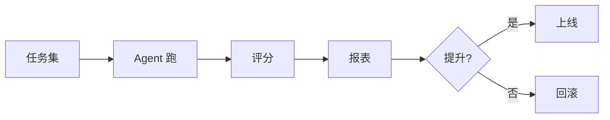
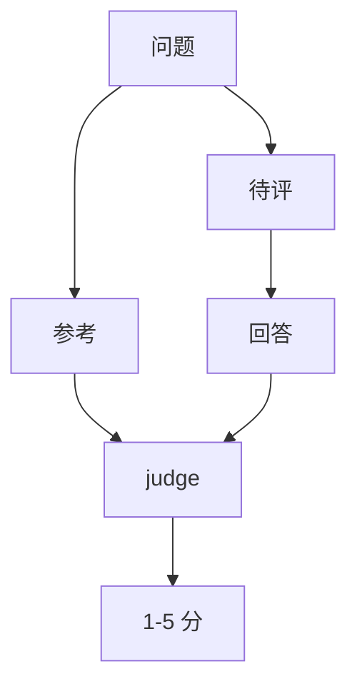
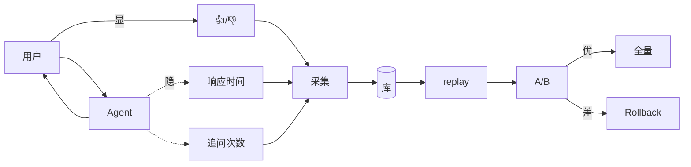
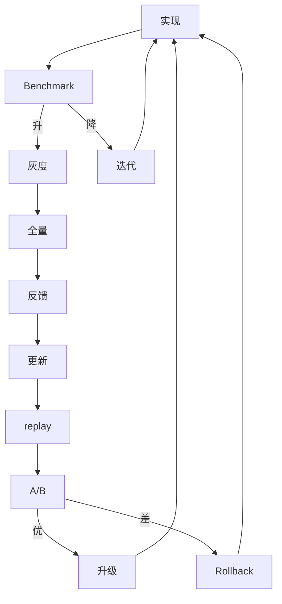

# 进阶 Ch2 · 评估与优化

> **TL;DR**：
> 1. 本章解决"Agent 上线后怎么知道它好不好"——给 Agent 装上仪表盘
> 2. 核心结论：3 个核心能力——Benchmark（任务集+评分函数）/ LLM-as-judge（用模型评模型）/ 反馈闭环（采集用户反馈 + replay + A/B）
> 3. 读完能做：搭一个评估 pipeline，从离线 Benchmark 到在线 A/B 全覆盖

> 📌 **前置阅读**：入门 [Ch1-Ch6 全部](/getting-started/00-roadmap) + 进阶 [Ch1 系统设计](/production/01-system-design)

## 1. 背景 & 问题

PM 问"Agent 效果怎么样"，开发说"还行"——每个项目的尴尬。三个根本问题：① 没有 baseline 不知道好不好 ② 人工评估不可持续（每天几万次对话）③ 反馈不完整（90% 不点 👍/👎，80% 默认好评）。

本章给出 3 个递进能力：**Benchmark**（任务集+评分）、**LLM-as-judge**（强模型当裁判）、**反馈闭环**（真实数据反哺）。配套 `examples/10-evaluation/` 含 3 个最小可运行模块。

## 2. 核心概念

### 2.1 Benchmark 设计

**Benchmark 是 Agent 的"考试题"**，由任务集（100+ 真实问题）和评分函数组成。



（图 2.1：Benchmark 流程）

**任务集**：线上真实 query（200 条脱敏）+ 人工对抗样本 + 公开数据集（HotpotQA）。30-50 条起步，3 个月内扩到 200+。

**评分函数**：规则（关键词/JSON schema）+ 相似度（cosine > 0.8）+ judge。实操 30% 规则 + 70% judge。

**任务分层**：简单 30% / 中 50% / 难 20%。**分层得分比总分更说明问题**——总分 85% 可能简单题 99% / 难题 40%，是偏科。

### 2.2 LLM-as-judge

**LLM-as-judge 是用模型评模型**——便宜但有偏差。



（图 2.2：LLM-as-judge 流程）

**核心机制**：固定 judge prompt（问题+参考+回答）→ 输出 1-5 分 + 原因。`llm_judge.py` 有最小实现。

**judge 选择**：比被评**强 1-2 档**（gpt-4o 评 mini，opus 评 sonnet）。temperature=0，prompt 固定。

**校准**：人工评 50 条得金标准，judge 评同一批对比相关系数。< 0.7 改 prompt 或换模型。每季度更新。

**三种偏差**：位置（随机打乱）、长度（prompt 强调"以准确为准"）、自我偏好（GPT-4o 评 GPT-4o 有 5-10% 偏好，用不同家族交叉）。

**不用场景**：安全/伦理/主观偏好——用规则+人工抽样。

### 2.3 反馈闭环

**反馈闭环 = 用真实用户数据反哺 Agent**。



（图 2.3：反馈闭环）

**显式 vs 隐式**：显式稀疏（5-15% 反馈率，80% 默认好评）；隐式（响应时间、追问次数、跳出率）信号弱但量大。两类结合看。

**离线 replay**：提取线上 query（脱敏）成任务集，升级前跑一遍。比固定 Benchmark 更贴近真实。

**A/B 测试**：上线前 10% 流量验证。按 user_id 哈希（同用户同桶），每组 ≥1000 请求，p < 0.05 才显著。

**两个禁忌**：① 用反馈直接微调（噪声大）② 采集后放一边（90% 项目）。要"每周 review → 每月更新 → 每季度升级"。

### 2.4 3 能力整合

三个能力构成持续迭代闭环。



（图 2.4：3 能力闭环）

**关键节点**：开发期（Benchmark）→ 上线期（5%→10%→全量）→ 运行期（持续采集）→ 升级期（Benchmark+replay+A/B 三关）。

### 2.5 指标设计原则

三原则：① **可计算**（输入/输出/阈值明确）② **分层**（正确性/效率/体验/安全/业务）③ **挂钩行动**（"< 阈值就做什么"预案）。

### 2.6 成熟度模型

| 等级 | 特征 |
|------|------|
| L1 凭感觉 | 5-10 例子 |
| L2 自动化 | 30-100 任务 + 评分 |
| L3 多维度 | 200+ 任务 + judge + 分层 |
| L4 在线反馈 | 反馈 + replay + A/B |
| L5 自适应 | 监控+告警+自动 A/B |

多数卡 L2→L3。突破靠**指标分层+置信区间+业务对齐**。

### 2.7 评估节奏

- **每日 5 分钟**：dashboard + 告警
- **每周 30 分钟**：Benchmark + 抽 10-20 条人工
- **每月 2 小时**：分析反馈 + 更新任务集
- **每季度 1 天**：复盘 + 校准 judge + 评审 A/B

### 2.8 术语卡片

| 术语 | 定义 | 关键参数 |
|------|------|----------|
| **Benchmark** | 任务集+评分 | ≥100，按难度分层 |
| **任务集** | 真实/构造问题 | 简单 30 / 中 50 / 难 20 |
| **LLM-as-judge** | 模型评模型 | judge 强 1-2 档 |
| **校准集** | 人工金标准 | 50 条/季，> 0.7 |
| **反馈采集** | 显式+隐式 | 👍/👎 + 行为埋点 |
| **Replay** | 线上 query 离线 | 每两周一次 |
| **A/B 测试** | 流量切分 | ≥1000/组，p < 0.05 |
| **成熟度模型** | L1→L5 阶梯 | 对标定目标 |

### 2.9 成本控制

算力（mini 当 judge + 缓存 + 批量）、人力（20% 时间专人）、时间（单次 ≤ 1 小时）。**评估成熟度匹配产品成熟度**——MVP 阶段 L2 够。

## 3. 最小可运行示例

`examples/10-evaluation/` 提供 3 个评估组件的最小实现。

**3.1 Benchmark**——`py/benchmark.py`：

```python
@dataclass
class BenchmarkTask:
    id: str
    question: str
    expected_keywords: list[str] = field(default_factory=list)

class Benchmark:
    def score(self, task, actual):
        if not task.expected_keywords: return 1.0
        hits = sum(1 for kw in task.expected_keywords if kw in actual)
        return hits / len(task.expected_keywords)
```

**3.2 LLM-as-judge**——`py/llm_judge.py`：

```python
JUDGE_PROMPT = """评估员，给问答打分（1-5）。
问题：{question} 参考：{reference} 回答：{answer}
JSON：{{"score": 1-5, "reason": "..."}}"""

def judge(question, reference, answer):
    raw = client.chat.completions.create(...).choices[0].message.content
    return parse_score(raw)
```

**3.3 反馈闭环**——`py/feedback_loop.py`：

```python
@dataclass
class Feedback:
    user_id: str
    rating: int
    comment: str = ""

class FeedbackCollector:
    def satisfaction_rate(self):
        if not self.feedbacks: return 0.0
        return sum(1 for fb in self.feedbacks if fb.rating >= 4) / len(self.feedbacks)
```

**运行**：

```bash
cd examples/10-evaluation
pip install -r requirements.txt
pytest tests/ -v   # 4 测试全过
```

## 4. 常见陷阱

### 陷阱 1：Benchmark 任务集太小

**现象**：10 任务 90% 挺好，上线后翻车。

**原因**：10 任务无统计意义，置信区间 ±15%，真实可能 75% 也可能 100%。

**解法**：任务集 ≥100（简单 30 / 中 50 / 难 20）。结果附**置信区间**（Wilson/Bootstrap），别只报单点。每季度重采样。

### 陷阱 2：judge prompt 敏感

**现象**：换 prompt 后同答案从 4 分变 2 分。

**原因**：judge LLM 对 prompt 极敏感——一个逗号就能让分数大幅波动。

**解法**：① prompt 固定（任何改动视为重新校准）② 50 条校准集，人工 vs judge < 0.7 就重校 ③ 多模型交叉（GPT-4o+Claude+Gemini）④ 用 reasoning 模型（o1 / extended thinking）作 judge。

### 陷阱 3：反馈只采 👍/👎

**现象**：80% 反馈默认 👍，满意度看着 80%，实际投诉一大堆。

**原因**：用户懒得给差评。👍=凑合用、👎=特别愤怒，中间 80% 才是问题。

**解法**：显式+隐式结合。**显式**：👍/👎+1-5 星+评论。**隐式**：响应时间、追问次数（重复问=上答不满）、跳出率、复制率。**追问次数+复制率**比 👍/👎 准。

## 5. 本章速查表

| 能力 | 推荐实现 | 关键参数 |
|------|----------|----------|
| **Benchmark** | 100+ 任务 + 评分 | 难度分层 + 置信区间 |
| **LLM-as-judge** | GPT-4o 评 mini | prompt 固定 + 校准 50 条 |
| **反馈闭环** | 埋点 + replay | 👍/👎 + 行为 |
| **A/B 测试** | 流量 50/50 | ≥1000 + p < 0.05 |

**验证**：跑通"开发 → Benchmark → 灰度 → 反馈 → Replay → 升级 → A/B → 全量"闭环，`pytest tests/ -v` 4 测试全过。

**工具**：OpenAI Evals/LangSmith/Braintrust/Phoenix/Eppo·Statsig·GrowthBook。

## 6. 下章预告 & 关键术语桥接

> 🔜 **下章 [进阶 Ch3 安全与风险](/production/03-security)**

- **LLM-as-judge**：质量评估 → 安全合规评估（机制同，目标换）
- **反馈采集**：质量反馈 → 注入尝试（埋点扩到对抗）
- **Benchmark**：业务问题 → 对抗问题（注入/越狱/泄漏）

> 评估框架不变，"质量"还是"安全"才是关键变量。

---

### 思考题

1. 你的 Agent 有 Benchmark 吗？覆盖哪些场景？
2. 加 LLM-as-judge 会选哪个模型？怎么验证？
3. 反馈采集能区分"凑合用"和"真满意"吗？

### 行动清单

- [ ] 列 50-100 真实 query 做任务集
- [ ] 写关键词/相似度评分函数
- [ ] 接入 LLM-as-judge（先用 mini）
- [ ] 产品加"👍/👎+评论"按钮
- [ ] 每周跑 Benchmark（加日历提醒）
