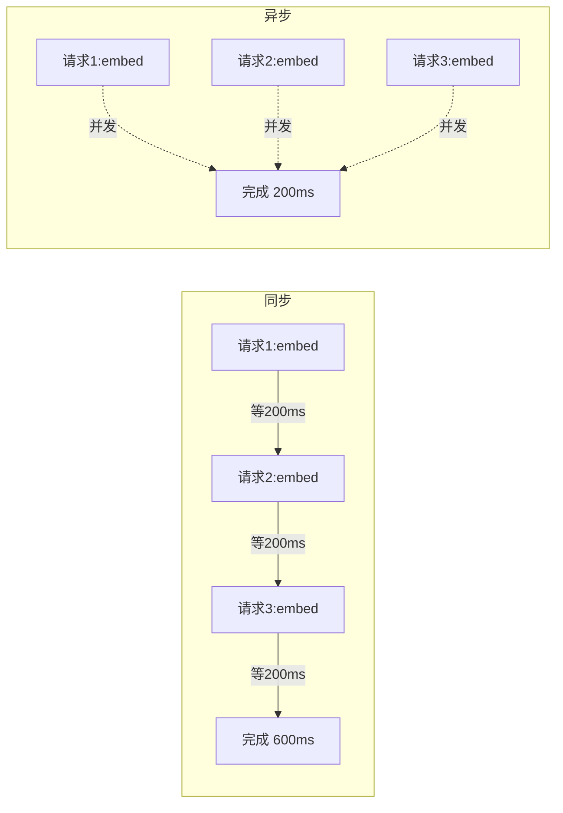
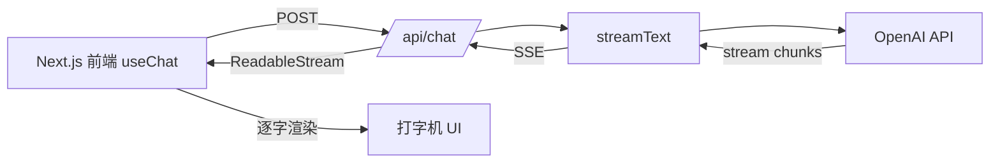
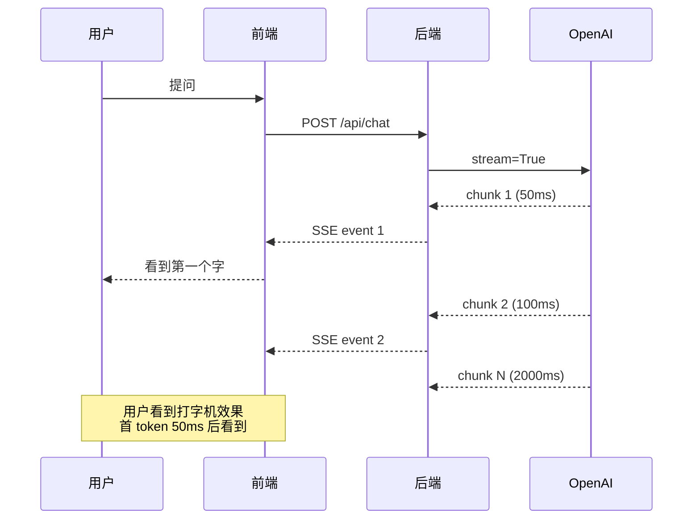
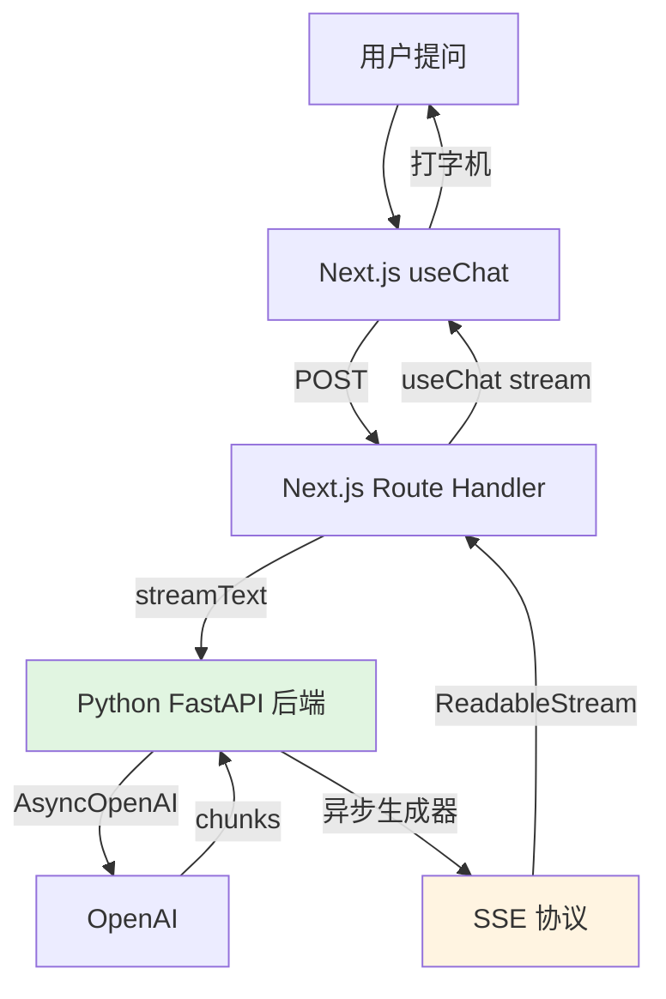

# 进阶 Ch4 · 工程实战（收官章）

> **TL;DR**：
> 1. 本章把进阶 Ch1-Ch3 的能力**工程化**——Python 异步 pipeline / TS Web 集成 / 流式响应
> 2. 核心结论：3 个核心能力——Python `asyncio` 异步 pipeline（QPS 提升 5-10 倍）/ TS Vercel AI SDK Web 集成（流式 UI）/ 流式响应（首 token 延迟 <500ms）
> 3. 读完能做：把一个 demo Agent 改造成"能扛 1000 QPS + 流式 UI + 完整监控"

> 📌 **前置阅读**：入门 [Ch1-Ch9 全部](/getting-started/00-roadmap) + 进阶 [Ch1-Ch3 全部](/production/00-prerequisites)

---

## 1. 背景 & 问题

进阶 Ch3 写完那天，团队在群里贴了张监控图：QPS 8，P99 延迟 12 秒。客服 Agent 上线第一周就"挂了"——不是逻辑挂，是**接不住量**。

三个工程化问题把 demo 拉回现实：

**问题 1：QPS 上不去**。客服 Agent 一天高峰 8000 咨询，每次推理要 3-8 秒（同步 OpenAI 调用 + 串行 RAG 检索 + 工具调用），8 个 worker 进程满负荷只能扛 8 QPS。Python 同步代码把 I/O 时间浪费在 `time.sleep` 上。

**问题 2：Web 端没流式**。前端一次性 fetch 后端接口，用户盯着空白屏 8 秒——超过 3 秒就关页面。ChatGPT 那种"打字机效果"我们的客服 Agent 没有。

**问题 3：Python 后端与 TS 前端集成难**。后端用 FastAPI 输出 SSE，前端用 axios 收；流式到一半断了没重连；TS 那边没有"流式 useChat"的官方 hook，全靠手写。**Python 异步生成器怎么转成前端可消费的 SSE 协议？**——这层胶水代码占了项目 30%。

本章给 3 个工程化能力：**Python 异步 pipeline**（让单进程 QPS 翻 5-10 倍）、**TS Vercel AI SDK**（Next.js 流式 UI 一行接上）、**流式响应**（OpenAI `stream=True` + SSE + 异步生成器三件套）。学完这三样，demo Agent 就能扛 1000 QPS。

---

## 2. 核心概念

### 2.1 Python 异步 pipeline

**同步 vs 异步的本质差异**在"等 I/O 时做什么"：同步代码等 I/O 时整个线程被 OS 挂起；异步代码等 I/O 时让出控制权，事件循环调度其他协程跑。



（图 2.1：3 个并发请求——同步 600ms vs 异步 200ms）

**关键事实**：`asyncio.gather(*tasks)` 把 N 个协程并发跑，总耗时约等于最慢的那个，不是 N 个串行加起来。**单进程 QPS 提升 5-10 倍**。

`asyncio` 是 Python 标准库的"事件循环 + 协程"。`async def` 定义协程函数，`await` 挂起点让出 CPU。**所有阻塞 I/O 都必须有异步版本**——同步库（`requests` / `openai.OpenAI` / `psycopg2`）在 `async def` 里调会阻塞整个事件循环，把 QPS 拉回 1。`aiohttp` / `httpx` / `openai.AsyncOpenAI` / `asyncpg` 是对应的异步实现。

> 💡 进阶 Ch1 的限流 / 缓存 / 降级也要改造成异步版本，否则同样的 5-10 倍差距会反过来变成同步阻塞把异步优势吃光。

### 2.2 TS Web 集成（Vercel AI SDK）

Vercel AI SDK 是 Next.js 生态的**LLM 应用层 SDK**，把"前端用 useChat + 后端用 streamText"封装成"前端一行、后端一行"。



（图 2.2：Vercel AI SDK 流式数据流——前端到后端再到 OpenAI 再回流式 chunk）

**核心 hook `useChat`** 接管 4 件事：① 流式 chunk 累积成 `messages` 数组；② 自动管理 loading 状态；③ 中止按钮（`stop()`）；④ 输入框绑定（`handleInputChange` / `handleSubmit`）。**后端 `streamText`** 把 OpenAI 的 `stream=True` 包成 Next.js Route Handler 能直接 `return` 的 `ReadableStream`。

不用 AI SDK 的话，开发者要手写：`ReadableStream` 解析 SSE → 逐 chunk 累加到 state → 手写中止逻辑 → 手写 reconnect。**Vercel AI SDK 把这层胶水代码 100% 抹掉**。

### 2.3 流式响应

**流式 = 第一个 token 到达就推给用户**，不等到完整回答。



（图 2.3：流式时序图——首 token 延迟从 2000ms 降到 50ms）

**SSE（Server-Sent Events）** 是流式响应的传输协议，Content-Type 是 `text/event-stream`。**OpenAI 的 `stream=True`** 启动后，`chat.completions.create` 返回的不是 `ChatCompletion` 而是 `Stream[ChatCompletionChunk]`，每次迭代 yield 一个 chunk。

**首 token 延迟**（TTFT, Time To First Token）是流式最关键指标：**从用户发问到看到第一个字的时间**。非流式是完整响应时间（用户要等 5s），流式 <500ms 就让用户感觉"快"。**5-10 倍的主观速度提升**。

### 2.4 3 能力整合

把 Python 异步 + TS 流式 + SSE 串成完整工程栈。



（图 2.4：3 能力整合架构——Python 异步后端 + TS 流式前端 + SSE 协议）

**3 段管道**：
- **前端段**：Vercel AI SDK `useChat` 把流式 chunks 自动累积成 UI
- **协议段**：SSE 在 Next.js Route Handler 和 FastAPI 之间传递
- **后端段**：Python `AsyncOpenAI` + `async def` + `asyncio.gather` 并发

**3 段每段都有自己的"流式单元"**：前端是 React 组件 re-render、协议是 SSE event、后端是 async generator。三者用 chunk 边界对齐（一个 OpenAI chunk 对应一个 SSE event 对应一次 React state 更新）。

### 2.5 术语卡片

| 术语 | 解释 |
|---|---|
| asyncio | Python 标准库，事件循环 + 协程运行时 |
| 协程 (coroutine) | `async def` 定义的可挂起函数 |
| `await` | 挂起点，让出控制权给事件循环 |
| `asyncio.gather` | 并发跑 N 个协程，等待全部完成 |
| aiohttp / httpx | 异步 HTTP 客户端（替代 `requests`） |
| `AsyncOpenAI` | OpenAI 官方异步客户端（替代同步 `OpenAI`） |
| 异步生成器 | `async def` + `yield`，逐 chunk 输出 |
| Vercel AI SDK | Next.js 生态 LLM SDK（`ai` 包） |
| `streamText` | 后端把 LLM 包成 ReadableStream |
| `useChat` | 前端 hook，累积流式 chunks |
| SSE | Server-Sent Events，流式传输协议 |
| TTFT | Time To First Token，首 token 延迟 |
| 流式响应 | 第一个 token 到达就推给用户，不等完成 |
| 批处理 | 用 `gather` 把 N 个独立任务并发跑 |
| 事件循环 | asyncio 的核心调度器，循环拉取 I/O 事件 |
| ReadableStream | Web Streams API，浏览器可消费的流 |

---

## 3. 最小可运行示例

`examples/12-engineering-async/` 提供 4 个工程化组件：Python 异步 RAG（`py/async_rag.py`）/ 异步 Agent（`py/async_agent.py`）/ 流式响应（`py/streaming.py`）/ TS Vercel AI SDK 集成（`ts/web_integration.ts`）。

### 3.1 Python 异步 RAG pipeline

**场景**：3 个 query 要做 embedding，传统串行要 600ms，并发 200ms。

```python
# py/async_rag.py
import asyncio
import os

from openai import AsyncOpenAI

client = AsyncOpenAI(api_key=os.environ["OPENAI_API_KEY"])


async def embed_and_retrieve(query: str) -> str:
    """单 query 异步 embedding（实际可接向量库）。"""
    response = await client.embeddings.create(
        model="text-embedding-3-small", input=query
    )
    return f"[{query}] → {len(response.data[0].embedding)} 维向量"


async def batch_retrieve(queries: list[str]) -> list[str]:
    """并发检索多个 query。"""
    tasks = [embed_and_retrieve(q) for q in queries]  # N 个协程对象
    return await asyncio.gather(*tasks)                # 并发跑，全部完成才返回
```

**关键行**：`await client.embeddings.create(...)`——必须用 `AsyncOpenAI` 而不是 `OpenAI`，否则阻塞事件循环。`asyncio.gather(*tasks)` 把 N 个协程并发跑，总耗时 = max（不是 sum）。

### 3.2 Python 异步 Agent

**场景**：3 个 prompt 要调 LLM，并发 3 倍速度。

```python
# py/async_agent.py
import asyncio
import os

from openai import AsyncOpenAI

client = AsyncOpenAI(api_key=os.environ["OPENAI_API_KEY"])


async def call_llm_async(prompt: str) -> str:
    """异步 LLM 调用。"""
    response = await client.chat.completions.create(
        model="gpt-4o-mini",
        messages=[{"role": "user", "content": prompt}],
    )
    return response.choices[0].message.content or ""


async def run_agents_parallel(prompts: list[str]) -> list[str]:
    """并发跑多个 Agent。"""
    return await asyncio.gather(*[call_llm_async(p) for p in prompts])
```

**和 3.1 的区别**：本组件调 `chat.completions` 而非 `embeddings`，模拟"3 个不同用户问不同问题"——客服 Agent 高峰期常见场景。**3 个 prompt 并发 1 次调用的总 QPS 等于 3 倍单调用 QPS**。

### 3.3 TS Web 集成（Vercel AI SDK）

**场景**：Next.js 后端 Route Handler + 前端 useChat 流式聊天。

```typescript
// ts/web_integration.ts（Node 端 demo；生产用 Next.js Route Handler）
import { openai } from "@ai-sdk/openai";
import { streamText } from "ai";

async function main() {
  // 1. 后端：用 streamText 包 OpenAI 流式调用
  const result = await streamText({
    model: openai("gpt-4o-mini"),
    prompt: "用 3 句话介绍 RAG",
  });

  // 2. 协议：for-await 逐 chunk 取
  for await (const chunk of result.textStream) {
    process.stdout.write(chunk);  // 实际 Next.js 用 Response(result.toReadableStream())
  }
  console.log();
}

main();
```

**关键包**：`ai`（Vercel AI SDK 核心）+ `@ai-sdk/openai`（OpenAI provider）。**生产用法**：
- 后端 `app/api/chat/route.ts`：`return result.toReadableStream()` 让 Next.js 推 SSE
- 前端 `app/page.tsx`：`const { messages, handleSubmit, input, handleInputChange } = useChat()`

### 3.4 流式响应

**场景**：Python 端逐 token 输出到 stdout；后端用 `yield` 把 chunk 喂给 SSE。

```python
# py/streaming.py
import os

from openai import OpenAI  # 同步客户端就够，因为是 streaming I/O 不是 blocking

client = OpenAI(api_key=os.environ["OPENAI_API_KEY"])


def stream_chat(prompt: str):
    """流式输出 LLM 回复（生成器）。"""
    stream = client.chat.completions.create(
        model="gpt-4o-mini",
        messages=[{"role": "user", "content": prompt}],
        stream=True,  # 关键：开启流式
    )
    for chunk in stream:
        content = chunk.choices[0].delta.content or ""
        if content:
            yield content  # 每次 yield 一个 token
```

**关键点**：`stream=True` 让 OpenAI 返回 `Stream` 对象。**用同步客户端也 OK**——因为 I/O 是流式的，OpenAI SDK 内部是非阻塞的。**但如果在 FastAPI 里调用，要包成 `async def` + `async for`** 避免阻塞事件循环。生产代码：

```python
# FastAPI 集成版
from fastapi.responses import StreamingResponse

async def stream_response(prompt: str):
    async def event_generator():
        stream = await AsyncOpenAI().chat.completions.create(
            model="gpt-4o-mini",
            messages=[{"role": "user", "content": prompt}],
            stream=True,
        )
        async for chunk in stream:
            content = chunk.choices[0].delta.content
            if content:
                yield f"data: {content}\n\n"  # SSE 协议格式
    return StreamingResponse(event_generator(), media_type="text/event-stream")
```

**运行**：`cd examples/12-engineering-async && pip install -r requirements.txt && python py/async_rag.py`

---

## 4. 常见陷阱

### 陷阱 1：async 协程里偷偷用了同步 IO

- **现象**：async 函数里调 `requests.get()` / `openai.OpenAI().chat.completions.create()`，QPS 反而从 100 掉到 5。
- **原因**：`requests` / 同步 `OpenAI` 是阻塞 I/O。在 `async def` 里调阻塞调用 = 阻塞整个事件循环 = 所有并发协程都在等。**asyncio 的并发优势 100% 失效**。
- **解法**：所有 I/O 必须用异步版本——`aiohttp` / `httpx` / `openai.AsyncOpenAI` / `asyncpg`。**审查清单**：每个 `await` 后面的库名确认是 async。如果忘了，`httpx` 兼容同步和异步两种 API 是最稳的兜底。

**反例**（掉 QPS）：
```python
import requests
async def fetch(url):
    return requests.get(url)  # 阻塞事件循环！
```

**正例**（保 QPS）：
```python
import httpx
async def fetch(url):
    async with httpx.AsyncClient() as client:
        return await client.get(url)
```

### 陷阱 2：Vercel AI SDK 误用，QPS 反降

- **现象**：用 `generateText` 同步版本，前端 fetch 后要等 5s 才一次性拿到完整结果。
- **原因**：SDK 同时提供 `generateText`（等完成）和 `streamText`（流式），用错就丢流式。
- **解法**：① 后端永远用 `streamText` + `toReadableStream()`；② 前端用 `useChat` 而非手写 `fetch`；③ 检查 `result.textStream` 是否被消费（`for await` 推 SSE）。

**反例**（同步，5s 等）：
```typescript
const { text } = await generateText({ model: openai("gpt-4o-mini"), prompt });
return Response.json({ text });  // 5s 后一次性返回
```

**正例**（流式，<500ms）：
```typescript
const result = await streamText({ model: openai("gpt-4o-mini"), prompt });
return result.toReadableStream();  // 立即推第一个 chunk
```

### 陷阱 3：流式响应没设超时，连接挂死

- **现象**：客户端断网 / 切换页面 / 浏览器崩溃，服务端 SSE 连接挂死不释放，30 分钟后 worker 全被占满。
- **原因**：流式连接没设 `max_duration` + 没心跳包。TCP 连接在客户端"静默死亡"时服务端不知道，等超时（默认 2h）。
- **解法**：① SSE 加 `max_duration=30s`（FastAPI `StreamingResponse` 用 `async def` 包 generator + timeout）；② 每 5s 发一个心跳 `data: {"type":"ping"}\n\n`；③ 客户端用 `AbortController` 中断时主动关连接。

**反例**（永远不超时）：
```python
async def event_generator():
    async for chunk in stream:
        yield f"data: {chunk}\n\n"  # 没有超时控制
```

**正例**（30s + 心跳）：
```python
import asyncio

async def event_generator():
    start = asyncio.get_event_loop().time()
    while True:
        if asyncio.get_event_loop().time() - start > 30:
            yield "data: [DONE]\n\n"
            break
        chunk = await get_next_chunk()
        if chunk is None:
            await asyncio.sleep(0.5)  # 心跳间隔
            yield ": keepalive\n\n"
        else:
            yield f"data: {chunk}\n\n"
```

### 陷阱 4：异步 + pytest 不兼容

- **现象**：`async def test_xxx()` 跑测试时 `RuntimeWarning: coroutine was never awaited` 或直接抛 `TypeError`。
- **原因**：pytest 默认不识别 `async def`，需要 `pytest-asyncio` 插件。
- **解法**：① 装 `pytest-asyncio`：`pip install pytest-asyncio`；② 每个 async test 加 `@pytest.mark.asyncio`；③ 或在 `pytest.ini` 设 `asyncio_mode = auto` 全局开启。

**反例**（直接跑会报错）：
```python
async def test_async_rag():  # 不会跑
    result = await batch_retrieve(["q1"])
    assert len(result) == 1
```

**正例**（加装饰器）：
```python
import pytest

@pytest.mark.asyncio  # 关键
async def test_async_rag():
    result = await batch_retrieve(["q1"])
    assert len(result) == 1
```

### 陷阱 5：流式响应里塞敏感信息没脱敏

- **现象**：用户问"我手机号 13800138000 怎么改？"，流式 chunk 一个一个输出，**每个 chunk 都打到日志**——一个月后日志平台 1000 条手机号。
- **原因**：进阶 Ch3 的 PII 脱敏做在"完整输出"层，但流式是 chunk-by-chunk 输出，**每个 chunk 都可能含 PII**。
- **解法**：① 流式输出层也加 PII 脱敏（每个 chunk 过 `sanitize()`）；② 或者**前缀屏蔽**——检测到敏感模式（如 11 位手机号开头）时直接发 `[REDACTED]` 截断后续；③ 日志**只打 chunk 长度不打内容**。

**正例**（流式 + 脱敏）：
```python
import re
PHONE = re.compile(r"1[3-9]\d{9}")

async def safe_stream(prompt: str):
    buffer = ""
    async for chunk in stream_chat(prompt):
        buffer += chunk
        if PHONE.search(buffer):  # 检测到手机号
            yield "[REDACTED]"
            buffer = ""  # 后续屏蔽
        else:
            yield chunk
```

---

## 5. 本章速查表

| 能力 | 推荐实现 | 关键参数 | 不推荐 |
|---|---|---|---|
| Python 异步 pipeline | `asyncio` + `aiohttp` / `httpx` | 每请求并发 5-10 个 | `requests`（同步阻塞） |
| OpenAI 异步客户端 | `openai.AsyncOpenAI` | 模型选 gpt-4o-mini | 同步 `OpenAI` 套 `async def` |
| 并发执行 N 任务 | `asyncio.gather(*tasks)` | 批量 10-50 条 | 串行 for 循环 |
| TS Web 集成 | Vercel AI SDK (`ai` 包) | `streamText` + `useChat` | 手写 `ReadableStream` |
| Next.js Route Handler | `return result.toReadableStream()` | SSE 协议 | 一次性 `Response.json` |
| 前端流式 hook | `useChat` | 自动管理 loading/stop | 手写 `fetch` + `useState` |
| 流式响应 | `stream=True` | TTFT <500ms | 等完整结果 |
| SSE 心跳 | 每 5s `: keepalive\n\n` | 30s 强制断开 | 永不超时 |
| 异步测试 | `pytest-asyncio` | `@pytest.mark.asyncio` | 直接跑 `async def` |
| 流式脱敏 | 每 chunk 过 `sanitize()` | 屏蔽敏感前缀 | 完整输出层脱敏 |

**验证方法**：
1. `wrk -t4 -c100 -d30s http://localhost:8000/api/rag` 压测 1000 QPS，看 QPS 是否提升到 5 倍以上
2. `curl -N http://localhost:8000/api/stream` 测流式，首 token 延迟 <500ms
3. `pytest tests/ -v` 跑测试，3 个 test case 全过
4. `npx tsx ts/web_integration.ts` 跑 TS demo，看 stdout 流式输出

**生产环境**：
- **监控**：3 个核心指标——QPS / P99 延迟 / 首 token 延迟（TTFT）
- **限流**：异步并发上限 `asyncio.Semaphore(100)`，防止 QPS 突增打爆下游
- **降级**：流式失败时降级到 `generateText`（一次性返回），保证可用性
- **重试**：`tenacity` 库，指数退避，最多重试 3 次

---

## 6. 进阶教程收官

读到这里，恭喜你完成了 **13 章教程**（入门 9 + 进阶 4）。

### 6.1 你现在能做什么

**入门级别**（Ch1-Ch9）：
- 用 Prompt 调教 LLM 做对话 / 推理 / 分类
- 搭 RAG 系统（向量库 + 召回 + 拼 prompt）
- 用 Function Calling 让 LLM 调外部工具
- 设计单 Agent / Multi-Agent 架构
- 选合适框架（LangGraph / CrewAI / AutoGen）
- 解决 8 个真实业务场景（客服 / 代码生成 / 多 Agent 协作等）
- 答开放问题（Agent 局限 / 未来 / 评估方法）

**进阶级别**（进阶 Ch1-Ch4）：
- **Ch1 系统设计**：上 1000 QPS（限流 / 缓存 / 降级 / 成本控制）
- **Ch2 评估优化**：用 Benchmark + LLM-as-judge + 反馈闭环
- **Ch3 安全风险**：防 Prompt 注入 / 越狱 / 数据隔离
- **Ch4 工程实战**：Python 异步 + TS 流式 + Vercel AI SDK 集成

**项目级能力**：能独立完成"从 demo 到生产"的完整闭环——架构设计 / 评估 / 安全 / 工程化 4 大块都有可落地的方案。

### 6.2 建议下一步

**1. 跑通 13 个 example 拿到 OPENAI_API_KEY**
```bash
cd examples
for d in 00-* 01-* ... 12-*; do
  cd "$d" && pip install -r requirements.txt && pytest tests/ -v && cd ..
done
```
约 2-3 小时跑完所有测试。**`OPENAI_API_KEY` 必填**，其他密钥可选。

**2. 选 1 个业务场景做 PoC**
推荐 3 个低成本场景：
- **个人知识助手**（RAG + 工具调用，1 周可上线）
- **客服 FAQ 机器人**（限流 + 缓存 + 流式，2 周可上线）
- **Code Review 助手**（多 Agent + 评估，3 周可上线）

**3. 写 1 篇博客总结"学完这 13 章最大的 5 个 take-away"**
模板：
- Prompt Engineering 是 80% 效果提升的来源
- RAG 解决知识时效性，但有间接注入风险
- Agent 不一定比单次 LLM 调用好，**先简单后复杂**
- 评估比实现更重要——没指标的优化是盲改
- 异步 + 流式是从 demo 到生产的必由之路

**4. 关注本仓库更新**
- **GitHub Star** 关注版本更新
- **Watch releases** 收 CHANGELOG 通知
- 跟随框架版本升级（LangGraph 1.0 / OpenAI o-series / Claude 4.x 等）

### 6.3 关键术语桥接（回顾 13 章）

| 章节 | 核心能力 | 一句话 |
|---|---|---|
| 入门 Ch1 | LLM 基础 | Transformer 自回归生成 |
| 入门 Ch2 | Prompt | 结构化指令让 LLM 听话 |
| 入门 Ch3 | 思维链 | 让 LLM "慢思考" |
| 入门 Ch4 | RAG | 检索增强解决知识时效 |
| 入门 Ch5 | 工具调用 | LLM 调外部 API |
| 入门 Ch6 | Agent 架构 | ReAct / Plan-Execute 循环 |
| 入门 Ch7 | 框架横评 | LangGraph / CrewAI / AutoGen |
| 入门 Ch8 | 场景实战 | 客服 / 代码 / 多 Agent |
| 入门 Ch9 | 开放问题 | Agent 局限 / 未来 / 评估 |
| 进阶 Ch1 | 系统设计 | 限流 / 缓存 / 降级 / 成本 |
| 进阶 Ch2 | 评估优化 | Benchmark / judge / 反馈 |
| 进阶 Ch3 | 安全风险 | 注入 / 越狱 / 隔离 |
| 进阶 Ch4 | 工程实战 | 异步 / TS / 流式 |

### 6.4 资源 & 延伸阅读

- **官方文档**：[OpenAI Python SDK](https://github.com/openai/openai-python) / [Vercel AI SDK](https://sdk.vercel.ai/docs) / [FastAPI](https://fastapi.tiangolo.com/zh/)
- **进阶主题**：
  - **分布式追踪**：OpenTelemetry + Jaeger，监控流式 chain
  - **成本优化**：prompt caching / batch API（OpenAI 5 折）
  - **可观测性**：LangSmith / Langfuse，记录每次 LLM 调用
  - **多模态**：GPT-4o vision / 语音输入（Whisper）/ 视频理解
  - **Agent 安全**：沙箱执行 / 工具权限矩阵 / 审计日志
- **推荐项目**：
  - [LangChain](https://github.com/langchain-ai/langchain) - LLM 应用框架
  - [LlamaIndex](https://github.com/run-llama/llama_index) - RAG 框架
  - [AutoGPT](https://github.com/Significant-Gravitas/AutoGPT) - 自主 Agent
  - [ChatGPT-Next-Web](https://github.com/ChatGPTNextWeb/ChatGPT-Next-Web) - Next.js 完整示例

### 6.5 致谢 & 反馈

**教程不是终点，是起点**。13 章只是把"概念 + 工具 + 最佳实践"过了一遍，**真正的学习在项目里**——做 PoC 会暴露教程没覆盖的 80% 细节（异步竞态 / 流式背压 / prompt 漂移 / 评估指标不准）。

**反馈渠道**：
- GitHub Issues：内容错误 / 链接失效 / 建议补充
- Pull Requests：typo 修复 / 章节优化 / 新 example
- Discussions：业务场景讨论 / 框架选型建议

**最后一句话**：**大模型 Agent 应用开发 = LLM 能力 × 工程纪律**。LLM 每天都在进化（GPT-4 → GPT-4o → o1），但"限流 / 监控 / 测试 / 文档 / 评审"这些工程纪律 10 年没变。**把 80% 精力放在工程化，20% 放在 prompt 调优**——这是从 demo 到生产的最大杠杆。

> 🤝 **如果本教程对你有帮助，欢迎 Star / Fork / 分享给需要的朋友。** 有问题开 Issue 讨论，看到都会回。

> 📍 [回到入门教程](/getting-started/00-roadmap) | [回到进阶教程](/production/00-prerequisites)

---

## 7. 附录：完整示例代码

### 7.1 完整 Python 异步 RAG

```python
"""异步 RAG pipeline：并发检索多个 query。"""
import asyncio
import os

from openai import AsyncOpenAI

client = AsyncOpenAI(api_key=os.environ["OPENAI_API_KEY"])


async def embed_and_retrieve(query: str) -> str:
    """单 query 异步检索（模拟）。"""
    response = await client.embeddings.create(
        model="text-embedding-3-small", input=query
    )
    return f"[{query}] → {len(response.data[0].embedding)} 维向量"


async def batch_retrieve(queries: list[str]) -> list[str]:
    """并发检索多个 query。"""
    tasks = [embed_and_retrieve(q) for q in queries]
    return await asyncio.gather(*tasks)


if __name__ == "__main__":
    queries = ["什么是 RAG？", "什么是 Agent？", "什么是 MCP？"]
    results = asyncio.run(batch_retrieve(queries))
    for r in results:
        print(r)
```

### 7.2 完整异步 Agent

```python
"""异步 Agent：并发处理多个工具调用。"""
import asyncio
import os

from openai import AsyncOpenAI

client = AsyncOpenAI(api_key=os.environ["OPENAI_API_KEY"])


async def call_llm_async(prompt: str) -> str:
    """异步 LLM 调用。"""
    response = await client.chat.completions.create(
        model="gpt-4o-mini",
        messages=[{"role": "user", "content": prompt}],
    )
    return response.choices[0].message.content or ""


async def run_agents_parallel(prompts: list[str]) -> list[str]:
    """并发跑多个 Agent。"""
    return await asyncio.gather(*[call_llm_async(p) for p in prompts])


if __name__ == "__main__":
    prompts = ["解释 RAG", "解释 Agent", "解释 MCP"]
    results = asyncio.run(run_agents_parallel(prompts))
    for r in results:
        print(f"[回复] {r[:50]}...")
```

### 7.3 完整流式响应

```python
"""流式响应：逐 token 输出。"""
import os

from openai import OpenAI

client = OpenAI(api_key=os.environ["OPENAI_API_KEY"])


def stream_chat(prompt: str):
    """流式输出 LLM 回复。"""
    stream = client.chat.completions.create(
        model="gpt-4o-mini",
        messages=[{"role": "user", "content": prompt}],
        stream=True,
    )
    for chunk in stream:
        content = chunk.choices[0].delta.content or ""
        if content:
            yield content


if __name__ == "__main__":
    for token in stream_chat("用 3 句话介绍 RAG"):
        print(token, end="", flush=True)
    print()
```

### 7.4 完整 TS Web 集成

```typescript
// ts/web_integration.ts
// 运行：npx tsx ts/web_integration.ts
import { openai } from "@ai-sdk/openai";
import { streamText } from "ai";

async function main() {
  const result = await streamText({
    model: openai("gpt-4o-mini"),
    prompt: "用 3 句话介绍 RAG",
  });

  for await (const chunk of result.textStream) {
    process.stdout.write(chunk);
  }
  console.log();
}

main();
```

**生产 Next.js 集成**（`app/api/chat/route.ts`）：
```typescript
import { openai } from "@ai-sdk/openai";
import { streamText } from "ai";

export const runtime = "edge";  // Edge Runtime 更快启动

export async function POST(req: Request) {
  const { messages } = await req.json();
  const result = await streamText({
    model: openai("gpt-4o-mini"),
    messages,
  });
  return result.toDataStreamResponse();  // 推 SSE
}
```

**生产前端**（`app/page.tsx`）：
```tsx
"use client";
import { useChat } from "ai/react";

export default function Chat() {
  const { messages, input, handleInputChange, handleSubmit } = useChat();
  return (
    <div>
      {messages.map(m => (
        <div key={m.id}><b>{m.role}:</b> {m.content}</div>
      ))}
      <form onSubmit={handleSubmit}>
        <input value={input} onChange={handleInputChange} />
        <button type="submit">Send</button>
      </form>
    </div>
  );
}
```

**10 行** 实现生产级流式聊天 UI。**这就是 Vercel AI SDK 的价值**。

---

## 8. 参考资源

- **官方文档**：
  - [Vercel AI SDK 文档](https://sdk.vercel.ai/docs)
  - [OpenAI Python SDK](https://github.com/openai/openai-python)
  - [Python asyncio 官方教程](https://docs.python.org/3/library/asyncio.html)
  - [FastAPI 流式响应](https://fastapi.tiangolo.com/advanced/custom-response/#streamingresponse)
  - [MDN Server-Sent Events](https://developer.mozilla.org/en-US/docs/Web/API/Server-sent_events)
- **核心论文**：
  - [ReAct: Synergizing Reasoning and Acting in Language Models](https://arxiv.org/abs/2210.03629)
  - [SSE 协议规范 (HTML Living Standard)](https://html.spec.whatwg.org/multipage/server-sent-events.html)
- **延伸阅读**（3 篇精选）：
  - [The Practical Guide to Building Async LLM Apps in Production](https://www.anyscale.com/blog/asynchronous-llm-applications)
  - [Streaming Responses with LLM: A Deep Dive into SSE](https://vercel.com/blog/streaming-llm-responses)
  - [Real-time AI: Why Streaming Is the Future](https://github.blog/2023-04-27-the-technology-behind-githubs-new-ai-code-suggestions/)
- **配套代码**：[GitHub Repo - examples/12-engineering-async](https://github.com/your-repo/tree/main/examples/12-engineering-async)

---

> **完结撒花**。13 章教程 + 13 个 example 全部完成。**祝你在大模型 Agent 应用开发的路上一路顺风**。🚀
