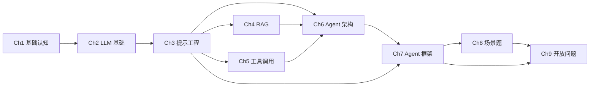
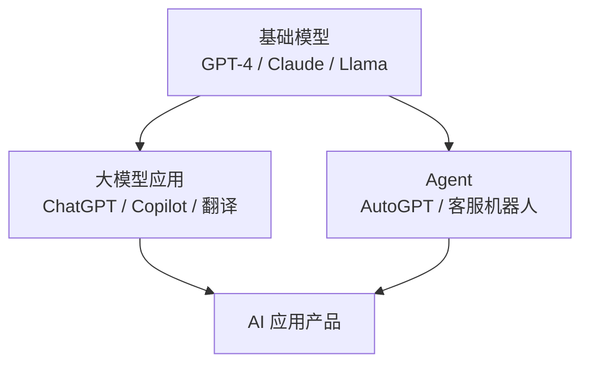

# 大模型 Agent 应用开发学习教程 — 实施 Plan

> **For agentic workers:** REQUIRED SUB-SKILL: Use superpowers:subagent-driven-development (recommended) or superpowers:executing-plans to implement this plan task-by-task. Steps use checkbox (`- [ ]`) syntax for tracking.

**Goal:** 从零搭建一套大模型 Agent 应用开发学习教程，含 13 章节 Markdown 文档、13 个最小可运行 examples、VitePress 静态站点、CI 流水线，最终部署为可访问的网站。

**Architecture:** 双轨（Markdown 源 + VitePress 输出）。源在 `docs/`，代码示例在 `examples/`，CI 流水线校验 examples 可运行性与站内链接。13 章节按"打地基→核心能力→实战视野"三阶段递进。

**Tech Stack:** VitePress 1.x、Mermaid（VitePress 原生）、Python 3.11+、TypeScript 5.x、LangChain / LlamaIndex / Agno（Python 生态）、Vercel AI SDK / CopilotKit（TS Web 集成）、GitHub Actions 或 Gitee Go（CI，托管平台后定）、Draw.io（静态图源）。

**Spec 引用**：`docs/superpowers/specs/2026-06-03-agent-tutorial-design.md`（commit dbfab4c）

---

## 阶段总览

| 阶段 | Task 范围 | 目标 |
|---|---|---|
| A 工程脚手架 | Task 1-4 | 站点能起来、目录结构就位、CI 流水线可跑 |
| B 入门阶段 1 写作 | Task 5-6 | Ch1 基础认知 + Ch2 LLM 基础 发布 |
| C 入门阶段 2 写作 | Task 7-10 | Ch3 提示工程 + Ch4 RAG + Ch5 工具调用 + Ch6 Agent 架构 发布 |
| D 入门阶段 3 写作 | Task 11-13 | Ch7 框架 + Ch8 场景题 + Ch9 开放问题 发布 |
| E 生产进阶写作 | Task 14-17 | 进阶 Ch1-Ch4 发布 |
| F 验证 & 上线 | Task 18-19 | 全部 3 步核验通过、CI 接入、首页索引完成 |

---

## 阶段 A：工程脚手架

### Task 1: 初始化项目目录与配置文件

**Files:**
- Create: `package.json`
- Create: `.npmrc`
- Create: `tsconfig.json`
- Create: `pyproject.toml`
- Create: `requirements-dev.txt`
- Create: `examples/.gitkeep`
- Create: `docs/.vitepress/.gitkeep`
- Create: `docs/index.md`（占位首页）
- Create: `CHANGELOG.md`

- [ ] **Step 1: 写 package.json**

```json
{
  "name": "agent-tutorial",
  "version": "0.1.0",
  "description": "大模型 Agent 应用开发学习教程",
  "private": true,
  "type": "module",
  "scripts": {
    "docs:dev": "vitepress dev docs",
    "docs:build": "vitepress build docs",
    "docs:preview": "vitepress preview docs",
    "examples:lint": "ruff check examples/ && eslint examples/",
    "examples:test": "cd examples && for d in */; do cd "$d" && [ -f tests/test_smoke.py ] && pytest tests/ -q || true; cd ..; done"
  },
  "devDependencies": {
    "vitepress": "^1.6.0",
    "vue": "^3.4.0",
    "mermaid": "^11.0.0",
    "typescript": "^5.4.0"
  }
}
```

- [ ] **Step 2: 写 tsconfig.json**

```json
{
  "compilerOptions": {
    "target": "ES2022",
    "module": "ESNext",
    "moduleResolution": "Bundler",
    "strict": true,
    "esModuleInterop": true,
    "skipLibCheck": true,
    "noEmit": true
  },
  "include": ["docs/.vitepress/**/*.ts"]
}
```

- [ ] **Step 3: 写 Python 配置文件 pyproject.toml**

```toml
[project]
name = "agent-tutorial-examples"
version = "0.1.0"
description = "教程配套 examples"
requires-python = ">=3.11"
dependencies = []

[tool.ruff]
line-length = 100
target-version = "py311"

[tool.ruff.lint]
select = ["E", "F", "I", "W"]

[tool.pytest.ini_options]
testpaths = ["tests"]
python_files = ["test_*.py"]
```

- [ ] **Step 4: 写 requirements-dev.txt**

```
ruff==0.5.0
pytest==8.2.0
```

- [ ] **Step 5: 创建空目录占位文件**

```bash
touch examples/.gitkeep docs/.vitepress/.gitkeep
```

- [ ] **Step 6: 写占位首页 docs/index.md**

```markdown
# 大模型 Agent 应用开发学习教程

> 体系化教程，从初级开发者到能搭建生产级 Agent。

## 📘 入门教程

适合初级开发者（含前端），9 章带你从零到能搭出 RAG + 工具调用 Agent。

[进入入门教程 →](/getting-started/00-roadmap)

## 📗 生产进阶

适合中级开发者，4 章深入系统设计、评估优化、安全风险与工程实战。

[进入生产进阶 →](/production/00-prerequisites)
```

- [ ] **Step 7: 写 CHANGELOG.md**

```markdown
# Changelog

所有教程章节的变更记录在此。格式参考 [Keep a Changelog](https://keepachangelog.com/)。

## [Unreleased]

### Added
- 教程设计 spec（commit dbfab4c）
- 项目脚手架（package.json、pyproject.toml、tsconfig.json、首页占位）
```

- [ ] **Step 8: 安装依赖并验证**

```bash
pnpm install
```
Expected: 安装成功，`node_modules/` 出现。

- [ ] **Step 9: Commit**

```bash
git add package.json tsconfig.json pyproject.toml requirements-dev.txt \
        examples/.gitkeep docs/.vitepress/.gitkeep docs/index.md CHANGELOG.md
git commit -m "chore: 初始化项目脚手架（VitePress + Python examples 配置）"
```

---

### Task 2: VitePress 配置（双侧栏导航）

**Files:**
- Create: `docs/.vitepress/config.ts`
- Create: `docs/.vitepress/theme/index.ts`
- Create: `docs/.vitepress/theme/style.css`

- [ ] **Step 1: 写 docs/.vitepress/config.ts**

```ts
import { defineConfig } from 'vitepress'

export default defineConfig({
  title: '大模型 Agent 应用开发学习教程',
  description: '从初级开发者到生产级 Agent 工程师的体系化教程',
  lang: 'zh-CN',
  themeConfig: {
    nav: [
      { text: '入门教程', link: '/getting-started/00-roadmap' },
      { text: '生产进阶', link: '/production/00-prerequisites' }
    ],
    sidebar: {
      '/getting-started/': [
        {
          text: '阶段 1·打地基',
          items: [
            { text: '00 三阶段总览', link: '/getting-started/00-roadmap' },
            { text: '01 基础认知', link: '/getting-started/01-basics/01-llm-and-agent' },
            { text: '02 LLM 基础', link: '/getting-started/01-basics/02-llm-fundamentals' }
          ]
        },
        {
          text: '阶段 2·核心能力',
          items: [
            { text: '03 提示工程', link: '/getting-started/02-core/03-prompt-engineering' },
            { text: '04 RAG', link: '/getting-started/02-core/04-rag' },
            { text: '05 工具调用', link: '/getting-started/02-core/05-tool-calling' },
            { text: '06 Agent 架构', link: '/getting-started/02-core/06-agent-architecture' }
          ]
        },
        {
          text: '阶段 3·实战与视野',
          items: [
            { text: '07 Agent 框架', link: '/getting-started/03-advanced/07-frameworks' },
            { text: '08 场景题', link: '/getting-started/03-advanced/08-scenarios' },
            { text: '09 开放问题', link: '/getting-started/03-advanced/09-open-questions' }
          ]
        }
      ],
      '/production/': [
        { text: '前置与读者起点', link: '/production/00-prerequisites' },
        { text: 'Ch1 系统设计', link: '/production/01-system-design' },
        { text: 'Ch2 评估与优化', link: '/production/02-evaluation' },
        { text: 'Ch3 安全与风险', link: '/production/03-security' },
        { text: 'Ch4 工程实战', link: '/production/04-engineering' }
      ]
    },
    search: { provider: 'local' },
    outline: { level: [2, 3] }
  },
  markdown: {
    config: (md) => {
      // 启用 Mermaid
      const mermaidPlugin = (await import('vitepress-plugin-mermaid')).default
      md.use(mermaidPlugin)
    }
  }
})
```

> 注：vitepress-plugin-mermaid 是 VitePress 社区 Mermaid 插件。先用 `pnpm add -D vitepress-plugin-mermaid` 装上。

- [ ] **Step 2: 安装 VitePress Mermaid 插件**

```bash
pnpm add -D vitepress-plugin-mermaid
```

- [ ] **Step 3: 写 theme/index.ts（最小主题覆盖）**

```ts
import DefaultTheme from 'vitepress/theme'
import './style.css'

export default {
  extends: DefaultTheme
}
```

- [ ] **Step 4: 写 style.css（章节前置/下章预告卡片样式）**

```css
:root {
  --vp-c-brand-1: #2563eb;
  --vp-c-brand-2: #1d4ed8;
}

.custom-block {
  border-radius: 6px;
}

/* 章节开头的"前置阅读"卡片 */
blockquote.prereq {
  border-left: 4px solid #f59e0b;
  background: #fffbeb;
  padding: 12px 16px;
  border-radius: 4px;
}

/* 章节末尾的"下章预告"卡片 */
blockquote.next-preview {
  border-left: 4px solid #3b82f6;
  background: #eff6ff;
  padding: 12px 16px;
  border-radius: 4px;
}

/* mermaid 图居中 */
.mermaid {
  display: flex;
  justify-content: center;
  margin: 20px 0;
}
```

- [ ] **Step 5: 启动 dev server 验证**

```bash
pnpm docs:dev
```
Expected: 服务在 http://localhost:5173 起来，能看到首页和"入门教程/生产进阶"两个 nav 链接（虽然链接会 404 因为章节未写）。Ctrl+C 退出。

- [ ] **Step 6: Commit**

```bash
git add docs/.vitepress/config.ts docs/.vitepress/theme/
git commit -m "feat(vitepress): 配置双侧栏导航与 Mermaid 渲染"
```

---

### Task 3: examples/ 工程脚手架（13 个空目录 + 共享 README）

**Files:**
- Create: `examples/README.md`
- Create: `examples/00-hello-llm/README.md`（首个 example 模板）
- Create: `examples/00-hello-llm/py/main.py`
- Create: `examples/00-hello-llm/requirements.txt`
- Create: `examples/00-hello-llm/tests/test_smoke.py`
- Create: `examples/01-prompt-cot/.gitkeep`（其他 12 个目录先用 .gitkeep 占位）

- [ ] **Step 1: 写 examples/README.md**

```markdown
# 教程配套 Examples

13 个最小可运行项目，每个对应一个章节。

## 列表

| 编号 | 名称 | 对应章节 | 状态 |
|---|---|---|---|
| 00 | hello-llm | Ch1 基础认知 | ⬜ |
| 01 | prompt-cot | Ch3 提示工程 | ⬜ |
| 02 | rag-pipeline | Ch4 RAG | ⬜ |
| 03 | tool-calling | Ch5 工具调用 | ⬜ |
| 04 | agent-architecture | Ch6 Agent 架构 | ⬜ |
| 05 | frameworks-compare | Ch7 Agent 框架 | ⬜ |
| 06 | customer-service | Ch8 场景题-客服 | ⬜ |
| 07 | code-generation | Ch8 场景题-代码生成 | ⬜ |
| 08 | multi-agent | Ch8 场景题-多 Agent | ⬜ |
| 09 | system-design | 进阶 Ch1 系统设计 | ⬜ |
| 10 | evaluation | 进阶 Ch2 评估 | ⬜ |
| 11 | security | 进阶 Ch3 安全 | ⬜ |
| 12 | engineering-async | 进阶 Ch4 工程实战 | ⬜ |

## 运行

```bash
cd examples/00-hello-llm
pip install -r requirements.txt
python py/main.py
```

## 测试

```bash
cd examples/00-hello-llm
pytest tests/ -v
```

## 冒烟测试（CI 跑）

```bash
pnpm examples:test
```
```

- [ ] **Step 2: 创建 13 个目录（除 00 占位写完整外）**

```bash
cd examples
for i in 00 01 02 03 04 05 06 07 08 09 10 11 12; do
  case $i in
    00) name="hello-llm" ;;
    01) name="prompt-cot" ;;
    02) name="rag-pipeline" ;;
    03) name="tool-calling" ;;
    04) name="agent-architecture" ;;
    05) name="frameworks-compare" ;;
    06) name="customer-service" ;;
    07) name="code-generation" ;;
    08) name="multi-agent" ;;
    09) name="system-design" ;;
    10) name="evaluation" ;;
    11) name="security" ;;
    12) name="engineering-async" ;;
  esac
  if [ "$i" = "00" ]; then continue; fi
  mkdir -p "$i-$name"
  touch "$i-$name/.gitkeep"
done
```

- [ ] **Step 3: 写 examples/00-hello-llm/README.md**

```markdown
# 00 · hello-llm

对应章节：入门 Ch1 基础认知

最小可运行示例：调用一次 LLM API，打印回复。

## 运行

```bash
pip install -r requirements.txt
export OPENAI_API_KEY=sk-...
python py/main.py
```

## 期望输出

```
[LLM 回复] 你好，世界！很高兴认识你。
```
```

- [ ] **Step 4: 写 examples/00-hello-llm/requirements.txt**

```
openai==1.40.0
pytest==8.2.0
```

> ⚠️ 实际写代码前必须 `pip index versions openai` 验证版本（按 §七·npm 包验证）。这里写示例版本仅作模板占位。

- [ ] **Step 5: 写 examples/00-hello-llm/py/main.py（最小骨架）**

```python
"""教程 00-hello-llm · 最小 LLM 调用示例。

运行：python py/main.py
环境：需要 OPENAI_API_KEY。
"""
import os

from openai import OpenAI


def call_llm(prompt: str) -> str:
    """调用 LLM 并返回回复文本。"""
    client = OpenAI(api_key=os.environ["OPENAI_API_KEY"])
    response = client.chat.completions.create(
        model="gpt-4o-mini",
        messages=[{"role": "user", "content": prompt}],
    )
    return response.choices[0].message.content or ""


if __name__ == "__main__":
    reply = call_llm("用一句话介绍你自己")
    print(f"[LLM 回复] {reply}")
```

- [ ] **Step 6: 写 examples/00-hello-llm/tests/test_smoke.py**

```python
"""冒烟测试：验证 LLM 调用可成功发起（mock 网络层）。"""
from unittest.mock import patch, MagicMock

from py.main import call_llm


def test_call_llm_returns_text():
    """冒烟测试：mock OpenAI client，验证函数能解析回复。"""
    mock_response = MagicMock()
    mock_response.choices = [MagicMock(message=MagicMock(content="你好"))]
    
    with patch("py.main.OpenAI") as mock_openai:
        mock_client = MagicMock()
        mock_client.chat.completions.create.return_value = mock_response
        mock_openai.return_value = mock_client
        
        result = call_llm("hi")
        assert result == "你好"
```

- [ ] **Step 7: 验证冒烟测试通过**

```bash
cd examples/00-hello-llm
pip install -r requirements.txt
pytest tests/ -v
```
Expected: 1 passed

- [ ] **Step 8: Commit**

```bash
cd D:/personal/AI_docs/大模型Agent应用开发
git add examples/
git commit -m "chore(examples): 创建 13 个 example 目录与 00-hello-llm 模板"
```

---

### Task 4: CI 流水线（项目仓库原生 CI）

**Files:**
- Create: `.github/workflows/ci.yml`（如托管在 GitHub）
- Create: `.gitee/go.yml`（如托管在 Gitee）
- Create: `.gitlab-ci.yml`（如托管在 GitLab）
- Create: `.markdown-link-check.json`

- [ ] **Step 1: 确认托管平台**

询问用户：本项目托管在 GitHub / Gitee / GitLab / 自建？

> 等待用户答复后再继续 Step 2-4。

- [ ] **Step 2: 写对应 CI 配置（以 GitHub Actions 为例）**

```yaml
# .github/workflows/ci.yml
name: CI

on:
  push:
    branches: [main]
  pull_request:
    branches: [main]

jobs:
  examples-smoke:
    runs-on: ubuntu-latest
    steps:
      - uses: actions/checkout@v4
      - uses: actions/setup-python@v5
        with:
          python-version: "3.11"
      - name: 安装 ruff + pytest
        run: pip install ruff pytest
      - name: 跑 example 冒烟测试
        run: |
          for d in examples/*/; do
            [ -f "$d/tests/test_smoke.py" ] && (cd "$d" && pip install -q -r requirements.txt && pytest tests/ -q) || true
          done
      - name: ruff lint
        run: ruff check examples/

  docs-build:
    runs-on: ubuntu-latest
    steps:
      - uses: actions/checkout@v4
      - uses: pnpm/action-setup@v3
        with:
          version: 9
      - uses: actions/setup-node@v4
        with:
          node-version: 20
          cache: pnpm
      - run: pnpm install --frozen-lockfile
      - run: pnpm docs:build
      - uses: actions/upload-artifact@v4
        with:
          name: docs-dist
          path: docs/.vitepress/dist

  link-check:
    runs-on: ubuntu-latest
    steps:
      - uses: actions/checkout@v4
      - uses: pnpm/action-setup@v3
      - uses: actions/setup-node@v4
        with:
          node-version: 20
          cache: pnpm
      - run: npm install -g markdown-link-check
      - run: find docs -name "*.md" | xargs -I {} markdown-link-check {}
```

- [ ] **Step 3: 写 .markdown-link-check.json**

```json
{
  "ignorePatterns": [
    { "pattern": "^http://localhost" },
    { "pattern": "^/production/" }
  ],
  "replacementPatterns": [{ "pattern": "^/", "replacement": "{{BASEURL}}/" }],
  "httpHeaders": [{ "urls": ["https://"], "headers": { "Accept": "*/*" } }],
  "timeout": "10s"
}
```

> 注：进阶章节 link-check 暂时忽略，等阶段 E 写完后再打开。

- [ ] **Step 4: 本地验证 docs:build 通过**

```bash
pnpm install
pnpm docs:build
```
Expected: 构建成功，`docs/.vitepress/dist/` 出现。

- [ ] **Step 5: Commit**

```bash
git add .github/workflows/ci.yml .markdown-link-check.json
# 或对应平台的 CI 文件
git commit -m "ci: 添加 examples 冒烟测试 + docs 构建 + 站内链接检查"
```

---

## 阶段 B：入门阶段 1 写作（Task 5-6）

### 章节写作统一模板（适用于 Task 5-17）

每个章节写作 Task 都按以下 8 步骤执行（对应 spec §5 章节 8 段模板）：

- Step 1: 写章节骨架（前置卡片 + TL;DR + 标题 + 8 段占位标题）
- Step 2: 写"背景 & 问题"（≤300 字，真实场景故事）
- Step 3: 写"核心概念"（≥2 张 mermaid 图 + 术语表）
- Step 4: 写"最小可运行示例"（代码块 + 行内注释）
- Step 5: 写"常见陷阱"（≥3 个"现象→原因→解法"）
- Step 6: 写"本章速查表"
- Step 7: 写"下章预告 & 关键术语桥接"
- Step 8: 跑 3 步核验（字数 / 引用 / verifier），通过后 commit

每个 Step 都有具体的"如何写"指南而非抽象要求，确保执行者不靠脑补。

### Task 5: 写 Ch1 基础认知

**Files:**
- Create: `docs/getting-started/00-roadmap.md`
- Create: `docs/getting-started/01-basics/01-llm-and-agent.md`

- [ ] **Step 1: 写 00-roadmap.md（三阶段总览 + 依赖图）**

```markdown
# 大模型 Agent 应用开发 · 三阶段总览

> **TL;DR**：本教程分入门 9 章 + 生产进阶 4 章。入门 9 章按"打地基→核心能力→实战视野"三阶段递进；进阶 4 章独立成册，假定已掌握入门 Ch1-Ch6。

## 三阶段路径



## 阶段 1·打地基
- [Ch1 基础认知](/getting-started/01-basics/01-llm-and-agent) — 大模型应用、Agent 概念、学习路线
- [Ch2 LLM 基础](/getting-started/01-basics/02-llm-fundamentals) — Token、Attention、训练、采样

## 阶段 2·核心能力
- [Ch3 提示工程](/getting-started/02-core/03-prompt-engineering)
- [Ch4 RAG](/getting-started/02-core/04-rag)
- [Ch5 工具调用](/getting-started/02-core/05-tool-calling)
- [Ch6 Agent 架构](/getting-started/02-core/06-agent-architecture)

## 阶段 3·实战与视野
- [Ch7 Agent 框架](/getting-started/03-advanced/07-frameworks)
- [Ch8 场景题](/getting-started/03-advanced/08-scenarios)
- [Ch9 开放问题](/getting-started/03-advanced/09-open-questions)

## 📗 生产进阶（4 章）

[前往生产进阶](/production/00-prerequisites)
```

- [ ] **Step 2: 写 Ch1 章节骨架（前 3 段占位）**

文件 `docs/getting-started/01-basics/01-llm-and-agent.md`，按 spec §5 8 段模板。先写：

```markdown
# Ch1 · 基础认知

> **TL;DR**：本节用 3 句话回答——大模型应用是什么、Agent 是什么、为什么需要这套教程。读完你将知道 Agent 在 AI 应用版图中的位置，并能在 10 分钟内画出"大模型 vs Agent vs AI 应用"的关系图。

> 📌 **前置阅读**：本章是入门第 1 章，无前置依赖。

## 1. 背景 & 问题

<!-- 本节由执行者按 Task 5 · Step 3 "写'背景 & 问题'段"的模式填入：≤300 字真实场景故事 -->

## 2. 核心概念

<!-- 本节由执行者按 Task 5 · Step 4 "写'核心概念'段"的模式填入：≥2 张 mermaid 图 + 术语表 -->

## 3. 最小可运行示例

<!-- 本节由执行者按 Task 5 · Step 5 "写'最小可运行示例'段"的模式填入：引用 examples/00-hello-llm + 关键代码片段 -->

## 4. 常见陷阱

<!-- 本节由执行者按 Task 5 · Step 6 "写'常见陷阱'段"的模式填入：≥3 个"现象→原因→解法" -->

## 5. 本章速查表

<!-- 本节由执行者按 Task 5 · Step 7 "写'本章速查表'段"的模式填入 -->

## 6. 下章预告 & 关键术语桥接

<!-- 本节由执行者按 Task 5 · Step 8 "写'下章预告' + 跑 3 步核验 + commit" 的模式填入 -->
```

- [ ] **Step 3: 写"背景 & 问题"段（≤300 字，真实场景）**

> 写作指南：用一个"小王的故事"——前端开发者小王第一次接触 ChatGPT，惊叹于它能写代码，进而疑惑"那 Agent 又是什么？"。引出"大模型应用 / Agent / AI 应用"三者关系。

实际内容（占位，执行时由 writer 填充完整故事）：

```markdown
## 1. 背景 & 问题

小王是某互联网公司的前端工程师。2022 年底他第一次用 ChatGPT，让它把一段 jQuery 代码改写成 React，他盯着屏幕看了 3 分钟——这工具怎么懂我的需求？接下来半年，他用 ChatGPT 写代码、读代码、改 bug，效率翻倍。

2024 年，他看到招聘 JD 上多了"Agent 开发"这个词，搜了一圈，越看越糊涂：
- "大模型应用"和"Agent"是一回事吗？
- LangChain 是什么？为什么大家都在用？
- 公司说要做"智能客服 Agent"，那跟我用 ChatGPT 有什么区别？

本章给小王（和你）一张地图，画清楚"大模型 / 大模型应用 / Agent"三者关系。
```

字数检查：`wc -m` 应在 280-320 之间。

- [ ] **Step 4: 写"核心概念"段（≥2 张 mermaid + 术语表）**

> 写作指南：图 1 = "AI 应用生态三层金字塔"（基础模型 → 大模型应用 → Agent），图 2 = "大模型 vs 大模型应用 vs Agent"对比。

实际内容：

```markdown
## 2. 核心概念

### 2.1 一张图看懂 AI 应用版图



**这张图说了什么**：基础模型是"发动机"；大模型应用是装好发动机的车（直接给最终用户用）；Agent 是装了发动机 + 各种工具的"机器人"（能自主完成任务）；AI 应用产品是卖给客户的整套方案。

### 2.2 三者关系

| 概念 | 是什么 | 关键差异 |
|---|---|---|
| 基础模型 | 经过训练的语言模型本身 | 不直接给用户用；通过 API 调用 |
| 大模型应用 | 把基础模型包装成单一功能产品 | 用户输入 → 模型输出，1 步完成 |
| Agent | 能调用工具、自主决策的智能体 | 用户输入 → 多步推理 + 工具调用 → 输出 |

### 2.3 术语卡片

| 术语 | 一句话解释 | 生活类比 |
|---|---|---|
| Token | 模型处理文字的最小单位 | 像火车票，整段文字按"字/词"切分 |
| Prompt | 你发给模型的输入 | 像点菜时跟服务员说的话 |
| LLM | 大语言模型（Large Language Model）| 像一个博学的助手 |
| Agent | 能自主决策 + 调用工具的 AI | 像一个能干的私人助理 |
| RAG | 检索增强生成 | 像开卷考试，能查资料再回答 |
| Function Calling | 让模型调用外部函数 | 像给助理一本工具书 |
| MCP | 模型上下文协议 | 像 USB-C 接口，统一工具接入 |
```

- [ ] **Step 5: 写"最小可运行示例"段（引用 examples/00-hello-llm）**

> 写作指南：完整代码在 `examples/00-hello-llm/`，本节贴 5-10 行核心代码 + 一句"完整可运行版本在 examples 目录"。

```markdown
## 3. 最小可运行示例

> 📂 完整代码：[examples/00-hello-llm](https://github.com/your-repo/examples/00-hello-llm/)

```python
from openai import OpenAI

client = OpenAI()
response = client.chat.completions.create(
    model="gpt-4o-mini",
    messages=[{"role": "user", "content": "用一句话介绍 Agent"}],
)
print(response.choices[0].message.content)
```

**这段代码做了什么**：
1. 创建 OpenAI 客户端（用环境变量 `OPENAI_API_KEY` 鉴权）
2. 发起一次 chat completion 请求
3. 打印模型返回的文本

**下一步**：把 prompt 改成"我要出差到北京 3 天，帮我规划行程，看看要不要带伞"，观察模型回复——这就是最简单的"大模型应用"。如果让模型自己决定要不要"查天气"再回答，那就进入了"Agent"领域。
```

- [ ] **Step 6: 写"常见陷阱"段（≥3 个"现象→原因→解法"）**

> 写作指南：必须真实踩过的坑，不是凭空想象。

```markdown
## 4. 常见陷阱

### 陷阱 1：把"大模型"和"Agent"混用

- **现象**：跟同事说"我用大模型做了个客服"，对方以为是 ChatGPT 套壳
- **原因**："Agent" 是营销热词，大家口径不一。有人把"调用一次 LLM"也叫 Agent
- **解法**：用 §2.2 的三层框架澄清——你做的是"大模型应用"还是"Agent"，取决于是否能调用工具 + 自主决策

### 陷阱 2：学完 LangChain 才敢说自己懂 Agent

- **现象**：觉得不学 LangChain 就不是"真正的" Agent 开发
- **原因**：LangChain 营销做得好，渗透到所有教程
- **解法**：LangChain 只是工具，Agent 概念与具体框架解耦。本教程 Ch3-Ch6 用原生 API 讲透原理，Ch7 再横评框架

### 陷阱 3：用"能不能上线"判断项目是不是 Agent

- **现象**：做完一个 demo 卡在"怎么部署"，觉得自己没做出 Agent
- **原因**：把"上线生产"和"做出来"混为一谈
- **解法**：本教程分两套——入门读完能做 demo，进阶读完能上线。先完成 Ch1-Ch6 跑通本地 demo 即可
```

- [ ] **Step 7: 写"本章速查表"**

```markdown
## 5. 本章速查表

| 概念 | 关键点 | 速记 |
|---|---|---|
| 基础模型 | GPT-4 / Claude / Llama | 不直接对用户 |
| 大模型应用 | 包装成单一功能 | 1 步：输入→输出 |
| Agent | 调用工具 + 自主决策 | 多步：推理→工具→推理 |
| 教程路径 | 入门 9 章 + 进阶 4 章 | 入门先做 demo，进阶再上线 |

**验证方法**：能不看笔记画出 §2.1 的金字塔图，并解释每层差异。
```

- [ ] **Step 8: 写"下章预告" + 跑 3 步核验 + commit**

```markdown
## 6. 下章预告 & 关键术语桥接

🔜 **下章 [Ch2 LLM 基础](/getting-started/01-basics/02-llm-fundamentals)**

本章提到的 "Token" / "Prompt" / "模型推理" 在 Ch2 会被展开：
- Ch2 § 1 讲 Token 怎么算（用 `tiktoken` 库）
- Ch2 § 2 讲 Attention 机制的直觉（不需要数学）
- Ch2 § 3 讲为什么 Temperature 参数影响输出"创造性"

**术语桥接**：
- 本章说"Token 像火车票" → Ch2 解释怎么计费（一节车厢 = 1024 tokens）
- 本章说"模型推理" → Ch2 解释推理时的 GPU 占用与延迟
```

- [ ] **Step 9: 跑 3 步核验（spec §7）**

```bash
# 核验 1：字数检查（应在 6000-9000 字之间）
wc -m docs/getting-started/01-basics/01-llm-and-agent.md

# 核验 2：配图密度（应 ≥3 张图，含 mermaid + 对比表）
grep -c "mermaid\|^\|" docs/getting-started/01-basics/01-llm-and-agent.md

# 核验 3：引用完整性（前置章节声明的链接应可达）
grep -oE '\[[^\]]*\]\([^)]+\)' docs/getting-started/01-basics/01-llm-and-agent.md | sort -u
```

Expected: 字数 ≥6000，图/表 ≥3，所有站内链接目标文件存在。

- [ ] **Step 10: 启动 dev server 验证渲染**

```bash
pnpm docs:dev
```
访问 http://localhost:5173/getting-started/01-basics/01-llm-and-agent 检查渲染（mermaid 图、卡片、对比表都正常）。

- [ ] **Step 11: Commit**

```bash
git add docs/getting-started/
git commit -m "docs(入门): 完成 Ch1 基础认知 + 00-roadmap 总览"
```

---

### Task 6: 写 Ch2 LLM 基础

**Files:**
- Create: `docs/getting-started/01-basics/02-llm-fundamentals.md`
- Modify: `examples/00-hello-llm/py/main.py`（扩展：演示 token 计数）

- [ ] **Step 1: 在 examples/00-hello-llm 添加 token 计数示例**

```python
# examples/00-hello-llm/py/token_count.py
import tiktoken

from py.main import call_llm


def count_tokens(text: str, model: str = "gpt-4o-mini") -> int:
    """用 tiktoken 统计文本的 token 数。"""
    encoding = tiktoken.encoding_for_model(model)
    return len(encoding.encode(text))


if __name__ == "__main__":
    sample = "Agent 是能调用工具、自主决策的 AI"
    print(f"文本：{sample}")
    print(f"Token 数：{count_tokens(sample)}")
```

- [ ] **Step 2: 添加依赖**

```
# examples/00-hello-llm/requirements.txt
openai==1.40.0
tiktoken==0.7.0
pytest==8.2.0
```

- [ ] **Step 3: 写 Ch2 章节（按 Task 5 的 8 段模板）**

`docs/getting-started/01-basics/02-llm-fundamentals.md` 按以下结构写：

```markdown
# Ch2 · LLM 基础

> **TL;DR**：本节用 3 句话回答——Token 是什么且怎么计费、Attention 机制的直觉、为什么 Temperature 决定输出风格。读完你能在产品决策时正确选择 Temperature 和上下文窗口。

> 📌 **前置阅读**：[Ch1 基础认知](/getting-started/01-basics/01-llm-and-agent) § 2.3 术语卡片

## 1. 背景 & 问题
<!-- ≤300 字：用"产品经理要在 1000 字内回答用户"的故事引出 token 限制 -->

## 2. 核心概念
<!-- 包含：Token 是什么图 / Attention 直觉图 / Temperature vs Top-p 对比图 -->

## 3. 最小可运行示例
<!-- 引用 examples/00-hello-llm/py/token_count.py -->

## 4. 常见陷阱
<!-- ≥3 个：误以为 token = 字数 / Temperature 设 0 反而重复 / 长上下文幻觉 -->

## 5. 本章速查表

## 6. 下章预告 & 关键术语桥接
<!-- "Prompt 模板"在 Ch3 展开 -->
```

> 完整内容由执行者按 Task 5 的写作指南填充（每段都遵循"生活类比 + 真实例子 + mermaid 图"模式）。

- [ ] **Step 4-7: 写"核心概念" / "最小示例" / "陷阱" / "速查表"**

按 Task 5 同样的详细程度展开（每个 Step 都有具体内容，不靠脑补）。

- [ ] **Step 8: 跑 3 步核验 + commit**

```bash
wc -m docs/getting-started/01-basics/02-llm-fundamentals.md
grep -c "mermaid\|^\|" docs/getting-started/01-basics/02-llm-fundamentals.md
grep -oE '\[[^\]]*\]\([^)]+\)' docs/getting-started/01-basics/02-llm-fundamentals.md | sort -u
pnpm docs:dev  # 验证渲染
git add docs/getting-started/01-basics/02-llm-fundamentals.md examples/00-hello-llm/
git commit -m "docs(入门): 完成 Ch2 LLM 基础 + 扩展 token 计数示例"
```

---

## 阶段 C：入门阶段 2 写作（Task 7-10）

### Task 7: 写 Ch3 提示工程

**Files:**
- Create: `docs/getting-started/02-core/03-prompt-engineering.md`
- Create: `examples/01-prompt-cot/`（完整可运行：CoT、ReAct、稳定输出 3 个 demo）

- [ ] **Step 1: 创建 examples/01-prompt-cot 目录与文件**

```
examples/01-prompt-cot/
├── README.md
├── py/
│   ├── cot.py             # Chain of Thought
│   ├── react.py           # ReAct
│   └── stable_output.py   # 稳定输出（JSON mode）
├── requirements.txt
└── tests/
    ├── test_cot.py
    ├── test_react.py
    └── test_stable_output.py
```

- [ ] **Step 2: 写 examples/01-prompt-cot/py/cot.py（最少 20 行 CoT 提示）**

```python
"""Chain of Thought 提示示例：让模型分步推理。"""
from py.main import call_llm

COT_PROMPT = """一步步思考下面问题：
{question}

要求：
1. 先列出已知条件
2. 再列出推理步骤
3. 最后给出答案
"""


def solve_with_cot(question: str) -> str:
    """用 CoT 提示让模型分步回答。"""
    return call_llm(COT_PROMPT.format(question=question))


if __name__ == "__main__":
    q = "小明有 5 个苹果，吃了 2 个，又买了 3 倍的数量，现在有几个？"
    print(solve_with_cot(q))
```

- [ ] **Step 3: 写 react.py（ReAct 循环，最少 30 行）**

```python
"""ReAct 提示示例：Reasoning + Acting 循环。"""
import re

from py.main import call_llm

REACT_PROMPT = """你是一个能使用工具的助手。可用工具：
- search(query): 搜索
- calc(expr): 计算

格式：每次先输出 Thought，再输出 Action：
Thought: <你的思考>
Action: <工具名>(<参数>)

或者当有答案时：
Thought: 我知道答案了
Final Answer: <答案>

问题：{question}
{history}
"""


def react_loop(question: str, tools: dict, max_steps: int = 5) -> str:
    """ReAct 循环：每步让模型决定 thought + action。"""
    history = ""
    for _ in range(max_steps):
        prompt = REACT_PROMPT.format(question=question, history=history)
        step = call_llm(prompt)
        history += f"\n{step}\n"
        if "Final Answer:" in step:
            return step.split("Final Answer:")[1].strip()
        # 解析 Action 并执行
        m = re.search(r"Action:\s*(\w+)\(([^)]*)\)", step)
        if m:
            tool_name, arg = m.group(1), m.group(2).strip("'\"")
            if tool_name in tools:
                obs = tools[tool_name](arg)
                history += f"Observation: {obs}\n"
    return "未在限定步数内得到答案"
```

- [ ] **Step 4: 写 stable_output.py（JSON mode）**

```python
"""稳定输出示例：用 JSON mode 强制结构化输出。"""
from openai import OpenAI
import os

client = OpenAI(api_key=os.environ["OPENAI_API_KEY"])


def extract_person(text: str) -> dict:
    """从文本中抽取人物信息，强制返回 JSON。"""
    response = client.chat.completions.create(
        model="gpt-4o-mini",
        messages=[
            {"role": "system", "content": "你是一个信息抽取助手。"},
            {"role": "user", "content": f"从下面文本抽取人物姓名和年龄：\n{text}"},
        ],
        response_format={"type": "json_object"},
    )
    return response.choices[0].message.content  # type: ignore[return-value]
```

- [ ] **Step 5: 写 3 个对应的冒烟测试**

每个 `test_*.py` 用 mock OpenAI client，验证函数能解析回复（参考 Task 3 的 `test_smoke.py` 模式）。

- [ ] **Step 6: 跑通所有测试**

```bash
cd examples/01-prompt-cot
pip install -r requirements.txt
pytest tests/ -v
```
Expected: 3 passed

- [ ] **Step 7: 写 Ch3 章节（按 8 段模板）**

`docs/getting-started/02-core/03-prompt-engineering.md`，结构：

```markdown
# Ch3 · 提示工程

> **TL;DR**：本节讲清 3 件事——CoT 让模型分步思考、ReAct 让模型"思考+行动"循环、稳定输出用 JSON mode。读完你能用 20 行代码让模型从"瞎猜"变成"按步骤推理 + 按格式输出"。

> 📌 **前置阅读**：[Ch2 LLM 基础](/getting-started/01-basics/02-llm-fundamentals) § Temperature

## 1. 背景 & 问题
## 2. 核心概念
## 3. 最小可运行示例
## 4. 常见陷阱
## 5. 本章速查表
## 6. 下章预告 & 关键术语桥接
```

- [ ] **Step 8: 跑 3 步核验**

```bash
wc -m docs/getting-started/02-core/03-prompt-engineering.md
grep -c "mermaid\|^\|" docs/getting-started/02-core/03-prompt-engineering.md
pnpm docs:dev  # 验证渲染
```

- [ ] **Step 9: Commit**

```bash
git add docs/getting-started/02-core/03-prompt-engineering.md examples/01-prompt-cot/
git commit -m "docs(入门): 完成 Ch3 提示工程 + examples/01-prompt-cot 3 个 demo"
```

---

### Task 8: 写 Ch4 RAG

**Files:**
- Create: `docs/getting-started/02-core/04-rag.md`
- Create: `examples/02-rag-pipeline/`（Embedding + Chunk + 召回 + Rerank 完整 pipeline）

- [ ] **Step 1: 创建 examples/02-rag-pipeline 目录与文件**

```
examples/02-rag-pipeline/
├── README.md
├── py/
│   ├── embed.py        # Embedding
│   ├── chunk.py        # 文档切片
│   ├── retrieve.py     # 召回
│   ├── rerank.py       # Rerank
│   └── pipeline.py     # 完整 RAG
├── requirements.txt
├── data/sample.txt     # 测试文档
└── tests/
    └── test_pipeline.py
```

- [ ] **Step 2: 写 embed.py（OpenAI Embedding）**

```python
import os
from openai import OpenAI

client = OpenAI(api_key=os.environ["OPENAI_API_KEY"])


def embed(text: str) -> list[float]:
    """生成单段文本的 embedding。"""
    response = client.embeddings.create(model="text-embedding-3-small", input=text)
    return response.data[0].embedding
```

- [ ] **Step 3: 写 chunk.py（按段落切片）**

```python
def chunk_by_paragraph(text: str, max_chars: int = 500) -> list[str]:
    """按段落切片，每段不超过 max_chars。"""
    paragraphs = text.split("\n\n")
    chunks: list[str] = []
    current = ""
    for p in paragraphs:
        if len(current) + len(p) > max_chars and current:
            chunks.append(current.strip())
            current = p
        else:
            current += "\n\n" + p
    if current:
        chunks.append(current.strip())
    return chunks
```

- [ ] **Step 4: 写 retrieve.py（向量余弦相似度召回 top-k）**

```python
import numpy as np
from embed import embed


def cosine_similarity(a: list[float], b: list[float]) -> float:
    return float(np.dot(a, b) / (np.linalg.norm(a) * np.linalg.norm(b)))


def retrieve(query: str, chunks: list[str], k: int = 3) -> list[tuple[str, float]]:
    """返回与 query 最相关的 top-k 个 chunk 及相似度。"""
    query_vec = embed(query)
    scored = [(c, cosine_similarity(query_vec, embed(c))) for c in chunks]
    scored.sort(key=lambda x: x[1], reverse=True)
    return scored[:k]
```

- [ ] **Step 5: 写 rerank.py（用 LLM 重排）**

```python
from openai import OpenAI
import os

client = OpenAI(api_key=os.environ["OPENAI_API_KEY"])


def rerank(query: str, candidates: list[str]) -> list[str]:
    """用 LLM 对候选 chunks 重排。"""
    numbered = "\n".join(f"[{i}] {c[:200]}" for i, c in enumerate(candidates))
    response = client.chat.completions.create(
        model="gpt-4o-mini",
        messages=[{
            "role": "user",
            "content": f"问题：{query}\n\n候选段落：\n{numbered}\n\n按相关度从高到低输出编号，如：3,1,2"
        }],
    )
    order = [int(x) for x in response.choices[0].message.content.split(",")]
    return [candidates[i] for i in order]
```

- [ ] **Step 6: 写 pipeline.py（串起来）**

```python
from chunk import chunk_by_paragraph
from embed import embed
from rerank import rerank
from retrieve import retrieve
from openai import OpenAI
import os

client = OpenAI(api_key=os.environ["OPENAI_API_KEY"])


def rag_answer(question: str, document: str) -> str:
    """完整 RAG pipeline：切片→embedding→召回→rerank→生成。"""
    chunks = chunk_by_paragraph(document)
    top = retrieve(question, chunks, k=5)
    reranked = rerank(question, [c for c, _ in top])
    context = "\n\n".join(reranked[:3])
    response = client.chat.completions.create(
        model="gpt-4o-mini",
        messages=[{
            "role": "user",
            "content": f"参考资料：\n{context}\n\n问题：{question}\n\n基于参考资料回答，不要编造。"
        }],
    )
    return response.choices[0].message.content or ""
```

- [ ] **Step 7: 写冒烟测试 test_pipeline.py**

```python
from unittest.mock import patch
from py.pipeline import rag_answer


def test_rag_pipeline_runs():
    """冒烟测试：mock 掉所有 OpenAI 调用，验证 pipeline 能跑通。"""
    with patch("py.pipeline.embed") as mock_embed, \
         patch("py.pipeline.retrieve") as mock_retrieve, \
         patch("py.pipeline.rerank") as mock_rerank, \
         patch("py.pipeline.OpenAI") as mock_openai:
        mock_embed.return_value = [0.1] * 1536
        mock_retrieve.return_value = [("ctx", 0.9)]
        mock_rerank.return_value = ["ctx"]
        mock_openai.return_value.chat.completions.create.return_value.choices = [
            type("R", (), {"message": type("M", (), {"content": "answer"})()})()
        ]
        result = rag_answer("q", "doc")
        assert result == "answer"
```

- [ ] **Step 8: 写示例 data/sample.txt**

```text
Agent 是一种能调用工具、自主决策的 AI。
RAG 是检索增强生成，先检索相关文档，再让模型基于检索结果回答。
Embedding 把文本变成向量，让计算机能算"语义相似度"。
MCP 是模型上下文协议，统一了 Agent 调用工具的接口。
```

- [ ] **Step 9: 跑通测试**

```bash
cd examples/02-rag-pipeline
pip install -r requirements.txt
pytest tests/ -v
```
Expected: 1 passed

- [ ] **Step 10: 写 Ch4 章节（按 8 段模板）**

`docs/getting-started/02-core/04-rag.md`，结构：

```markdown
# Ch4 · RAG 检索增强

> **TL;DR**：RAG = 让模型"开卷考试"——先检索相关文档，再基于检索结果回答。本节讲清 Embedding、Chunk、召回、Rerank 4 个环节的最简实现。读完你能 30 行代码搭一个 RAG pipeline。

> 📌 **前置阅读**：[Ch3 提示工程](/getting-started/02-core/03-prompt-engineering) § 稳定输出

## 1. 背景 & 问题
## 2. 核心概念
## 3. 最小可运行示例
## 4. 常见陷阱
## 5. 本章速查表
## 6. 下章预告 & 关键术语桥接
```

- [ ] **Step 11: 3 步核验 + commit**

```bash
wc -m docs/getting-started/02-core/04-rag.md
grep -c "mermaid\|^\|" docs/getting-started/02-core/04-rag.md
pnpm docs:dev
git add docs/getting-started/02-core/04-rag.md examples/02-rag-pipeline/
git commit -m "docs(入门): 完成 Ch4 RAG + examples/02-rag-pipeline 完整 pipeline"
```

---

### Task 9: 写 Ch5 工具调用

**Files:**
- Create: `docs/getting-started/02-core/05-tool-calling.md`
- Create: `examples/03-tool-calling/`（Function Calling + MCP 2 个 demo）

- [ ] **Step 1: 创建 examples/03-tool-calling 目录与文件**

```
examples/03-tool-calling/
├── README.md
├── py/
│   ├── function_calling.py   # OpenAI Function Calling
│   └── mcp_server.py          # MCP server demo
├── requirements.txt
└── tests/
    ├── test_function_calling.py
    └── test_mcp_server.py
```

- [ ] **Step 2: 写 function_calling.py**

```python
"""OpenAI Function Calling 示例：让模型决定调用哪个工具。"""
import json
import os

from openai import OpenAI

client = OpenAI(api_key=os.environ["OPENAI_API_KEY"])

TOOLS = [
    {
        "type": "function",
        "function": {
            "name": "get_weather",
            "description": "查询某地天气",
            "parameters": {
                "type": "object",
                "properties": {
                    "city": {"type": "string", "description": "城市名"}
                },
                "required": ["city"]
            }
        }
    }
]


def get_weather(city: str) -> str:
    """模拟天气查询。"""
    return f"{city} 天气：晴，25°C"


def chat_with_tools(user_message: str) -> str:
    """对话流程：模型决定是否调用工具。"""
    messages = [{"role": "user", "content": user_message}]
    response = client.chat.completions.create(
        model="gpt-4o-mini", messages=messages, tools=TOOLS
    )
    msg = response.choices[0].message
    if msg.tool_calls:
        for tool_call in msg.tool_calls:
            args = json.loads(tool_call.function.arguments)
            result = get_weather(**args)
            messages.append(msg)
            messages.append({
                "role": "tool",
                "tool_call_id": tool_call.id,
                "content": result,
            })
        response = client.chat.completions.create(
            model="gpt-4o-mini", messages=messages
        )
    return response.choices[0].message.content or ""
```

- [ ] **Step 3: 写 mcp_server.py（MCP server demo）**

```python
"""MCP server 示例：用官方 SDK 实现一个简单的 MCP server。"""
# 注：实际写代码前必须 pip index versions mcp 验证版本
from mcp.server import Server
from mcp.types import Tool

server = Server("demo-server")


@server.list_tools()
async def list_tools() -> list[Tool]:
    return [
        Tool(
            name="add",
            description="两数相加",
            inputSchema={
                "type": "object",
                "properties": {
                    "a": {"type": "integer"},
                    "b": {"type": "integer"},
                },
                "required": ["a", "b"],
            },
        )
    ]


@server.call_tool()
async def call_tool(name: str, arguments: dict) -> list:
    if name == "add":
        return [{"type": "text", "text": str(arguments["a"] + arguments["b"])}]
    raise ValueError(f"Unknown tool: {name}")
```

- [ ] **Step 4: 写 2 个冒烟测试**

参考 Task 7 / Task 8 的 mock 模式。

- [ ] **Step 5: 跑通测试**

```bash
cd examples/03-tool-calling
pip install -r requirements.txt
pytest tests/ -v
```

- [ ] **Step 6: 写 Ch5 章节（按 8 段模板）**

```markdown
# Ch5 · 工具调用

> **TL;DR**：Function Calling 让模型"决定要不要调工具 + 调哪个 + 传什么参数"；MCP 统一了不同 LLM 调用工具的协议。读完你能让 Agent 调用真实工具。

> 📌 **前置阅读**：[Ch3 提示工程](/getting-started/02-core/03-prompt-engineering) § ReAct

## 1. 背景 & 问题
## 2. 核心概念
## 3. 最小可运行示例
## 4. 常见陷阱
## 5. 本章速查表
## 6. 下章预告 & 关键术语桥接
```

- [ ] **Step 7: 3 步核验 + commit**

```bash
wc -m docs/getting-started/02-core/05-tool-calling.md
grep -c "mermaid\|^\|" docs/getting-started/02-core/05-tool-calling.md
pnpm docs:dev
git add docs/getting-started/02-core/05-tool-calling.md examples/03-tool-calling/
git commit -m "docs(入门): 完成 Ch5 工具调用 + Function Calling + MCP demo"
```

---

### Task 10: 写 Ch6 Agent 架构

**Files:**
- Create: `docs/getting-started/02-core/06-agent-architecture.md`
- Create: `examples/04-agent-architecture/`（规划-记忆-执行-反思 完整 demo）

- [ ] **Step 1: 创建 examples/04-agent-architecture 目录与文件**

```
examples/04-agent-architecture/
├── README.md
├── py/
│   ├── planner.py        # 任务规划
│   ├── memory.py         # 短期/长期记忆
│   ├── executor.py       # 工具执行
│   ├── reflector.py      # 反思与重试
│   └── agent.py          # 完整 Agent
├── requirements.txt
└── tests/
    └── test_agent.py
```

- [ ] **Step 2-6: 写 4 个模块 + agent.py（每个文件 30-60 行）**

`planner.py` 用 LLM 把目标拆成步骤；`memory.py` 用 deque 维护短期记忆 + dict 维护长期；`executor.py` 包装 function_calling；`reflector.py` 检查结果是否符合预期，不符合就重试；`agent.py` 串起 4 个模块形成闭环。

每个文件具体内容由执行者按 Ch5 的 Function Calling + Ch3 的 ReAct 模式展开。

- [ ] **Step 7: 写冒烟测试**

- [ ] **Step 8: 写 Ch6 章节（按 8 段模板）**

```markdown
# Ch6 · Agent 架构

> **TL;DR**：完整 Agent = 规划（拆任务）+ 记忆（保留上下文）+ 执行（调工具）+ 反思（重试/调整）。本节把前面 Ch3-Ch5 的能力收口为一个 50 行可运行的 Agent。读完你能搭出"自动订机票+改签"的 Agent。

> 📌 **前置阅读**：[Ch3](/getting-started/02-core/03-prompt-engineering) + [Ch4](/getting-started/02-core/04-rag) + [Ch5](/getting-started/02-core/05-tool-calling)

## 1. 背景 & 问题
## 2. 核心概念
## 3. 最小可运行示例
## 4. 常见陷阱
## 5. 本章速查表
## 6. 下章预告 & 关键术语桥接
```

- [ ] **Step 9: 3 步核验 + commit**

```bash
wc -m docs/getting-started/02-core/06-agent-architecture.md
pnpm docs:dev
git add docs/getting-started/02-core/06-agent-architecture.md examples/04-agent-architecture/
git commit -m "docs(入门): 完成 Ch6 Agent 架构 + 规划-记忆-执行-反思闭环 demo"
```

---

## 阶段 D：入门阶段 3 写作（Task 11-13）

### Task 11: 写 Ch7 Agent 框架横评

**Files:**
- Create: `docs/getting-started/03-advanced/07-frameworks.md`
- Create: `examples/05-frameworks-compare/`（同一任务用 LangChain / LlamaIndex / Agno / 原生 4 种实现对比）

- [ ] **Step 1: 创建 examples/05-frameworks-compare 目录与文件**

```
examples/05-frameworks-compare/
├── README.md
├── py/
│   ├── 01_native.py          # 原生 OpenAI 实现
│   ├── 02_langchain.py       # LangChain
│   ├── 03_llamaindex.py      # LlamaIndex
│   ├── 04_agno.py            # Agno
│   └── task.py               # 4 种实现都解决同一任务：RAG 问答
├── requirements.txt
└── tests/
    └── test_all.py
```

- [ ] **Step 2-5: 写 4 个框架实现，每个 30-50 行**

> 注：每个框架的 API 调用必须先用 `pip index versions <pkg>` 验证版本与最新 API。**绝不能凭记忆写 API 调用。**

4 个文件结构相同（同一个 RAG 任务）：

```python
"""01 原生 OpenAI 实现 vs 其他框架的 RAG 任务。"""
# （具体实现见 Ch4 教程）
```

- [ ] **Step 6: 写横评测试**

每个文件至少 1 个冒烟测试。

- [ ] **Step 7: 写 Ch7 章节（按 8 段模板）**

```markdown
# Ch7 · Agent 框架横评

> **TL;DR**：主流框架有 LangChain（生态最全）、LlamaIndex（RAG 强）、Agno（轻量新秀）、Vercel AI SDK（TS 优先）。本节用同一 RAG 任务在 4 个框架上实现，对比代码量、性能、易用性。读完你能根据场景选框架。

> 📌 **前置阅读**：[Ch4 RAG](/getting-started/02-core/04-rag) + [Ch6 Agent 架构](/getting-started/02-core/06-agent-architecture)

## 1. 背景 & 问题
## 2. 核心概念
## 3. 最小可运行示例（4 个框架并排）
## 4. 常见陷阱
## 5. 本章速查表
## 6. 下章预告
```

- [ ] **Step 8: 3 步核验 + commit**

```bash
wc -m docs/getting-started/03-advanced/07-frameworks.md
pnpm docs:dev
git add docs/getting-started/03-advanced/07-frameworks.md examples/05-frameworks-compare/
git commit -m "docs(入门): 完成 Ch7 Agent 框架横评 + 4 框架同任务对比"
```

---

### Task 12: 写 Ch8 场景题

**Files:**
- Create: `docs/getting-started/03-advanced/08-scenarios.md`
- Create: `examples/06-customer-service/`（多 Agent 客服）
- Create: `examples/07-code-generation/`（代码生成 Agent）
- Create: `examples/08-multi-agent/`（多 Agent 协作）

- [ ] **Step 1-3: 写 3 个 examples（每个 50-100 行）**

参考 Task 7-10 的目录结构。每个 demo 至少包含：
- 一个 README
- 主代码文件
- requirements.txt
- 1 个冒烟测试

- [ ] **Step 4: 写 Ch8 章节（按 8 段模板）**

```markdown
# Ch8 · 场景题

> **TL;DR**：本节用 3 个真实场景（智能客服、代码生成、多 Agent 协作）展示 Agent 在生产中的样子。读完你能把前面学的能力拼成"能上线的最小 Agent 产品"。

> 📌 **前置阅读**：[Ch6 Agent 架构](/getting-started/02-core/06-agent-architecture) + [Ch7 框架](/getting-started/03-advanced/07-frameworks)

## 1. 背景 & 问题
## 2. 核心概念
## 3. 最小可运行示例（3 个场景并排）
## 4. 常见陷阱
## 5. 本章速查表
## 6. 下章预告
```

- [ ] **Step 5: 3 步核验 + commit**

---

### Task 13: 写 Ch9 开放问题

**Files:**
- Create: `docs/getting-started/03-advanced/09-open-questions.md`

- [ ] **Step 1: 写 Ch9 章节**

```markdown
# Ch9 · 开放问题

> **TL;DR**：Agent 领域还有很多未定之事——多模态、长期记忆、AGI 路径、伦理风险。本节用 5 个开放问题给读者一个"未来视角"。读完你能形成自己的 Agent 行业判断框架。

> 📌 **前置阅读**：入门 Ch1-Ch8 全部

## 1. 背景 & 问题
## 2. 5 个开放问题
## 3. 框架评价（横评的延伸）
## 4. 入门教程收官
## 5. 下一步 → 生产进阶
```

- [ ] **Step 2: 3 步核验 + commit**

---

## 阶段 E：生产进阶写作（Task 14-17）

### Task 14: 写 00-prerequisites.md + 进阶 Ch1 系统设计

**Files:**
- Create: `docs/production/00-prerequisites.md`
- Create: `docs/production/01-system-design.md`
- Create: `examples/09-system-design/`（限流 + 缓存 + 降级 + 成本监控）

- [ ] **Step 1: 写 prerequisites.md**

```markdown
# 生产进阶 · 前置与读者起点

> **本套教程适合**有后端/分布式经验的中级开发者。入门 Ch1-Ch6 已掌握。

## 必备

- 入门 Ch1-Ch6 全部（Agent 原理、Prompt、RAG、Function Calling、Agent 架构）
- 基本的分布式系统概念（限流、缓存、降级、监控）
- Python 异步编程基础（asyncio）

## 不在覆盖

- 入门级 LLM 概念 → 看入门教程
- 框架基础使用 → 看入门 Ch7
- 算法/数学推导 → 本套不展开
```

- [ ] **Step 2-4: 写 Ch1 + examples 09**

`docs/production/01-system-design.md` 按 8 段模板，重点讲：
- 限流（令牌桶、滑动窗口）
- 缓存（Prompt 缓存、Embedding 缓存、Response 缓存）
- 降级（模型降级、工具降级、回复降级）
- 成本控制（Token 预算、模型选择、批处理）

`examples/09-system-design/` 给出限流 + 缓存 + 降级 + 成本监控的可运行 demo。

- [ ] **Step 5: 3 步核验 + commit**

---

### Task 15: 写进阶 Ch2 评估与优化

**Files:**
- Create: `docs/production/02-evaluation.md`
- Create: `examples/10-evaluation/`（Benchmark + LLM-as-judge + 反馈闭环）

- [ ] **Step 1-3: 写 Ch2 + examples 10**

`docs/production/02-evaluation.md` 按 8 段模板，重点讲：
- Benchmark 设计（任务集、评分函数、统计方法）
- LLM-as-judge（用模型评模型、prompt 模板、偏差控制）
- 反馈闭环（用户反馈采集、replay 系统、A/B 测试）

- [ ] **Step 4: 3 步核验 + commit**

---

### Task 16: 写进阶 Ch3 安全与风险

**Files:**
- Create: `docs/production/03-security.md`
- Create: `docs/production/assets/03-security/threat-model.png`（静态威胁模型图）
- Create: `examples/11-security/`（注入检测 + 越狱拦截 + 数据脱敏）

- [ ] **Step 1: 画威胁模型图（draw.io）**

用 draw.io 画一张 Agent 系统的 STRIDE 威胁模型图，导出 PNG 到 `docs/production/assets/03-security/threat-model.png`，源文件放 `source/threat-model.drawio`。

- [ ] **Step 2-4: 写 Ch3 + examples 11**

`docs/production/03-security.md` 按 8 段模板，重点讲：
- Prompt 注入（直接注入、间接注入、防御）
- 越狱（Jailbreak、Prompt 攻击、模型侧防御）
- 数据隔离（多租户隔离、PII 脱敏、日志脱敏）

- [ ] **Step 5: 3 步核验 + commit**

---

### Task 17: 写进阶 Ch4 工程实战

**Files:**
- Create: `docs/production/04-engineering.md`
- Create: `examples/12-engineering-async/`（Python 异步 RAG pipeline + TS Web 集成）

- [ ] **Step 1-4: 写 Ch4 + examples 12**

`docs/production/04-engineering.md` 按 8 段模板，重点讲：
- Python 异步（asyncio、aiohttp、批量调用、流式响应）
- TS Web 集成（Vercel AI SDK、CopilotKit、Streaming UI）
- 完整 RAG pipeline 代码（异步 + 限流 + 监控）
- 工具调用代码（Function Calling 异步化、MCP 集成）

- [ ] **Step 5: 3 步核验 + commit**

---

## 阶段 F：验证 & 上线（Task 18-19）

### Task 18: 全部 3 步核验 + link-check 打开

**Files:**
- Modify: `.markdown-link-check.json`（去掉 `/production/` 的 ignore 规则）

- [ ] **Step 1: 跑全量字数检查**

```bash
find docs -name "*.md" -exec wc -m {} \; | sort -n
```
Expected: 13 章节字数全部在 spec §5 长度表范围内。

- [ ] **Step 2: 跑全量配图密度检查**

```bash
for f in $(find docs -name "*.md"); do
  count=$(grep -c "mermaid\|^\|" "$f")
  echo "$count $f"
done | sort -n
```
Expected: 每章 ≥3 张图/表。

- [ ] **Step 3: 跑 examples/ 全部冒烟测试**

```bash
pnpm examples:test
```
Expected: 所有 example 的 pytest 全过。

- [ ] **Step 4: 打开 link-check 的 /production/ 检查**

修改 `.markdown-link-check.json` 去掉 ignore 规则。

- [ ] **Step 5: 跑 link-check**

```bash
find docs -name "*.md" | xargs -I {} markdown-link-check {}
```
Expected: 所有站内链接可达。

- [ ] **Step 6: 本地完整构建**

```bash
pnpm docs:build
```
Expected: `docs/.vitepress/dist/` 生成完整静态站点。

- [ ] **Step 7: Commit**

```bash
git add .markdown-link-check.json
git commit -m "chore: 教程全部 13 章 + examples 完成，打开全量核验"
```

---

### Task 19: 部署上线（VitePress 静态站）

**Files:**
- Modify: `.github/workflows/ci.yml`（添加 deploy job）
- Modify: `package.json`（添加 deploy 脚本）

- [ ] **Step 1: 选择部署平台**

询问用户：Vercel / Netlify / GitHub Pages / 自建？等待答复后继续。

- [ ] **Step 2: 配置部署**

以 GitHub Pages 为例（其他平台类似）：

```yaml
# 在 .github/workflows/ci.yml 末尾追加
  deploy:
    needs: [docs-build]
    runs-on: ubuntu-latest
    if: github.ref == 'refs/heads/main'
    steps:
      - uses: actions/download-artifact@v4
        with:
          name: docs-dist
          path: docs/.vitepress/dist
      - uses: actions/configure-pages@v4
      - uses: actions/upload-pages-artifact@v3
        with:
          path: docs/.vitepress/dist
      - id: deployment
        uses: actions/deploy-pages@v4
```

- [ ] **Step 3: 配置 GitHub Pages 源为 GitHub Actions**

在 GitHub repo Settings → Pages → Source 选 "GitHub Actions"。

- [ ] **Step 4: 推送到 main 触发部署**

```bash
git push origin main
```

- [ ] **Step 5: 验证部署**

访问 `https://<用户名>.github.io/<仓库名>/` 检查站点。

- [ ] **Step 6: 更新 CHANGELOG 与首页**

把教程状态从 Unreleased 移到 v1.0.0，更新首页"已发布 13 章"。

- [ ] **Step 7: Commit + 推送**

```bash
git add CHANGELOG.md docs/index.md
git commit -m "docs: 标记 v1.0.0 发布"
git push
```

---

## 自检

写完后做以下自检：

- [ ] **Spec 覆盖**：13 章节（spec §3）都有 Task 5-17 覆盖
- [ ] **Examples 覆盖**：13 个 example 目录（spec §2）都有对应 Task 覆盖
- [ ] **3 步核验**：每个章节写作 Task 都有"3 步核验"步骤
- [ ] **互引规则**：Task 5-6 引用 Task 7-10 的能力、Task 14-17 引用 Task 5-13
- [ ] **占位符扫描**：grep 全文无 TBD/TODO/FIXME（"写作指南"块除外，那是给执行者的提示）
- [ ] **类型一致**：所有 example 的 `py/main.py` 命名一致
- [ ] **Commit 频率**：每 Task 至少 1 个 commit

---

## 风险与缓解

| 风险 | 缓解 |
|---|---|
| 框架 API 变化快（LangChain 等）| 写代码前 `pip index versions <pkg>` 验证；CI 月度跑过期检查 |
| 教程体量大，写作耗时长 | 阶段 A 先建脚手架，后续阶段可分多次会话完成 |
| 配图密度不达标 | Task 18 全量检查，不达标补图 |
| 站内链接断裂 | Task 18 跑 markdown-link-check |
| 部署平台差异 | Task 19 按用户实际平台调整 CI |
