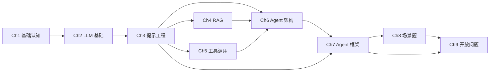

# 大模型 Agent 应用开发学习教程 — 设计 Spec

> 创建日期：2026-06-03
> 状态：已通过头脑风暴，待用户审查
> 范围：入门教程 9 章 + 生产进阶 4 章，共 13 章

## 1. 目的 & 读者

**目的**：为初级开发者（含前端）提供体系化的大模型 Agent 应用开发教程，让读者在合理时长内能搭出一个 RAG + 工具调用的业务 Agent，并理解主流框架的选型取舍。

**两套读者起点**：

| 教程 | 读者 | 学完能做什么 |
|---|---|---|
| 📘 入门教程 | 初级开发者（含前端）| 能独立搭一个 RAG + 工具调用 Agent，能读懂框架源码与做选型对比 |
| 📗 生产进阶 | 中级开发者（有后端 / 分布式经验）| 能上线运维一个生产级 Agent，含多 Agent 协同与框架选型判断 |

**矛盾处理**：原方案"读完后能上线生产 Agent + 多 Agent 框架选型"对初级读者是过载的，因此拆为两套互引教程。两套读者起点不同，可独立选读。

## 2. 交付物形态

**双轨**：
- **源**：`docs/` 目录的 Markdown 文件（git 友好、AI 协作方便）
- **输出**：用 VitePress 渲染为带导航/搜索/暗色主题的静态网站（初中生阅读体验最好）

**目录结构**：

```
docs/
├── index.md                       ← VitePress 首页（双套入口 + 总览图）
├── getting-started/               ← 📘 入门教程
│   ├── 00-roadmap.md              ← 三阶段总览 + 章节依赖图
│   ├── 01-basics/
│   │   ├── 01-llm-and-agent.md
│   │   └── 02-llm-fundamentals.md
│   ├── 02-core/
│   │   ├── 03-prompt-engineering.md
│   │   ├── 04-rag.md
│   │   ├── 05-tool-calling.md
│   │   └── 06-agent-architecture.md
│   ├── 03-advanced/
│   │   ├── 07-frameworks.md
│   │   ├── 08-scenarios.md
│   │   └── 09-open-questions.md
│   └── assets/                    ← mermaid 源 + 静态图
├── production/                    ← 📗 生产进阶
│   ├── 00-prerequisites.md        ← 入门读者已掌握 X、Y、Z
│   ├── 01-system-design.md
│   ├── 02-evaluation.md
│   ├── 03-security.md
│   ├── 04-engineering.md
│   └── assets/
└── .vitepress/
    └── config.ts                  ← 双侧栏导航
```

**代码示例**：`examples/` 目录与 `docs/` 平行，13 个最小可运行项目，章节正文用相对路径引用。

## 3. 章节组织（螺旋式上升）

### 入门教程 9 章 — 三阶段递进

**阶段 1 · 打地基**
1. Ch1 基础认知：大模型应用、Agent 概念、学习路线
2. Ch2 LLM 基础：Token、Attention、训练、推理与采样

**阶段 2 · 核心能力**（每能力从原理→最小代码→陷阱）
3. Ch3 提示工程：Prompt 模板、Cot、ReAct、稳定输出
4. Ch4 RAG：Embedding、Chunk、召回、Rerank
5. Ch5 工具调用：Function Calling、MCP、权限与结果反馈
6. Ch6 Agent 架构：规划-记忆-执行-反思闭环（收口 4 个核心能力）

**阶段 3 · 实战与视野**
7. Ch7 Agent 框架：主流框架横评、工程结构、选型取舍
8. Ch8 场景题：客服、代码生成、多 Agent、稳定性
9. Ch9 开放问题：Agent 未来、瓶颈、框架评价

### 生产进阶 4 章

1. Ch1 系统设计：高并发、缓存、降级、成本控制
2. Ch2 评估与优化：Benchmark、LLM-as-judge、反馈闭环
3. Ch3 安全与风险：Prompt 注入、越狱、数据隔离
4. Ch4 工程实战：Python 异步、TS Web 集成、RAG pipeline、工具调用代码

### 入门 9 章依赖图



箭头 = "强烈建议先读"。Ch3 提示工程是 4 个核心能力的共同前置，Ch6 Agent 架构收口 4 个核心能力。

## 4. 跨套互引规则

- 入门 Ch8 场景题中"多 Agent 客服"案例 → 文末链接 "稳定性 / 降级策略详见 → 进阶 Ch1 §降级"
- 进阶 Ch1/2/3/4 开头 → "前置：入门 Ch1~Ch6"
- 进阶章节不重复入门讲过的概念（除非该概念的工程视角不同）

## 5. 章节内部统一结构（8 段模板）

所有章节共用 8 段式模板（与 tech-blog.md 兼容）：

1. **TL;DR**（3 句话）——这章解决什么、核心结论、读完能做什么
2. **前置章节**——需先读 Ch X § Y 的小卡片
3. **背景 & 问题**——真实场景故事引入（≤300 字）
4. **核心概念**——≥2 张 mermaid 图（原理图 + 流程图）；术语表卡片化
5. **最小可运行示例**——可直接复制的代码 + 行内注释（Python 默认；Web 集成场景用 TS）
6. **常见陷阱**——≥3 个"现象→原因→解法"真实踩坑
7. **本章速查表**——关键 API、关键配置、验证方法
8. **下章预告 & 关键术语桥接**——本章术语在下一章如何被使用

### 章节长度控制

| 章节类型 | 目标字数 | 目标图数 | 目标代码示例数 |
|---|---|---|---|
| 入门 Ch1~Ch6（基础 + 核心）| 6000-9000 | 4-6 | 3-5 |
| 入门 Ch7~Ch9（实战 + 视野）| 5000-7000 | 3-4 | 2-3 |
| 进阶 Ch1~Ch4 | 7000-10000 | 4-5 | 3-4 |

**总规模**：13 章 × 中位 7500 字 ≈ **10 万字**，配套图 **≥50 张**。

## 6. 图表规范

### 类型矩阵

| 图类型 | 工具 | 典型场景 | 每章使用 |
|---|---|---|---|
| 流程图（flowchart）| Mermaid | ReAct 循环、RAG pipeline、Agent 决策流 | ≥1 |
| 时序图（sequenceDiagram）| Mermaid | Function Calling 调用链、多 Agent 消息传递 | ≥1 |
| 状态图（stateDiagram）| Mermaid | Agent 状态机、对话上下文生命周期 | 0-1 |
| 类图（classDiagram）| Mermaid | 框架源码结构、数据模型 | 0-1 |
| 架构图（系统级）| 静态 PNG/SVG（draw.io 导出）| 多 Agent 协作、整体系统拓扑 | 0-1（仅核心章）|
| 对比表 | Markdown table | 框架选型、方案对比、版本兼容 | ≥1 |

### Mermaid 可读性规范

- 节点标签 ≤8 字；超过拆成多节点
- 箭头文字 ≤12 字
- 单图节点 ≤12 个；超过拆 2 张
- 图下方 1-2 句"这张图说了什么"导读

### 图源文件存放

```
docs/
├── getting-started/
│   ├── 02-core/04-rag.md        ← 章节正文（含 mermaid 代码块）
│   └── assets/04-rag/
│       ├── overview.png         ← 静态图
│       └── source/overview.drawio  ← 静态图源文件
```

### 配图密度自检（每章发布前过）

- ≥3 张图（Mermaid + 静态 + 对比表合计）？
- 每 2000 字至少 1 张图？
- 所有复杂概念至少有 1 张原理图？
- 所有数据/对比至少有 1 张对比表？
- 没有连续 5 段以上纯文字？

## 7. 教程质量保证机制

### 4 类"错误"与处理

| 错误类型 | 典型场景 | 处理机制 |
|---|---|---|
| 技术准确性错误 | API 签名写错、版本过期、流程与官方文档矛盾 | 派发 verifier 代理（来自 OMC 体系）跑 3 步核验 |
| 代码示例不可运行 | 复制粘贴报错、缺 import、依赖冲突 | examples/ 目录 CI 冒烟测试 |
| 章节关联性断裂 | Ch5 引用了 Ch6 才讲的概念、术语桥接失效 | code-reviewer 类代理（来自 OMC 体系）做前置检查 |
| 初中生看不懂 | 专业术语未解释、抽象概念无类比 | 所有抽象概念必须有"生活类比" |

### 3 步核验流程（每章发布前）

1. **技术核验**（verifier 代理，来自 OMC 体系）
   - 所有 npm/PyPI 包名、API 签名、版本号与官方文档交叉对照
   - 用 §七·npm 包验证（npm view）+ Context7 MCP
2. **代码可运行性**（CI 流水线）
   - examples/ 目录每个 demo 跑 lint + 冒烟测试
   - 失败的代码必须修复或显式标注"已知问题"
3. **可读性 & 关联性**（code-reviewer 类代理，来自 OMC 体系）
   - 扫"前置依赖是否被引用"+"术语先于定义"+"图是否够"+"陷阱是否真实"
   - 对照 §一 15 条自检清单

### examples/ 目录结构

```
examples/                           ← 与 docs/ 平行，所有代码示例可运行
├── 01-hello-llm/
│   ├── README.md
│   ├── py/main.py                 ← Python 主示例
│   ├── ts/main.ts                 ← Web 集成示例（可选）
│   ├── requirements.txt
│   └── tests/test_smoke.py        ← 冒烟测试（必须有）
├── 02-prompt-cot/
├── 03-rag-pipeline/
...
└── 13-multi-agent-customer-service/
```

每个 example 是一个最小可运行项目，章节正文用「打开 examples/03-rag-pipeline/，运行 `python main.py`」相对路径引用。

### 版本与依赖管理

- 所有第三方库版本在首次引用时用 `npm view` / Context7 验证 + 锁定到具体版本
- 每章末尾"速查表"列出该章用到的所有依赖与版本
- CI 月度跑一次"依赖过期检查"，发现破坏性升级时在项目仓库开 issue 跟踪

### 教程自身的版本演进

- 使用 `CHANGELOG.md` 记录每章的更新
- 章节使用 v1.0 / v1.1 之类的版本号（写在文件名后缀）
- 破坏性更新（API 大变）→ 旧版本归档到 `docs/archive/`，新版本上主目录

## 8. 工程栈

- **教程网站**：VitePress（双侧栏导航 + 全文搜索 + 暗色主题）
- **代码默认语言**：Python（LangChain / LlamaIndex / Agno 生态主力）
- **Web 集成示例**：TypeScript（Vercel AI SDK / CopilotKit）
- **图表**：Mermaid（VitePress 原生渲染）+ Markdown 对比表 + 静态图（draw.io）
- **CI**：项目仓库原生 CI 流水线（lint + 冒烟测试 + 依赖过期检查；如托管在 GitHub 用 GitHub Actions，托管在 Gitee 用 Gitee Go，托管在 GitLab 用 GitLab CI）

## 9. 不在范围内（YAGNI）

- ❌ 视频教程（只做文档站）
- ❌ 多语言翻译（先中文，英文视反馈再加）
- ❌ 互动式代码沙箱（VitePress 内嵌代码块已够用，不引入 StackBlitz）
- ❌ 用户账号 / 评论 / 收藏（保持纯文档）
- ❌ 移动端 App（VitePress 响应式已够用）

## 10. 验收标准

### 入门教程

- [ ] 9 章全部发布，章节间"前置依赖"明确
- [ ] examples/01-13 全部可运行（"可运行"定义：lint 通过 + 冒烟测试用例 + 至少一次端到端跑通；不要求全功能/全分支覆盖）
- [ ] 章节长度符合 §5 长度表
- [ ] 配图密度符合 §6 自检
- [ ] 3 步核验全部通过
- [ ] VitePress 站点能 `pnpm dev` 起来、双侧栏导航可用

### 生产进阶

- [ ] 4 章全部发布
- [ ] 进阶各章 §4 互引规则生效
- [ ] 进阶 §3 安全章节有威胁模型图
- [ ] 进阶 §4 工程实战有 Python 异步 + TS Web 集成双 demo

## 11. 风险与缓解

| 风险 | 影响 | 缓解 |
|---|---|---|
| 框架版本变更快，代码示例过期 | 中 | 锁定版本 + CI 月度检查 + 显式标注失效时点 |
| 教程体量大（10 万字），写作周期长 | 中 | 分阶段交付（先阶段 1+2，再阶段 3 与进阶）|
| 初中生读者看不懂抽象概念 | 高 | 所有抽象概念强制要求"生活类比" + 术语卡片化 |
| Mermaid 复杂图渲染失败 | 低 | 单图节点 ≤12，超出拆 2 张 |
| 互引链接断裂 | 中 | CI 跑 `markdown-link-check` 校验站内链接 |
